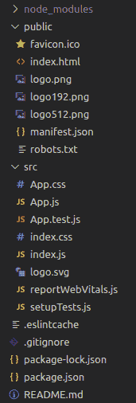
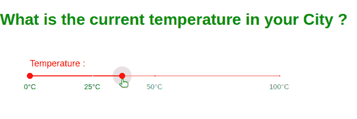

# Reaction

中使用材质 UI 的范围滑块

> Original: [https://www.geeksforgeeks.org/range-slider-using-material-ui-in-react/](https://www.geeksforgeeks.org/range-slider-using-material-ui-in-react/)

**[Material-UI](https://www.geeksforgeeks.org/material-ui-introduction-and-installation-for-react/)**是基于反应的模块。 Material-UI 库为用户提供了最高效、最有效、最友好的界面。 要使用范围滑块，我们需要安装 Material-UI。 此外，对于自定义样式，您始终可以在 Material-UI 中引用 SVG 图标组件的 API。

**前提条件：**

*   [反应基础 JS](https://www.geeksforgeeks.org/reactjs/)
*   已创建[ReactJS](https://www.geeksforgeeks.org/reactjs/)应用程序

下面的所有步骤都描述了为图标添加颜色的顺序。

**安装：**

*   **步骤 1：**在继续之前，首先我们必须安装 Material-UI 模块，在项目目录中运行以下命令，在 src 文件夹中的终端的帮助下，或者您也可以在项目文件夹中的 Visual Studio 代码的终端中运行此命令。

```jsx
npm install @material-ui/core  
```

*   **步骤 2：**安装模块后，现在打开项目目录中 src 文件夹下的 App.js 文件，并删除其中的代码。
*   **步骤 3：**现在从 React 导入 React、useState(用于滑块的初始状态)，从 Material-UI 模块导入 Slider。
*   **步骤 4：**在 app.js 文件中，添加此代码片段以导入来自 React 的 Reaction、useState(用于滑块的初始状态)和来自 Material-UI 模块的 Slider。

```jsx
import React, { useState } from "react";
import { Slider } from "@material-ui/core";
```

项目的文件结构如下所示：



下面是一个示例程序，用来说明滑块的用法：

**示例：城市当前温度的**范围滑块。

**文件名-src/App.js：**

## JavaScript

```jsx
//We use useState for the initial set values
import React, { useState } from "react";
import "./App.css";
//we import slider from material ui
import { Slider } from "@material-ui/core";

function App() {
  //Providing different values with labels
  const gfg = [
    {
      value: 0,
      label: "0°C",
    },
    {
      value: 25,
      label: "25°C",
    },
    {
      value: 50,
      label: "50°C",
    },
    {
      value: 100,
      label: "100°C",
    },
  ];

  const [val, setVal] = useState([0, 40]);
  const updateRange = (e, data) => {
    setVal(data);
  };
  return (
    <div className="App">
      <h1> What is the current temperature in your City ? </h1>
      <div style={{ width: 500, margin: 60 }}>
        <span> Temperature : </span>{" "}
        <Slider value={val} onChange={updateRange} marks={gfg} />
      </div>{" "}
    </div>
  );
}
export default App;
```

**文件名-src/App.css：**

## CSS

```jsx
body {
  margin: 0px;
}
.App {
  font-family: sans-serif;
  color: green;
  font-size: 16px;
}

span {
  color: red;
  font-size: 18px;
  font-weight: 13px;
  font-family: Verdana, Geneva, Tahoma, sans-serif;

}
```

**输出：**因此，使用上述步骤，我们可以使用 Material-UI Slider 在[ReactJS](https://www.geeksforgeeks.org/reactjs/)中制作范围滑块。

