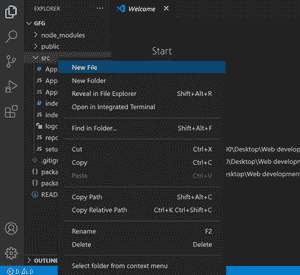
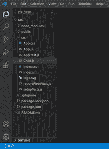
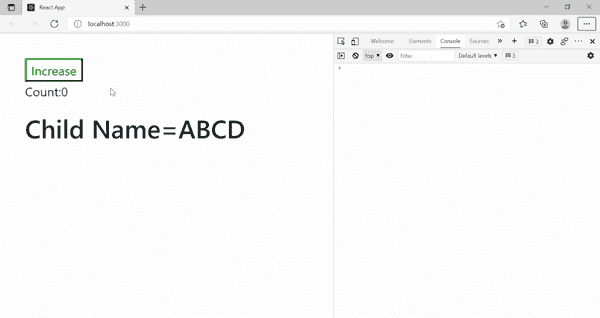
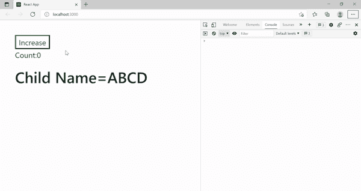

# 在 ReactJS

中重新呈现组件

> Original: [https://www.geeksforgeeks.org/re-rendering-components-in-reactjs/](https://www.geeksforgeeks.org/re-rendering-components-in-reactjs/)

正如我们所知，REACTIVE JS 是一个开源 JavaScript 库，用于构建专门用于单页面应用程序的用户界面。 它还通过仅更新已改变的 UI 部分来提供快速的用户体验，这也是众所周知的。 呈现组件不在用户手中，它是 React 组件生命周期的一部分，由 React 在不同的应用程序阶段调用，通常是在 Reaction 组件第一次实例化时调用。 更新状态的第二个或后续渲染称为**重新渲染**。 每当 Reaction 组件的状态或道具发生更改时，它们都会自动重新渲染。

**前提条件：**[Reaction JS](https://www.geeksforgeeks.org/react-js-introduction-working/)，[Reaction JS|组件生命周期](https://www.geeksforgeeks.org/reactjs-lifecycle-components/)

从代码中的任何位置对状态进行简单更新，都会导致自动重新呈现所有用户界面(UI)元素。 但是，在某些情况下，Render()方法可能依赖于其他一些数据。 重新渲染可能是由列出的三个原因中的任何一个引起的：

1.  更新状态
2.  在道具中更新
3.  重新渲染父组件

不必要的重新渲染会影响应用程序的性能，并导致用户电池损耗，这肯定不是用户想要的。 让我们详细了解为什么重新呈现组件，以及如何防止不必要的重新呈现来优化应用程序组件。

**为什么重新渲染组件？**

让我们更深入地了解一下前面提到的重新渲染的三个原因。

1.  **状态更新：**状态更改可以从*属性*或*setState*更改来更新变量(比方说)。 该组件获取更新后的状态，然后 Reaction 重新呈现该组件，以反映应用程序上的更改。
2.  **prop：**中的更新类似地，*prop*中的更改会导致状态更改，而状态更改会导致 Reaction 重新呈现组件。
3.  **父组件的重新渲染：**每当调用组件渲染函数时，它的所有后续子组件都将重新渲染，而不管它们的*道具*是否已更改。

每次状态更改时，Reaction 都会计划渲染(计划渲染并不意味着这会立即发生，这可能需要时间并在最佳时刻完成)。 更改状态意味着当我们调用 useState 函数(useState 是一个允许您在功能组件中拥有状态变量的 Hook)时，Reaction 会触发更新。

**示例：**创建一个简单的 Counter Reaction 项目将有助于理解重新呈现组件的概念。

**先决条件：**下载[与代码](https://code.visualstudio.com/download)和[节点包](https://nodejs.org/en/download/)。
**步骤 1：**通过运行以下给定命令创建一个名为 Counter-app 的新 Reaction 项目。

```
npx create-react-app counter-app
```

**第二步：**安装完成后，可以打开项目文件夹，如下图所示。

```
cd counter-app     
```

**步骤 3：**创建 Reaction JS 应用程序后，通过运行以下给定命令安装所需的模块。

```
npm install react-desktop
```

**步骤 4：**打开 VS 代码在 VS 代码中转到资源管理器(**按 crtl+Shift+E**)。 接下来，转到**src 文件夹->新建文件**，如图所示。 并将其命名为 Child.js(这是子组件)。



子零部件的制作

**项目结构：**如下所示。



项目结构

**第 5 步：**编辑 App.js 文件中的代码，如下所示。

App.js 文件将包含以下内容：

1.  声明的状态将更改并导致重新渲染，
2.  控制台中的一条消息通知父组件已呈现。
3.  将返回一个 div，该 div 由一个按钮(将增加计数并最终导致状态改变)和一个子组件组成，该子组件有一个道具，该道具不变，但被意外地重新呈现。

每次调用组件的呈现函数时，代码都会给出一条消息。 每次单击计数按钮都会触发状态更改。

**App.js 文件**

## JavaScript

```
import { useState } from 'react';
import './Style.css';         // CSS file for style
import Child from './Child';  // Child Component

function App() {
  const [Count,setCount]=useState(0);
  console.log("Parent rendered");
  return (
    <div className="wrap">
      <button onClick={()=>setCount(Count+1)}>
        Increase
      </button>

<p>Count:{Count}</p>

      <Child name={"ABCD"}/>
    </div>
  );
}

export default App;
```

**步骤 6：**如图所示，进入**src 文件夹->新建文件**创建子组件，并将其命名为 Child，js


转到“src”->“New File”以创建新的子组件

**步骤 7：**在 Child.js 文件中编写以下代码

Child.js 将具有以下内容：

*   控制台中的告知该子组件被呈现的消息，
*   将返回一个 div，该 div 的标题使用 prop 将名称放入其中。

每次调用组件的呈现函数时，代码都会给出一条消息。 每次单击计数按钮都会触发状态更改。 父组件中的每个状态更改都会触发其所有后续子组件的重新渲染，即使道具没有更改。

**Child.js**

## JavaScript

```
function Child(props){
    console.log("Child Rendered");
    return(
        <div>
            <h1>Child Name={props.name}</h1>
        </div>
    );
}

export default Child;
```

**运行应用程序的步骤：**打开终端，键入以下命令。

```
npm start
```

发帖主题：Re：Колибри0.7.0



在控制台区域中可以看到父组件被重新呈现的次数，子组件也被重新呈现的次数。

**如何防止不需要的组件重新渲染？**

如果子组件在其道具没有任何更改的情况下重新呈现，则可以通过使用挂钩来阻止它。 **React.memo**是救世主，它是一个较高级别的组件，用于记忆)结果，即 React 将跳过该组件的呈现，并重用上次呈现的结果。 它检查道具更改。

**示例：**简单的 CounReaction 项目中的微小更改可以防止我们的项目进行不必要的重新渲染。 需要在 Child.js 文件中进行更改，如下所示。

## JavaScript

```
import React from 'react';    

function Child(props){
    console.log("Child Rendered");
    return(
        <div>
            <h1>Child Name={props.name}</h1>
        </div>
    );
}

// Export default Child;

export default React.memo(Child); // Changes
```

发帖主题：Re：Колибри0.7.0



现在，在重新渲染父组件时不重新渲染子组件。 在控制台区域可以清楚地看到。

**注意：**此方法仅作为性能优化而存在。 不要依赖它来阻止渲染，因为这可能会导致错误。