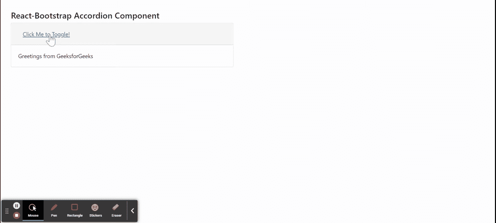

# Reaction-Bootstrap Accordion 组件

> Original: [https://www.geeksforgeeks.org/react-bootstrap-accordion-component/](https://www.geeksforgeeks.org/react-bootstrap-accordion-component/)

Reaction-Bootstrap 是一个前端框架，其设计考虑到了 Reaction。 AccordionComponent提供了一种方法来控制我们的卡片组件，以便我们可以一次打开一个。 我们可以在 ReactJS 中使用以下方法来使用 Reaction-Bootstrap Accordion 组件。

**手风琴道具：**

*   **activeKey：**是当前激活的密钥，与当前激活的扩展卡对应。
*   **As：**它可以用作此组件的自定义元素类型。
*   **defaultActiveKey：**它是启动时展开的默认活动键。
*   **onSelect：**它是名为 SelectCallback 的回调函数。
*   **bsPrefix：**它是使用高度定制的引导程序css的安全通道。

**一致。切换道具：**

*   **As：**它可以用作此组件的自定义元素类型。
*   **eventKey：**当点击折叠组件时，用于对应该组件的按键。
*   **onClick：**点击该组件时触发的回调函数。

**手风琴。** **折叠****道具：**

*   **儿童：**用于传递儿童道具，只能包含一个儿童。
*   **eventKey：**它是用于对应切换器的键。

**useAccordionTogger 道具：**它用于创建带有此钩子的自定义切换组件。

*   **eventKey：**它是为指定元素/卡指定的密钥。
*   **回调：**它是在触发切换事件时触发的回调函数。

**创建 Reaction 应用程序并安装模块：**

*   **步骤 1：**使用以下命令创建 Reaction 应用程序：

    ```
    npx create-react-app foldername
    ```

*   **步骤 2：**创建项目文件夹(即文件夹名**)后，**使用以下命令移动到该文件夹：

    ```
    cd foldername
    ```

*   **步骤 3：**创建 ReactJS 应用程序后，使用以下命令安装所需的****模块：****

    ```
    **npm install react-bootstrap 
    npm install bootstrap**
    ```

******项目结构：**如下所示。****

****

项目结构**** 

******示例：**现在在**App.js**文件中写下以下代码。 在这里，App 是我们编写代码的默认组件。****

## ****App.js****

```
**import React from 'react';
import 'bootstrap/dist/css/bootstrap.css';

import Accordion from 'react-bootstrap/Accordion';
import Card from 'react-bootstrap/Card';
import Button from 'react-bootstrap/Button';

export default function App() {
  return (
    <div style={{ display: 'block', 
                  width: 700, padding: 30 }}>
      <h4>React-Bootstrap Accordion Component</h4>
      <Accordion defaultActiveKey="0">
        <Card>
          <Card.Header>
            <Accordion.Toggle as={Button} 
              variant="link" eventKey="0">
              Click Me to Toggle!
            </Accordion.Toggle>
          </Card.Header>
          <Accordion.Collapse eventKey="0">
            <Card.Body>
             Greetings from GeeksforGeeks
            </Card.Body>
          </Accordion.Collapse>
        </Card>
      </Accordion>
    </div>
  );
}**
```

******运行应用程序的步骤：**使用以下命令从项目根目录运行应用程序：****

```
**npm start**
```

******输出：**现在打开浏览器，转到***http://localhost:3000/***，您将看到以下输出：****

********

******引用：**[https://react-bootstrap.github.io/components/accordion/](https://react-bootstrap.github.io/components/accordion/)****