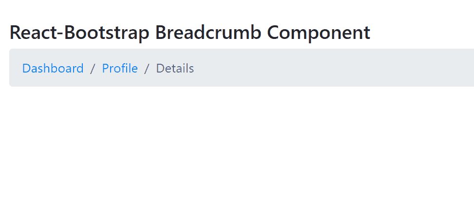

# 反应引导面包屑组件

> Original: [https://www.geeksforgeeks.org/react-bootstrap-breadcrumb-component/](https://www.geeksforgeeks.org/react-bootstrap-breadcrumb-component/)

Reaction-Bootstrap 是一个前端框架，其设计考虑到了 Reaction。 Breadcrumb 组件提供了一种方式来指示当前页面的位置，也提供了在导航层次结构中的位置。 我们可以在 ReactJS 中使用以下方法来使用 Reaction-Bootstrap Breadcrumb 组件。

**面包屑道具：**

*   **As：**它可以用作此组件的自定义元素类型。
*   **className：**它用来写我们的类名，用于样式化。
*   **标签：**它是 NAV 元素的 ARIA 标签。
*   **listProps****：**它用于为<ol>元素传递附加道具。
*   **bsPrefix：**它是使用高度定制的引导程序css的安全通道。

**面包屑。项目道具：**

*   **活动：**它用于将该元素设置为活动状态。
*   **As：**它可以用作此组件的自定义元素类型。
*   **href：**该元素使用 href 属性。
*   **link As：**对于此组件内部链接，it 用于允许使用自定义元素类型。
*   **linkProps：**对于非活动项目，它用于将按原样传递的附加道具传递给底层链接。
*   **target：**它用于为内部的<a>元素提供目标属性。
*   **title：**它用于为内部的<a>元素提供 title 属性。
*   **bsPrefix：**它是使用高度定制的引导程序css的安全通道。

**创建 Reaction 应用程序并安装模块：**

*   **步骤 1：**使用以下命令创建 Reaction 应用程序：

    ```jsx
    npx create-react-app foldername
    ```

*   **步骤 2：**创建项目文件夹(即 foldername**)后，**使用以下命令移动到该文件夹：

    ```jsx
    cd foldername
    ```

*   **步骤 3：**创建 ReactJS 应用程序后，使用以下命令安装所需的****模块：****

    ```jsx
    **npm install react-bootstrap 
    npm install bootstrap**
    ```

******项目结构：**如下所示。****

****

项目结构**** 

******示例：**现在在**App.js**文件中写下以下代码。 在这里，App 是我们编写代码的默认组件。****

## ****App.js****

```jsx
**import React from 'react';
import 'bootstrap/dist/css/bootstrap.css';
import Breadcrumb from 'react-bootstrap/Breadcrumb';

export default function App() {
  return (
    <div style={{ display: 'block', 
                  width: 700, padding: 30 }}>
      <h4>React-Bootstrap Breadcrumb Component</h4>
      <Breadcrumb>
        <Breadcrumb.Item href="#">
           Dashboard
        </Breadcrumb.Item>
        <Breadcrumb.Item href="#">
          Profile
        </Breadcrumb.Item>
        <Breadcrumb.Item active>
          Details
        </Breadcrumb.Item>
      </Breadcrumb>
    </div>
  );
}**
```

******运行应用程序的步骤：**使用以下命令从项目根目录运行应用程序：****

```jsx
**npm start**
```

******输出：**现在打开浏览器，转到***http://localhost:3000/***，您将看到以下输出：****

********

******引用：**[https://react-bootstrap.github.io/components/breadcrumb/](https://react-bootstrap.github.io/components/breadcrumb/)****