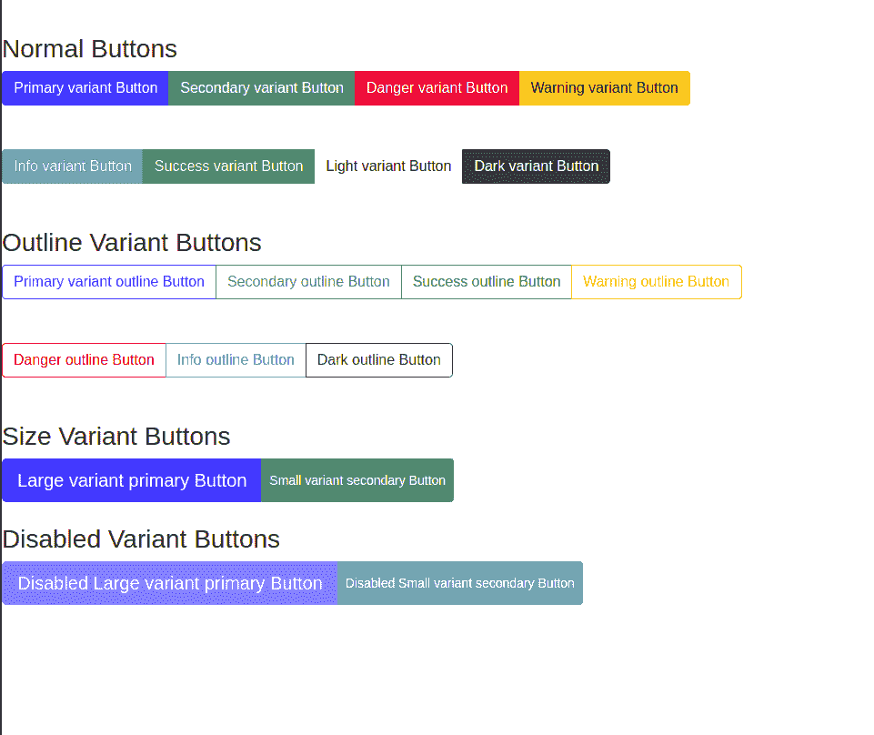

# Reaction-Bootstrap 按钮组件

> Original: [https://www.geeksforgeeks.org/react-bootstrap-button-component/](https://www.geeksforgeeks.org/react-bootstrap-button-component/)

**简介：**Reaction-Bootstrap 是一个在设计时考虑到 Reaction 的前端框架。 Bootstrap 是为 Reaction 重新构建和修改的，因此被称为 Reaction-Bootstrap。 按钮用于在网站上执行操作，它们在前端部分起着至关重要的作用。

**按钮道具：**

*   **变体：**用于为徽章添加不同的主题和视觉样式。
*   **bsPrefix：**它是一个用于使用高度定制的引导 CSS 的逃生舱。
*   **禁用**：用于禁用按钮。
*   **激活：**用于手动设置按钮非激活状态。
*   **大小：**用于指定按钮的大小。
*   **As：**用作此组合的描述性目的的自定义元素。
*   **类型：**用于定义按钮的功能。
*   **名称：**用于命名每个按钮。
*   **值：**用于为每个按钮赋予特定值。
*   **onChange：**根据按钮类型，按下按钮时会触发回调函数。

**ToggleButtonGroup 道具：**

*   **名称：**用于命名每个按钮。
*   **onChange：**根据按钮类型，按下按钮时会触发回调函数。
*   **大小：**用于指定按钮的大小。
*   **类型：**用于定义按钮的功能，如单选或复选框。
*   **值：**用于为每个按钮赋予特定值。
*   **垂直：**用于垂直设置按钮样式。

**切换按钮道具：**

*   **禁用**：用于禁用标签和输入。
*   **inputRef：**一个引用被添加到<Input>元素。
*   **类型：**用于定义按钮的功能，如单选或复选框。
*   **选中：**它确定由<ToggleButtonGroup>管理的输入元素的选中状态。
*   **onChange：**根据按钮类型，按下按钮时会触发回调函数。
*   **名称：**用于确定每个按钮的名称。
*   **值：**它用于为每个按钮赋予特定值，这些值对于其同级按钮应该是唯一的。

**创建 Reaction 应用程序并安装模块：**

*   **步骤 1：**使用以下命令创建 Reaction 应用程序。

    ```jsx
    npx create-react-app foldername
    ```

*   **步骤 2：**创建项目文件夹(即 foldername**)后，**使用以下命令移动到该文件夹。

    ```jsx
    cd foldername
    ```

*   **步骤 3：**创建 ReactJS 应用程序后，使用以下命令安装所需的模块。

    ```jsx
    npm install react-bootstrap bootstrap
    ```

*   **步骤 4：**在*index.js*文件中添加以下行。

    ```jsx
    import 'bootstrap/dist/css/bootstrap.css';
    ```

**项目结构：**如下所示。


**接近：**

*   首先，使用上面提到的命令安装 reaction-bootstrap。
*   现在，在 app.js 文件中，按照以下说明编写代码。
*   安装完成后，从该文件中的“Reaction-Bootstrap/Button-Group”导入“ButtonGroup”。
*   ButtonGroup 用于对多个按钮进行分组，为了更改按钮的颜色，可以使用“Variant”属性。 比如主要的、次要的和危险的。

**示例：**现在使用该文件中的以下代码片段并导出该组件，以便我们可以在 index.js 中导入以进行呈现。

## App.js

```jsx
import React from "react";
import ButtonGroup from "react-bootstrap/ButtonGroup";
import Button from "react-bootstrap/Button";

export default function ButtonGrouping() {
  return (
    <>
      <h3>Normal Buttons</h3>
      <ButtonGroup aria-label="Basic example">
        <Button variant="primary">
            Primary variant Button
        </Button>
        <Button variant="secondary">
            Secondary variant Button
        </Button>
        <Button variant="danger">
            Danger variant Button
        </Button>
        <Button variant="warning">
            Warning variant Button
        </Button>
        <Button variant="info">
            Info variant Button
        </Button>
        <Button variant="success">
            Success variant Button
        </Button>
        <Button variant="light">
            Light variant Button
        </Button>
        <Button variant="dark">
            Dark variant Button
        </Button>
      </ButtonGroup>

      <br />
      <br />
      <br />

      <h3>Outline Variant Buttons</h3>

      <ButtonGroup>
        <Button variant="outline-primary">
          Primary variant outline Button
        </Button>
        <Button variant="outline-secondary">
            Secondary outline Button
        </Button>
        <Button variant="outline-success">
            Success outline Button
        </Button>
        <Button variant="outline-warning">
            Warning outline Button
        </Button>
        <Button variant="outline-danger">
            Danger outline Button
        </Button>
        <Button variant="outline-info">
            Info outline Button
        </Button>
        <Button variant="outline-dark">
            Dark outline Button
        </Button>
      </ButtonGroup>

      <br />
      <br />
      <br />

      <h3>Size Variant Buttons</h3>

      <ButtonGroup>
        <Button variant="primary" size="lg">
          Large variant primary Button
        </Button>
        <Button variant="secondary" size="sm">
          Small variant secondary Button
        </Button>
      </ButtonGroup>

      <br />
      <br />

      <h3>Disabled Variant Buttons</h3>

      <ButtonGroup>
        <Button variant="primary" size="lg" disabled>
          Disabled Large variant primary Button
        </Button>
        <Button variant="secondary" size="sm" disabled>
          Disabled Small variant secondary Button
        </Button>
      </ButtonGroup>
    </>
  );
}
```

**运行应用程序的步骤：**使用以下命令从项目根目录运行应用程序：

```jsx
npm start
```

**输出：**现在打开浏览器，转到***http://localhost:3000/***，您将看到以下输出。



**引用：**[**https://react-bootstrap.netlify.app/components/buttons/#buttons**](https://react-bootstrap.netlify.app/components/buttons/#buttons)