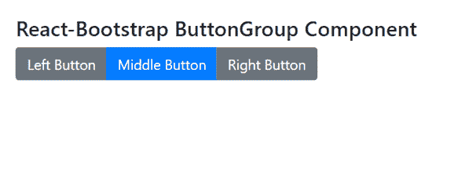

# Reaction-Bootstrap ButtonGroup 组件

> Original: [https://www.geeksforgeeks.org/react-bootstrap-buttongroup-component/](https://www.geeksforgeeks.org/react-bootstrap-buttongroup-component/)

Reaction-Bootstrap 是一个前端框架，其设计考虑到了 Reaction。 ButtonGroup 组件为提供了一种将一系列按钮组合在一行上的方法。 我们可以在 ReactJS 中使用以下方法来使用 Reaction-Bootstrap ButtonGroup 组件。

**按钮组道具：**

*   **角色：**描述按钮组的 ARIA 角色。
*   **大小：**用于设置组内所有按钮的大小。
*   **切换：**用于显示类似按钮的切换组。
*   **垂直：**它提供了一种使按钮集看起来垂直堆叠的方法。
*   **As：**它可以用作此组件的自定义元素类型。
*   **bsPrefix：**它是使用高度定制的引导程序css的安全通道。

**ButtonToolbar****道具：**

*   **角色：**它是描述按钮工具栏的 ARIA 角色。
*   **bsPrefix：**它是使用高度定制的引导程序css的安全通道。

**创建 Reaction 应用程序并安装模块：**

*   **步骤 1：**使用以下命令创建 Reaction 应用程序：

    ```jsx
    npx create-react-app foldername
    ```

*   **步骤 2：**创建项目文件夹(即文件夹名**)后，**使用以下命令移动到该文件夹：

    ```jsx
    cd foldername
    ```

*   **步骤 3：**创建 ReactJS 应用程序后，使用以下命令安装所需的****模块：****

    ```jsx
    **npm install react-bootstrap 
    npm install bootstrap**
    ```

******项目结构：**如下所示。****

****

项目结构**** 

******示例：**现在在**App.js**文件中写下以下代码。 在这里，App 是我们编写代码的默认组件。****

## ****App.js****

```jsx
**import React from 'react';
import 'bootstrap/dist/css/bootstrap.css';
import ButtonGroup from 'react-bootstrap/ButtonGroup';
import Button from 'react-bootstrap/Button';

export default function App() {
  return (
    <div style={{ display: 'block', 
                  width: 700, 
                  padding: 30 }}>
      <h4>React-Bootstrap ButtonGroup Component</h4>
      <ButtonGroup aria-label="Basic example">
          <Button variant="secondary">
             Left Button
          </Button>
          <Button variant="primary">
             Middle Button
          </Button>
          <Button variant="secondary">
             Right Button
          </Button>
      </ButtonGroup>
    </div>
  );
}**
```

******运行应用程序的步骤：**使用以下命令从项目根目录运行应用程序：****

```jsx
**npm start**
```

******输出：**现在打开浏览器，转到***http://localhost:3000/***，您将看到以下输出：****

********

******引用：**[https://react-bootstrap.github.io/components/button-group/](https://react-bootstrap.github.io/components/button-group/)****