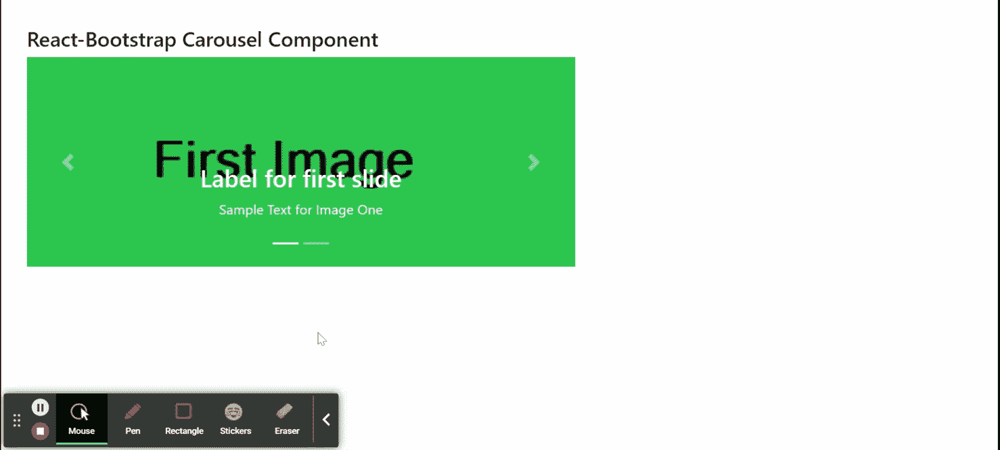

# Reaction-Bootstrap Carousel 组件

> Original: [https://www.geeksforgeeks.org/react-bootstrap-carousel-component/](https://www.geeksforgeeks.org/react-bootstrap-carousel-component/)

Reaction-Bootstrap 是一个前端框架，其设计考虑到了 Reaction。 Carousel 组件提供了一种方法，用于以循环的方式以完整的方式为我们的图像或文本幻灯片创建幻灯片放映。 我们可以在 ReactJS 中使用以下方法来使用 Reaction-Bootstrap Carousel 组件。

**旋转木马道具：**

*   **activeIndex：**用于控制当前活动的可视幻灯片。
*   **As：**它可以用作此组件的自定义元素类型。
*   **控件：**这些控件用于显示旋转木马中的下一步/上一步按钮。
*   **defaultActiveIndex：**它是默认的活动索引，即 0。
*   **淡入：**用于在移动时在幻灯片之间添加淡入淡出动画。
*   **指示器：**用于 s一组滑动位置指示器。
*   **间隔：**用于延迟自动循环运动之间的时间。
*   **键盘：**用来指示传送带是否应该对键盘事件做出反应。
*   **nextIcon：**它用于覆盖默认的 Next 图标。
*   **nextLabel：**它可以用来显示旋转木马中的下一个元素，它是一种只对屏幕阅读器显示的标签类型。
*   **onSelect：**当活动项改变时，被触发是 callback。
*   **onSlid：**当幻灯片过渡结束时，被触发，这是一个 callback。
*   **onSlide：**当幻灯片转场开始s 时，被触发，这是一个 CAllback。
*   **暂停：**用于根据不同的鼠标事件暂停幻灯片。
*   **PrevIcon：**它用于覆盖默认的上一个图标。
*   **pvLabel：**它可以用来显示旋转木马中的前一个元素，它是一种只对屏幕阅读器显示的标签类型。
*   **ref：**它用于提供该元素的 ref 属性。
*   **幻灯片：**用于启用幻灯片之间的动画。
*   **触摸：**在触摸屏设备上使用它来指示是否应该支持左右滑动交互。
*   **WRAP：**它表示旋转木马是否应该有硬停止或连续循环。
*   **bsPrefix：**它是使用高度定制的引导程序css的安全通道。

**旋转木马。项目道具：**

*   **As：**它可以用作此组件的自定义元素类型。
*   **间隔：**用于延迟这些项目自动循环移动之间的时间。
*   **bsPrefix：**它是使用高度定制的引导程序css的安全通道。

**旋转木马。标题道具：**

*   **As：**它可以用作此组件的自定义元素类型。
*   **bsPrefix：**它是使用高度定制的引导程序css的安全通道。

**创建 Reaction 应用程序并安装模块：**

*   **步骤 1：**使用以下命令创建 Reaction 应用程序：

    ```
    npx create-react-app foldername
    ```

*   **步骤 2：**创建项目文件夹(即 foldername**)后，**使用以下命令移动到该文件夹：

    ```
    cd foldername
    ```

*   **步骤 3：**创建 ReactJS 应用程序后，使用以下命令安装所需的****模块：****

    ```
    **npm install react-bootstrap 
    npm install bootstrap**
    ```

******项目结构：**如下所示。****

****

项目结构**** 

******示例：**现在在**App.js**文件中写下以下代码。 在这里，App 是我们编写代码的默认组件。****

## ****App.js****

```
**import React from 'react';
import 'bootstrap/dist/css/bootstrap.css';
import Carousel from 'react-bootstrap/Carousel';

export default function App() {
  return (
    <div style={{ display: 'block', width: 700, padding: 30 }}>
      <h4>React-Bootstrap Carousel Component</h4>
      <Carousel>
        <Carousel.Item interval={1500}>
          
          <Carousel.Caption>
            <h3>Label for first slide</h3>
            <p>Sample Text for Image One</p>
          </Carousel.Caption>
        </Carousel.Item>
        <Carousel.Item interval={500}>
          
          <Carousel.Caption>
            <h3>Label for second slide</h3>
            <p>Sample Text for Image Two</p>
          </Carousel.Caption>
        </Carousel.Item>
      </Carousel>
    </div>
  );
}**
```

******运行应用程序的步骤：**使用以下命令从项目根目录运行应用程序：****

```
**npm start**
```

******输出：**现在打开浏览器，转到***http://localhost:3000/***，您将看到以下输出：****

********

******引用：**[https://react-bootstrap.github.io/components/carousel/](https://react-bootstrap.github.io/components/carousel/)****