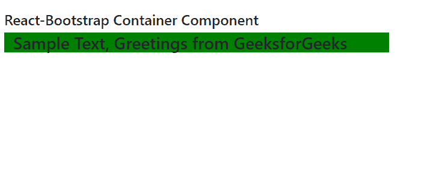
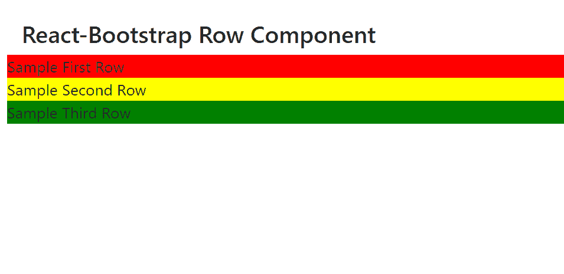
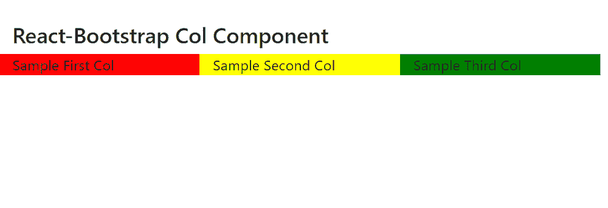

# Reaction-Bootstrap 容器、行和列组件

> Original: [https://www.geeksforgeeks.org/react-bootstrap-container-row-and-col-component/](https://www.geeksforgeeks.org/react-bootstrap-container-row-and-col-component/)

Reaction-Bootstrap 是一个前端框架，其设计考虑到了 Reaction。 我们可以在 ReactJS 中使用以下方法来使用 Reaction-Bootstrap Container，Row，Col 组件。

*   **Container**组件为提供了一种居中和水平填充我们的应用程序内容的方法。 当用户想要响应像素宽度时使用。
*   **行**组件提供了一种在网格系统中 r表示行的方式。 它在我们想要以行的形式显示数据时使用。
*   **列**组件为提供了一种在网格系统中呈现列的方式。 当我们想要以列的形式显示数据时，使用它

**集装箱道具：**

*   **As：**它可以用作此组件的自定义元素类型。
*   **液体：**它用于使容器填满所有可用的水平空间。
*   **bsPrefix：**它是使用高度定制的引导程序css的安全通道。

**行道具：**

*   **As：**它可以用作此组件的自定义元素类型。
*   **LG：**它用于表示在分辨率为≥992 像素的大型设备上彼此相邻的列数。
*   **MD：**它用于表示在分辨率为≥768像素的中型设备上彼此相邻安装的列数。
*   **sm：**它用于表示在分辨率为≥576像素的小型设备上相邻放置的列数。
*   **xl：**它用于表示在分辨率为≥1200像素的超大设备上相邻放置的列数。
*   **xs：**它用于表示在分辨率为<576 像素的超小型设备上相邻放置的列数。
*   **noGutters：**它用于 r删除添加的负边距和列之间的间距。
*   **bsPrefix：**它是使用高度定制的引导程序css的安全通道。

加入时间：清华大学 2007 年 01 月 25 日下午 3：33

*   **As：**它可以用作此组件的自定义元素类型。
*   **lg：**它用于表示分辨率为≥992 像素的大型设备上要跨越的列数。
*   **MD：**它用于表示具有分辨率≥768像素的中等设备上要跨越的列数。
*   **sm：**它用于表示分辨率为≥576像素的小型设备上要跨越的列数。
*   **xl：**它用于表示分辨率为≥1200像素的超大设备上要跨越的列数。
*   **xs：**它用于表示分辨率为<576 像素的超小型设备上要跨越的列数。
*   **bsPrefix：**它是使用高度定制的引导程序css的安全通道。

**创建 Reaction 应用程序并安装模块：**

*   **步骤 1：**使用以下命令创建 Reaction 应用程序：

    ```
    npx create-react-app foldername
    ```

*   **步骤 2：**创建项目文件夹(即文件夹名**)后，**使用以下命令移动到该文件夹：

    ```
    cd foldername
    ```

*   **步骤 3：**创建 ReactJS 应用程序后，使用以下命令安装所需的****模块：****

    ```
    **npm install react-bootstrap 
    npm install bootstrap**
    ```

******项目结构：**如下所示。****

****

项目结构**** 

******容器组件示例：**现在在**App.js**文件中写下以下代码。 在这里，App 是我们编写代码的默认组件。****

## ****App.js****

```
**import React from 'react';
import 'bootstrap/dist/css/bootstrap.css';
import Container from 'react-bootstrap/Container';

export default function App() {
  return (
    <div style={{ display: 'block',
                  width: 700, padding: 30 }}>
      <h4>React-Bootstrap Container Component</h4>
      <Container
        style={{
          backgroundColor: 'green'
        }}
      >
        <h3>Sample Text, Greetings from GeeksforGeeks</h3>
      </Container>
    </div>
  );
}**
```

******运行应用程序的步骤：**使用以下命令从项目根目录运行应用程序：****

```
**npm start**
```

******输出：**现在打开浏览器，转到***http://localhost:3000/***，您将看到以下输出：****

********

******行组件示例：**现在在**App.js**文件中写下以下代码。 在这里，App 是我们编写代码的默认组件。****

## ****App.js****

```
**import React from 'react';
import 'bootstrap/dist/css/bootstrap.css';
import Row from 'react-bootstrap/Row';

export default function App() {
  return (
    <div style={{ display: 'block', 
                  width: 700, padding: 30 }}>
      <h4>React-Bootstrap Row Component</h4>
      <Row style={{
        backgroundColor: 'red',
      }}>
        Sample First Row
      </Row>
      <Row style={{
        backgroundColor: 'yellow',
      }}>
        Sample Second Row
      </Row>
      <Row style={{
        backgroundColor: 'green',
      }}>
        Sample Third Row
      </Row>
    </div>
  );
}**
```

******运行应用程序的步骤：**使用以下命令从项目根目录运行应用程序：****

```
**npm start**
```

******输出：**现在打开浏览器，转到***http://localhost:3000/***，您将看到以下输出：****

********

******示例：**现在在**App.js**文件中写下以下代码。 在这里，App 是我们编写代码的默认组件。****

## ****App.js****

```
**import React from 'react';
import 'bootstrap/dist/css/bootstrap.css';
import Col from 'react-bootstrap/Col';
import Row from 'react-bootstrap/Row';

export default function App() {
  return (
    <div style={{ display: 'block', width: 700, padding: 30 }}>
      <h4>React-Bootstrap Col Component</h4>
      <Row>
        <Col style={{
          backgroundColor: 'red',
        }}>
          Sample First Col
      </Col>
        <Col style={{
          backgroundColor: 'yellow',
        }}>
          Sample Second Col
      </Col>
        <Col style={{
          backgroundColor: 'green',
        }}>
          Sample Third Col
      </Col>
      </Row>
    </div>
  );
}**
```

******运行应用程序的步骤：**使用以下命令从项目根目录运行应用程序：****

```
**npm start**
```

******输出：**现在打开浏览器，转到***http://localhost:3000/***，您将看到以下输出：****

********

******引用：******

*   ****[https：//react-bootstrap.github.io/layout/grid/#container-props](https://react-bootstrap.github.io/layout/grid/#container-props)****
*   ****[https：//react-bootstrap.github.io/layout/grid/#row-props](https://react-bootstrap.github.io/layout/grid/#row-props)****
*   ****[https：//react-bootstrap.github.io/layout/grid/#col-props](https://react-bootstrap.github.io/layout/grid/#col-props)****