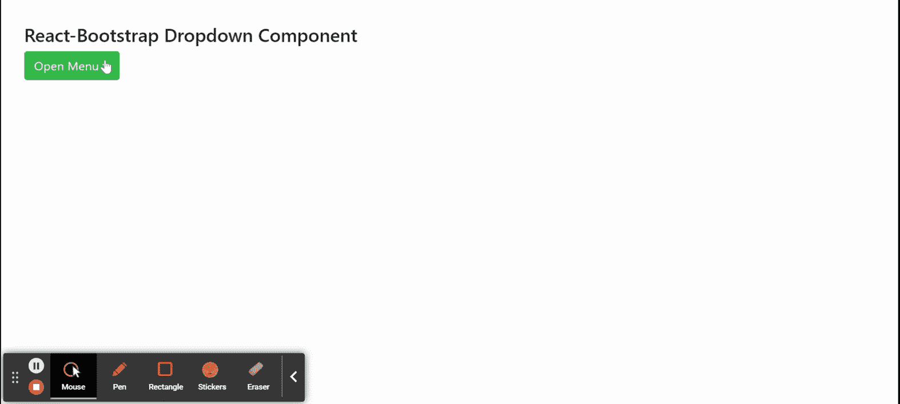

# 反应引导下拉组件

> Original: [https://www.geeksforgeeks.org/react-bootstrap-dropdown-component/](https://www.geeksforgeeks.org/react-bootstrap-dropdown-component/)

Reaction-Bootstrap 是一个前端框架，其设计考虑到了 Reaction。 下拉组件提供了一种方法，当在菜单上单击时，可以在菜单内显示链接列表或更多操作。 我们可以在 ReactJS 中使用以下方法来使用 Reaction-Bootstrap 下拉组件。

**下拉道具：**

*   **alignRight：**它用于将菜单与下拉切换的右侧对齐。
*   **As：**它可以用作此组件的自定义元素类型。
*   **Drop：**它用于确定菜单相对于其切换的位置和方向。
*   **翻转：**用于在参考元素重叠的情况下翻转下拉菜单。
*   **FocusFirstItemOnShow：**打开下拉列表时，它用于控制其焦点行为。
*   **navbar：**该属性默认为 false，指示下拉菜单是否与导航栏相关。
*   **onSelect：**它是在选择菜单项时触发的回调函数。
*   **onTogger：**当需要更改下拉菜单的可见性时，触发回调。
*   **show：**下拉列表是否可见。
*   **bsPrefix：**它是使用高度定制的引导程序css的安全通道。

**拆分按钮道具：**

*   **禁用：**用于禁用该按钮。
*   **href：**它用于将 href 属性传递给底层的非切换按钮。
*   **id：**它是切换按钮的常规 HTML id 属性。
*   **menuAlign：**用于响应对齐下拉菜单。
*   **menuRole：**它用于应用于菜单组件的 ARIA 可访问角色。
*   **onClick：**它是作为非切换按钮的处理程序传递的回调函数。
*   **renderMenuOnMount：**用于指示是否在 DOM 中首次显示下拉菜单之前呈现该下拉菜单。
*   **rootCloseEvent：**当哪个事件在组件外部触发时，它用于关闭组件。
*   **大小：**它表示组件的大小。
*   **target****：**对于非切换按钮，it 是传递给它的n 锚目标。
*   **标题：**用于定义非切换按钮的内容。
*   **toggleLabel：**F或切换按钮，it 是 a可删除标签。
*   **type：**用于传递非切换按钮的类型。
*   **变量：**用来表示它的风格变体。
*   **bsPrefix：**它是使用高度定制的引导程序css的安全通道。

**下拉。切换道具：**

*   **As：**它可以用作此组件的自定义元素类型。
*   **Child BsPrefix：**它用于DropdownButton传递到底层按钮或其他任何按钮。
*   **eventKey：**它用于唯一地标识下拉切换组件。
*   **id：**它用于将 HTMLid 属性传递给此元素。
*   **Split：**它用于将 Split 属性传递给该元素。
*   **bsPrefix：**它是使用高度定制的引导程序css的安全通道。

**下拉菜单道具：**

*   **对齐：**用于下拉菜单将其与容器的指定侧对齐。
*   **alignRight：**用于下拉菜单将其与容器右侧对齐。
*   **As：**它可以用作此组件的自定义元素类型。
*   **翻转：**它用于将下拉菜单翻转到与其相反的位置。
*   **onSelect：**它是在选择菜单项时触发的回调函数。
*   **popperConfig：**用于将弹出器选项集直接传递给弹出器。
*   **renderOnMount：**它用于指示是否在 DOM 中首次显示下拉菜单之前呈现它。
*   **rootCloseEvent：**当哪个事件在组件外部触发时，用于关闭组件。
*   **show：**用于指示下拉菜单是否可见。
*   **bsPrefix：**它是使用高度定制的引导程序css的安全通道。

**下拉。项目道具：**

*   **活动：**它可用于将菜单项标记为活动。
*   **As：**它可以用作此组件的自定义元素类型。
*   **禁用：**用于使菜单项禁用。
*   **eventKey：**用于唯一标识所选菜单项的。
*   **href：**它用于将*href*属性传递给该元素。
*   **onClick：**单击菜单项时触发的回调函数。
*   **onSelect：**它是在选择菜单项时触发的回调函数。
*   **bsPrefix：**它是使用高度定制的引导程序css的安全通道。

**下拉。标题道具：**

*   **As：**它可以用作此组件的自定义元素类型。
*   **bsPrefix：**它是使用高度定制的引导程序css的安全通道。

**下拉。分割道具：**

*   **As：**它可以用作此组件的自定义元素类型。
*   **bsPrefix：**它是使用高度定制的引导程序css的安全通道。

**创建 Reaction 应用程序并安装模块：**

*   **步骤 1：**使用以下命令创建 Reaction 应用程序：

    ```
    npx create-react-app foldername
    ```

*   **步骤 2：**创建项目文件夹(即 foldername**)后，**使用以下命令移动到该文件夹：

    ```
    cd foldername
    ```

*   **步骤 3：**创建 ReactJS 应用程序后，使用以下命令安装所需的****模块：****

    ```
    **npm install react-bootstrap 
    npm install bootstrap**
    ```

******项目结构：**如下所示。****

****

项目结构**** 

******示例：**现在在**App.js**文件中写下以下代码。 在这里，App 是我们编写代码的默认组件。****

## ****App.js****

```
**import React from 'react';
import 'bootstrap/dist/css/bootstrap.css';
import Dropdown from 'react-bootstrap/Dropdown';

export default function App() {
  return (
    <div style={{ display: 'block', 
                  width: 700, 
                  padding: 30 }}>
      <h4>React-Bootstrap Dropdown Component</h4>
      <Dropdown>
        <Dropdown.Toggle variant="success">
          Open Menu
        </Dropdown.Toggle>
        <Dropdown.Menu>
          <Dropdown.Item href="#">
            Home Page
          </Dropdown.Item>
          <Dropdown.Item href="#">
            Settings
          </Dropdown.Item>
          <Dropdown.Item href="#">
            Logout
          </Dropdown.Item>
        </Dropdown.Menu>
      </Dropdown>
    </div>
  );
}**
```

******运行应用程序的步骤：**使用以下命令从项目根目录运行应用程序：****

```
**npm start**
```

******输出：**现在打开浏览器，转到***http://localhost:3000/***，您将看到以下输出：****

********

******引用：**[https://react-bootstrap.github.io/components/dropdowns/](https://react-bootstrap.github.io/components/dropdowns/)****