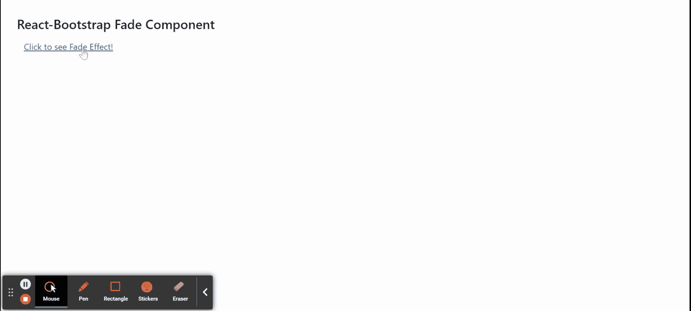
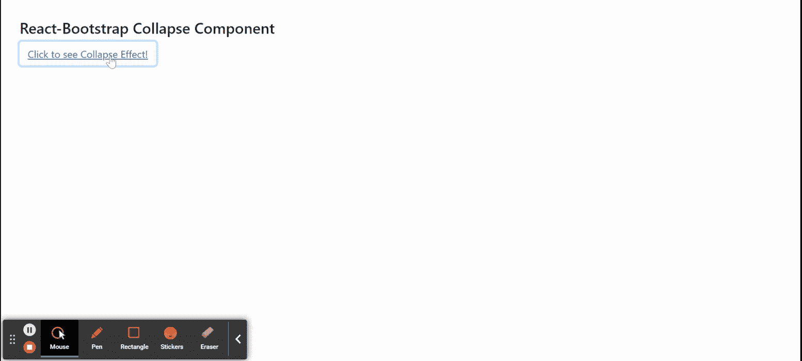

# Reaction-Bootstrap 淡入淡出和折叠组件

> Original: [https://www.geeksforgeeks.org/react-bootstrap-fade-and-collapse-component/](https://www.geeksforgeeks.org/react-bootstrap-fade-and-collapse-component/)

Reaction-Bootstrap 是一个前端框架，其设计考虑到了 Reaction。 **淡入淡出**组件提供了一种向子组件或元素添加淡入淡出动画的方法。 **折叠**组件提供了一种将折叠切换动画添加到组件或元素的方法我们可以在 ReactJS 中使用以下方法来使用 Reaction-Bootstrap 淡入淡出和折叠组件。

**淡出道具：**

*   **显示：**当组件安装时，它用于运行淡入动画。
*   **in：**用于显示组件。
*   **mount OnEnter：**它用于在组件等待时装载组件，直到触发第一个*进入*转换。
*   **onEnter：**它是在组件淡入之前触发的回调函数。
*   **onEntered：**它是在 HAS 组件淡入后触发的回调函数。
*   **onEnching：**它是组件开始淡入后触发的回调函数。
*   **onExit：**它是在组件淡出之前触发的回调函数。
*   **onExited：**它是在组件淡出后触发的回调函数。
*   **onExiting：**它是组件开始淡出后触发的回调函数。
*   **超时：**表示淡入淡出动画的时长，单位为毫秒。
*   **Unmount tOnExit：**用于卸载组件。

**折叠道具：**

*   **显示：**当组件安装时，它用于运行展开动画。
*   **子元素：**用于定义该组件的子元素。
*   **className：**用于为该组件的样式添加类名。
*   **尺寸：**表示高度和宽度形式的尺寸。
*   **getDimensionValue：**它是一个返回动画 DOM 节点的宽度或高度的函数。
*   **in：**用于显示组件。
*   **mount OnEnter：**它用于在组件等待时装载组件，直到触发第一个*进入*转换。
*   **onEnter：**它是在组件展开之前触发的回调函数。
*   **onEntered：**它是组件展开后触发的回调函数。
*   **onEnching：**它是组件开始展开后触发的回调函数。
*   **onExit：**它是在组件折叠之前触发的回调函数。
*   **onExited：**它是组件折叠后触发的回调函数。
*   **onExiting：**它是组件开始崩溃后触发的回调函数。
*   **角色：**定义可折叠元素的 ARIA 角色。
*   **超时：**表示折叠动画的时长，单位为毫秒。
*   **Unmount tOnExit：**用于卸载组件。

**创建 Reaction 应用程序并安装模块：**

**步骤 1：**使用以下命令创建 Reaction 应用程序：

```
npx create-react-app foldername
```

**步骤 2：**创建项目文件夹(即文件夹名**)后，**使用以下命令移动到该文件夹：

```
cd foldername
```

**步骤 3：**创建 ReactJS 应用程序后，使用以下命令安装所需的****模块：****

```
**npm install react-bootstrap 
npm install bootstrap**
```

******项目结构：**如下所示。****

****

项目结构**** 

******淡入组件示例：**现在在**App.js**文件中写下以下代码。 在这里，App 是我们编写代码的默认组件。****

******文件名：App.js******

## ****JavaScript****

```
**import React, { useState } from 'react';
import 'bootstrap/dist/css/bootstrap.css';
import Button from 'react-bootstrap/Button'
import Fade from 'react-bootstrap/Fade'

export default function App() {

  const [open, setOpen] = useState(false);

  return (
    <div style={{ display: 'block',
                  width: 700, padding: 30 }}>
      <h4>React-Bootstrap Fade Component</h4>
      <div style={{ width: 660, height: 'auto' }}>
        <Button
          variant="link"
          onClick={() => setOpen(!open)}
          aria-expanded={open}
          aria-controls="fadeID"
        >
          Click to see Fade Effect!
      </Button>
        <Fade in={open}>
          <div id="fadeID"
            style={{
              width: 300,
              textAlign: 'justify'
            }}
          >
            Greetings from GeeksforGeeks, How are you?
            Stay safe
            Always keep yourself health.
            Study and work hard.
          </div>
        </Fade>
      </div>
    </div>
  );
}**
```

******运行应用程序的步骤：**使用以下命令从项目根目录运行应用程序：****

```
**npm start**
```

******输出：**现在打开浏览器，转到***http://localhost:3000/***，您将看到以下输出：****

********

******折叠组件示例：**现在在**App.js**文件中写下以下代码。 在这里，App 是我们编写代码的默认组件。****

******文件名：App.js******

## ****JavaScript****

```
**import React, { useState } from 'react';
import 'bootstrap/dist/css/bootstrap.css';
import Button from 'react-bootstrap/Button'
import Collapse from 'react-bootstrap/Collapse'

export default function App() {

  const [open, setOpen] = useState(false);

  return (
    <div style={{ display: 'block',
                  width: 700, padding: 30 }}>
      <h4>React-Bootstrap Collapse Component</h4>
      <div style={{ width: 660, height: 'auto' }}>
        <Button
          variant="link"
          onClick={() => setOpen(!open)}
          aria-expanded={open}
          aria-controls="collapseID"
        >
          Click to see Collapse Effect!
      </Button>
        <Collapse in={open}>
          <div id="collapseID"
            style={{
              width: 300,
              textAlign: 'justify'
            }}
          >
            Greetings from GeeksforGeeks, How are you?
            Stay safe
            Always keep yourself health.
            Study and work hard.
          </div>
        </Collapse>
      </div>
    </div>
  );
}**
```

******运行应用程序的步骤：**使用以下命令从项目根目录运行应用程序：****

```
**npm start**
```

******输出：**现在打开浏览器，转到***http://localhost:3000/***，您将看到以下输出：****

********

******引用：******

*   ****[https：//react-bootstrap.github.io/utilities/transitions/#collapse](https://react-bootstrap.github.io/utilities/transitions/#collapse)****
*   ****[https：//react-bootstrap.github.io/utilities/transitions/#fade](https://react-bootstrap.github.io/utilities/transitions/#fade)****