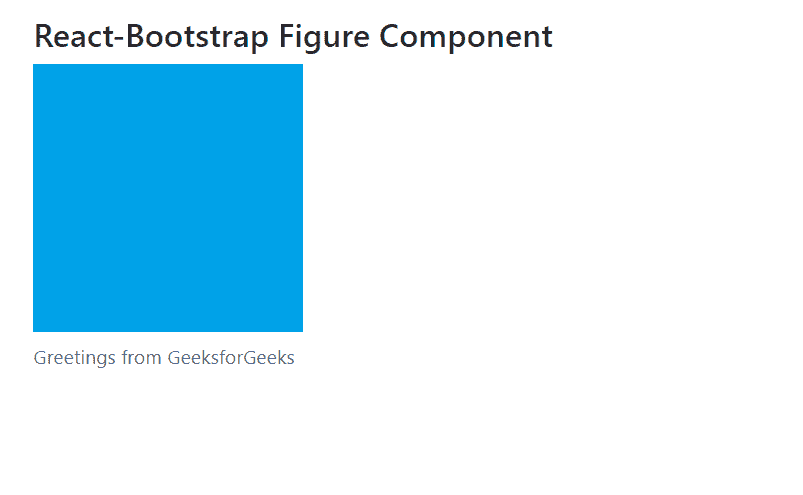

# Reaction-Bootstrap Figures 组件

> Original: [https://www.geeksforgeeks.org/react-bootstrap-figures-component/](https://www.geeksforgeeks.org/react-bootstrap-figures-component/)

Reaction-Bootstrap 是一个前端框架，其设计考虑到了 Reaction。 图形组件为提供了一种方法，可以将一段内容与我们的图像一起显示在和中，例如，如果我们想要显示带有可选标题的图像，则可以使用、。 我们可以在 ReactJS 中使用以下方法来使用 Reaction-Bootstrap 图组件。

**图形道具：**

*   **As：**它可以用作此组件的自定义元素类型。
*   **bsPrefix：**它是使用高度定制的引导程序css的安全通道。

**图 Image****道具：**它不需要任何道具。

**图标题****道具：**

*   **As：**它可以用作此组件的自定义元素类型。
*   **bsPrefix：**它是使用高度自定义的引导程序CSS 的安全通道

**创建 Reaction 应用程序并安装模块：**

*   **步骤 1：**使用以下命令创建 Reaction 应用程序：

    ```jsx
    npx create-react-app foldername
    ```

*   **步骤 2：**创建项目文件夹(即 foldername**)后，**使用以下命令移动到该文件夹：

    ```jsx
    cd foldername
    ```

*   **步骤 3：**创建 ReactJS 应用程序后，使用以下命令安装所需的****模块：****

    ```jsx
    **npm install react-bootstrap 
    npm install bootstrap**
    ```

******项目结构：**如下所示。****

****

项目结构**** 

******示例：**现在在**App.js**文件中写下以下代码。 在这里，App 是我们编写代码的默认组件。****

## ****App.js****

```jsx
**import React from 'react';
import 'bootstrap/dist/css/bootstrap.css';
import Figure from 'react-bootstrap/Figure';

export default function App() {
  return (
    <div style={{ display: 'block',
                  width: 700,
                  padding: 30 }}>
      <h4>React-Bootstrap Figure Component</h4>
      <Figure>
        <Figure.Image
          width={200}
          height={200}
          alt="200x200"
src="https://media.geeksforgeeks.org/wp-content/uploads/20210425000233/test-300x297.png"
        />
        <Figure.Caption>
          Greetings from GeeksforGeeks
        </Figure.Caption>
      </Figure>
    </div>
  );
}**
```

******运行应用程序的步骤：**使用以下命令从项目根目录运行应用程序：****

```jsx
**npm start**
```

******输出：**现在打开浏览器，转到***http://localhost:3000/***，您将看到以下输出：****

********

******引用：**[https://react-bootstrap.github.io/components/figures/](https://react-bootstrap.github.io/components/figures/)****