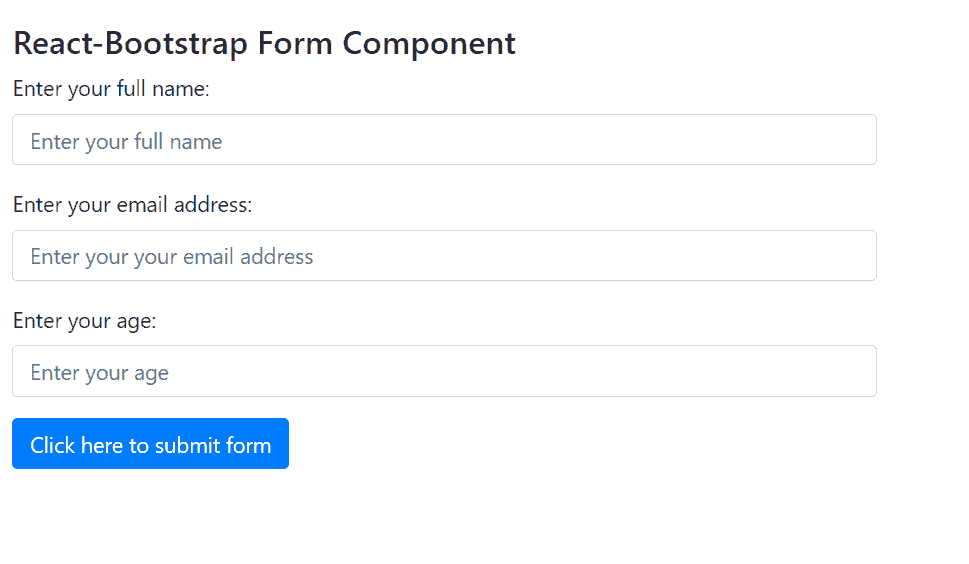

# 反应引导表单组件

> Original: [https://www.geeksforgeeks.org/react-bootstrap-form-component/](https://www.geeksforgeeks.org/react-bootstrap-form-component/)

Reaction-Bootstrap 是一个前端框架，其设计考虑到了 Reaction。 表单组件提供了制作表单并接受用户输入，然后将其转发到服务器进行进一步数据处理的方法。 我们可以在 ReactJS 中使用以下方法来使用 Reaction-Bootstrap 表单组件。

**造型道具：**

*   **ref：**用于将 form-ref 转发到底层元素。
*   **As：**它可以用作此组件的自定义元素类型。
*   **inline：**用于在单个水平行上显示一系列标签、按钮等。
*   **已验证：**它用于将表单标记为已用真/假值验证。
*   **bsPrefix：**它是使用高度定制的引导程序css的安全通道。

**表**

*   **ref：**用于将 form-ref 转发到底层元素。
*   **As：**它可以用作此组件的自定义元素类型。
*   **列：**它用于将 FormLabel 呈现为<列>组件。
*   **htmlFor：**用于使用<FormGroup>中的control Id(如果未明确指定)。
*   **srOnly：**它用于直观地隐藏标签。
*   **bsPrefix：**它是使用高度定制的引导程序css的安全通道。

**窗体组道具：**

*   **ref：**用于将 form-ref 转发到底层元素。
*   **As：**它可以用作此组件的自定义元素类型。
*   **control Id：**用于设置<FormControl>上的 id 和<FormGroup.Label>组件上的 htmlFor。
*   **bsPrefix：**它是使用高度定制的引导程序css的安全通道。

**表单。行道具：**

*   **As：**它可以用作此组件的自定义元素类型。
*   **bsPrefix：**它是使用高度定制的引导程序css的安全通道。

**表单。文本道具：**

*   **ref：**用于将 formText 引用转发到底层元素。
*   **As：**它可以用作此组件的自定义元素类型。
*   **静音：**它用于向其添加文本静音类。
*   **bsPrefix：**它是使用高度定制的引导程序css的安全通道。

**表单。检查道具：**

*   **As：**它可以用作此组件的自定义元素类型。
*   **id：**它是用于标识的普通 HTML*id*属性。
*   **isInvalid：**用于手动将输入的样式设置为无效。
*   **isStatic：**用于添加*Position-Static*样式。
*   **isValid：**用于手动设置输入样式为有效。
*   **类型：**用于可勾选类型。
*   **bsPrefix：**它是使用高度定制的引导程序css的安全通道。
*   **bsCustomPrefix：**F或自定义控件，it 用作单独的 bsPrefix。

**表单控制道具：**

*   **ref：**用于将 form-ref 转发到底层元素。
*   **As：**它可以用作此组件的自定义元素类型。
*   **Custom：**它用于使用 Bootstrap 的自定义表单元素。
*   **禁用：**用于 m禁用控件。
*   **htmlSize：**对于底层元素，它用于其大小属性。
*   **id：**它用于使用<窗体组>中的控件 ID
*   **isInvalid：**对于控件，它用于添加无效的验证样式。
*   **isValid：**对于控件，它用于添加有效的验证样式。
*   **onChange：**它是值更改时触发的回调函数。
*   **明文：**用于将输入后缀为明文。
*   **readOnly：**用于使控件处于只读状态。
*   **大小：**表示输入大小。
*   **类型：**用于表示输入的 HTML 输入类型。
*   **value：**对于底层输入，它用作其 value 属性。
*   **bsPrefix：**它是使用高度定制的引导程序css的安全通道。
*   **bsCustomPrefix：**对于自定义控件，it 是单独的 bsPrefix。

**创建 Reaction 应用程序并安装模块：**

*   **步骤 1：**使用以下命令创建 Reaction 应用程序：

    ```jsx
    npx create-react-app foldername
    ```

*   **步骤 2：**创建项目文件夹(即 foldername**)后，**使用以下命令移动到该文件夹：

    ```jsx
    cd foldername
    ```

*   **步骤 3：**创建 ReactJS 应用程序后，使用以下命令安装所需的****模块：****

    ```jsx
    **npm install react-bootstrap 
    npm install bootstrap**
    ```

******项目结构：**如下所示。****

****

项目结构**** 

******示例：**现在在**App.js**文件中写下以下代码。 在这里，App 是我们编写代码的默认组件。****

## ****App.js****

```jsx
**import React from 'react';
import 'bootstrap/dist/css/bootstrap.css';
import Form from 'react-bootstrap/Form';
import Button from 'react-bootstrap/Button';

export default function App() {
  return (
    <div style={{ display: 'block', 
                  width: 700, 
                  padding: 30 }}>
      <h4>React-Bootstrap Form Component</h4>
      <Form>
      <Form.Group>
          <Form.Label>Enter your full name:</Form.Label>
          <Form.Control type="text" 
                        placeholder="Enter your full name" />
        </Form.Group>
        <Form.Group>
          <Form.Label>Enter your email address:</Form.Label>
          <Form.Control type="email" 
                        placeholder="Enter your your email address" />
        </Form.Group>
        <Form.Group>
          <Form.Label>Enter your age:</Form.Label>
          <Form.Control type="number" placeholder="Enter your age" />
        </Form.Group>
        <Button variant="primary" type="submit">
           Click here to submit form
        </Button>
      </Form>
    </div>
  );
}**
```

******运行应用程序的步骤：**使用以下命令从项目根目录运行应用程序：****

```jsx
**npm start**
```

******输出：**现在打开浏览器，转到***http://localhost:3000/***，您将看到以下输出：****

********

******引用：**[https://react-bootstrap.github.io/components/forms/](https://react-bootstrap.github.io/components/forms/)****