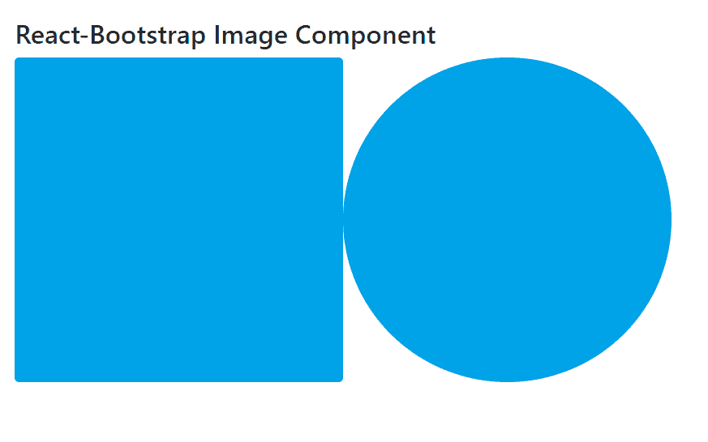

# Reaction-Bootstrap 映像组件

> Original: [https://www.geeksforgeeks.org/react-bootstrap-image-component/](https://www.geeksforgeeks.org/react-bootstrap-image-component/)

Reaction-Bootstrap 是一个前端框架，其设计考虑到了 Reaction。 Image Component提供了一种方法，可以在此 Image Component的帮助下将图像放入我们的应用程序中。 我们可以在 ReactJS 中使用以下方法来使用 Reaction-Bootstrap Image 组件。

**图像道具：**

*   **流体：**它提供了一种将我们的图像设置为流体图像的方法。
*   **圆形：**它提供了一种将图像设置为圆形的方法。
*   **round dedCircle：**它提供了一种将图像设置为圆形的方法。
*   **缩略图：**它提供了一种将图像设置为缩略图形状的方法。
*   **bsPrefix：**它是使用高度定制的引导程序css的安全通道。

**创建 Reaction 应用程序并安装模块：**

*   **步骤 1：**使用以下命令创建 Reaction 应用程序：

    ```
    npx create-react-app foldername
    ```

*   **步骤 2：**创建项目文件夹(即 foldername**)后，**使用以下命令移动到该文件夹：

    ```
    cd foldername
    ```

*   **步骤 3：**创建 ReactJS 应用程序后，使用以下命令安装所需的****模块：****

    ```
    **npm install react-bootstrap 
    npm install bootstrap**
    ```

******项目结构：**如下所示。****

****

项目结构**** 

******示例：**现在在**App.js**文件中写下以下代码。 在这里，App 是我们编写代码的默认组件。****

## ****App.js****

```
**import React from "react";
import "bootstrap/dist/css/bootstrap.css";

import Image from "react-bootstrap/Image";

export default function App() {
  return (
    <div style={{ display: "block", width: 700, padding: 30 }}>
      <h4>React-Bootstrap Image Component</h4>
      <Image
        src=
"https://media.geeksforgeeks.org/wp-content/uploads/20210425000233/test-300x297.png"
        rounded
      />
      <Image
        src=
"https://media.geeksforgeeks.org/wp-content/uploads/20210425000233/test-300x297.png"
        roundedCircle
      />
    </div>
  );
}**
```

******运行应用程序的步骤：**使用以下命令从项目根目录运行应用程序：****

```
**npm start**
```

******输出：**现在打开浏览器，转到***http://localhost:3000/***，您将看到以下输出：****

********

******引用：**[https://react-bootstrap.github.io/components/images/](https://react-bootstrap.github.io/components/images/)****