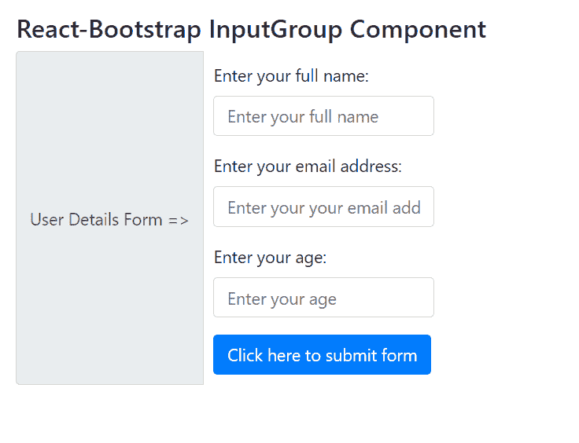

# Reaction-Bootstrap InputGroup 组件

> Original: [https://www.geeksforgeeks.org/react-bootstrap-inputgroup-component/](https://www.geeksforgeeks.org/react-bootstrap-inputgroup-component/)

Reaction-Bootstrap 是一个前端框架，其设计考虑到了 Reaction。 InputGroup 组件提供了在输入的两侧或两侧放置一个附加组件或按钮的方法。 我们可以在 ReactJS 中使用以下方法来使用 Reaction-Bootstrap InputGroup 组件。

**输入组道具：**

*   **As：**它可以用作此组件的自定义元素类型。
*   **HasValidation****：**在表单验证中使用它来处理输入的圆角。
*   **大小：**用于控制按钮和表单元素的大小。
*   **BsPrefix：**它是使用高度定制的引导程序css的安全通道。

**创建 Reaction 应用程序并安装模块：**

*   **步骤 1：**使用以下命令创建 Reaction 应用程序：

    ```jsx
    npx create-react-app foldername
    ```

*   **步骤 2：**创建项目文件夹(即文件夹名**)后，**使用以下命令移动到该文件夹：

    ```jsx
    cd foldername
    ```

*   **步骤 3：**创建 ReactJS 应用程序后，使用以下命令安装所需的****模块：****

    ```jsx
    **npm install react-bootstrap 
    npm install bootstrap**
    ```

******项目结构：**如下所示。****

****

项目结构**** 

******示例：**现在在**App.js**文件中写下以下代码。 在这里，App 是我们编写代码的默认组件。****

## ****App.js****

```jsx
**import React from "react";
import "bootstrap/dist/css/bootstrap.css";
import InputGroup from "react-bootstrap/InputGroup";
import Button from "react-bootstrap/Button";
import Form from "react-bootstrap/Form";

export default function App() {
  return (
    <div style={{ display: "block", width: 700, padding: 30 }}>
      <h4>React-Bootstrap InputGroup Component</h4>
      <InputGroup className="mb-3">
        <InputGroup.Prepend>
          <InputGroup.Text>User Details Form =>
           </InputGroup.Text>
        </InputGroup.Prepend>
        <Form style={{ padding: 10 }}>
          <Form.Group>
            <Form.Label>Enter your full name:</Form.Label>
            <Form.Control type="text"
                          placeholder="Enter your full name" />
          </Form.Group>
          <Form.Group>
            <Form.Label>Enter your email address:</Form.Label>
            <Form.Control
              type="email"
              placeholder="Enter your your email address"
            />
          </Form.Group>
          <Form.Group>
            <Form.Label>Enter your age:</Form.Label>
            <Form.Control type="number" 
                          placeholder="Enter your age" />
          </Form.Group>
          <Button variant="primary" type="submit">
            Click here to submit form
          </Button>
        </Form>
      </InputGroup>
    </div>
  );
}**
```

******运行应用程序的步骤：**使用以下命令从项目根目录运行应用程序：****

```jsx
**npm start**
```

******输出：**现在打开浏览器，转到***http://localhost:3000/***，您将看到以下输出：****

********

******引用：**[https://react-bootstrap.github.io/components/input-group/](https://react-bootstrap.github.io/components/input-group/)****