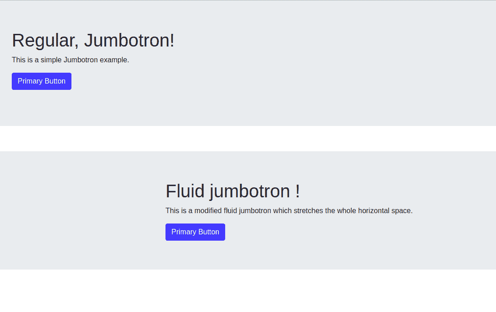

# Reaction-Bootstrap Jumbotron 组件

> Original: [https://www.geeksforgeeks.org/react-bootstrap-jumbotron-component/](https://www.geeksforgeeks.org/react-bootstrap-jumbotron-component/)

Reaction-Bootstrap 是一个前端框架，其设计考虑到了 Reaction。 Bootstrap 是为 Reaction 重新构建和修改的，因此被称为 Reaction-Bootstrap。

Jumbotron 主要用于展示网站的核心和主要内容。

**巨型加速器道具：**

*   **As：**它可以用作此组件的自定义元素类型。
*   **流体：**此属性用于**m**使巨型加速器全宽且没有圆角。
*   **bsPrefix：**它是一个用于使用高度定制的引导 CSS 的逃生舱。

**创建 Reaction 应用程序并安装模块：**

*   **步骤 1：**使用以下命令创建 Reaction 应用程序：

    ```jsx
    npx create-react-app foldername
    ```

*   **步骤 2：**创建项目文件夹(即 foldername**)后，**使用以下命令移动到该文件夹：

    ```jsx
    cd foldername
    ```

*   **步骤 3：**创建 ReactJS 应用程序后，使用以下命令安装所需的模块：

    ```jsx
    npm install react-bootstrap bootstrap
    ```

*   **第四步：**在*index.js*文件中添加以下行：

    ```jsx
    import 'bootstrap/dist/css/bootstrap.css';
    ```

**项目结构：**如下所示。


**示例：**现在在**App.js**文件中写下以下代码。 在这里，App 是我们编写代码的默认组件。

## App.js

```jsx
import Jumbotron from 'react-bootstrap/Jumbotron';
import Button from 'react-bootstrap/Button';
import Container from 'react-bootstrap/Container'

import React from 'react';

export default function JumbotronExample() {
  return (
    <>
    <Jumbotron>
      <h1>Regular, Jumbotron!</h1>
      <p>
        This is a simple Jumbotron example.
      </p>

      <p>
        <Button variant="primary">
          Primary Button
        </Button>
      </p>
    </Jumbotron>
    <br/>
    <Jumbotron fluid>
      <Container>
        <h1>Fluid jumbotron !</h1>
        <p>
           This is a modified fluid jumbotron which
           stretches the whole horizontal space.    
        </p>
        <Button variant="primary">
         Primary Button
        </Button>
      </Container>
    </Jumbotron>
    </>
  );
}
```

**运行应用程序的步骤：**使用以下命令从项目根目录运行应用程序：

```jsx
npm start
```

**输出：**现在打开浏览器，转到***http://localhost:3000/***，您将看到以下输出。



**参考链接：**[**https://react-bootstrap.netlify.app/components/jumbotron/**](https://react-bootstrap.netlify.app/components/jumbotron/)