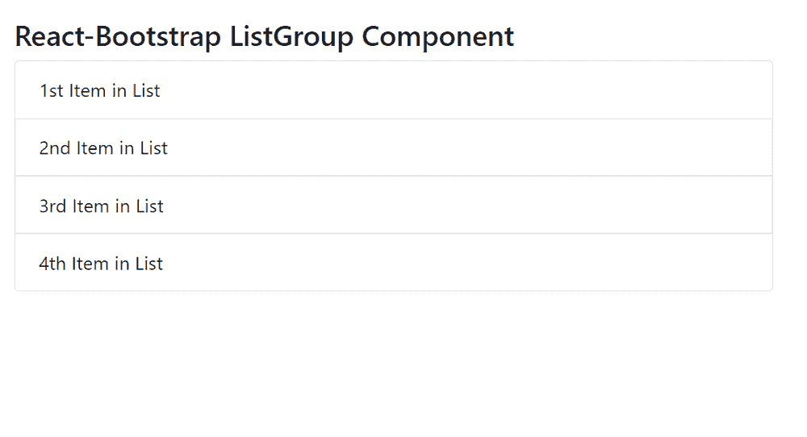

# 加入时间：清华大学 2007 年 01 月 25 日下午 3：33

> Original: [https://www.geeksforgeeks.org/react-bootstrap-listgroup-component/](https://www.geeksforgeeks.org/react-bootstrap-listgroup-component/)

Reaction-Bootstrap 是一个前端框架，其设计考虑到了 Reaction。 ListGroup 组件为提供了一种显示一系列内容的方法。 它是一个功能强大且灵活组件。 我们可以在 ReactJS 中使用以下方法来使用 Reaction-Bootstrap ListGroup 组件。

加入时间：清华大学 2007 年 01 月 25 日下午 3：33

*   **activeKey：**用于将 ListGroup 项标记为活动。
*   **As：**它可以用作此组件的自定义元素类型。
*   **defaultActiveKey****：**表示默认的活动键。
*   **水平：**用于 c将列表组项目的流向从垂直对齐更改为水平。
*   **onSelect：**它是在选择 ListGroup 项目时触发的回调。
*   **变体：**用于dd列表组的变体。
*   **bsPrefix：**它是使用高度定制的引导程序css的安全通道。

**ListGroup.Item 道具：**

*   **操作：**用于将 ListGroupItem 标记为可操作。
*   **活动：**用于将列表组项目标记为活动。
*   **As：**它可以用作此组件的自定义元素类型。
*   **禁用：**用于使列表项状态为禁用。
*   **eventKey：**用于唯一标识该组件
*   **href：**它用于传递此元素的 href 属性。
*   **onClick：**它是在单击 ListGroup 项时触发的回调。
*   **变体：**用于dd列表组项目的变体。
*   **bsPrefix：**它是使用高度定制的引导程序css的安全通道。

**创建 Reaction 应用程序并安装模块：**

*   **步骤 1：**使用以下命令创建 Reaction 应用程序：

    ```jsx
    npx create-react-app foldername
    ```

*   **步骤 2：**创建项目文件夹(即 foldername**)后，**使用以下命令移动到该文件夹：

    ```jsx
    cd foldername
    ```

*   **步骤 3：**创建 ReactJS 应用程序后，使用以下命令安装所需的****模块：****

    ```jsx
    **npm install react-bootstrap 
    npm install bootstrap**
    ```

******项目结构：**如下所示。****

****

项目结构**** 

******示例：**现在在**App.js**文件中写下以下代码。 在这里，App 是我们编写代码的默认组件。****

## ****App.js****

```jsx
**import React from 'react';
import 'bootstrap/dist/css/bootstrap.css';
import ListGroup from 'react-bootstrap/ListGroup';

export default function App() {
  return (
    <div style={{ display: 'block', width: 700, padding: 30 }}>
      <h4>React-Bootstrap ListGroup Component</h4>
      <ListGroup>
        <ListGroup.Item>1st Item in List</ListGroup.Item>
        <ListGroup.Item>2nd Item in List</ListGroup.Item>
        <ListGroup.Item>3rd Item in List</ListGroup.Item>
        <ListGroup.Item>4th Item in List</ListGroup.Item>
      </ListGroup>
    </div>
  );
}**
```

******运行应用程序的步骤：**使用以下命令从项目根目录运行应用程序：****

```jsx
**npm start**
```

******输出：**现在打开浏览器，转到***http://localhost:3000/***，您将看到以下输出：****

********

******引用：**[https://react-bootstrap.github.io/components/list-group/](https://react-bootstrap.github.io/components/list-group/)****