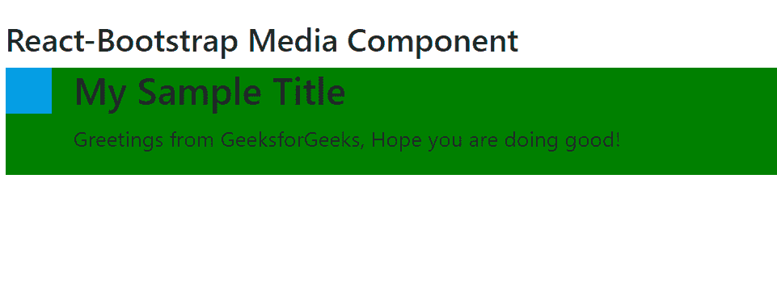

# Reaction-Bootstrap 媒体组件

> Original: [https://www.geeksforgeeks.org/react-bootstrap-media-component/](https://www.geeksforgeeks.org/react-bootstrap-media-component/)

Reaction-Bootstrap 是一个前端框架，其设计考虑到了 Reaction。 媒体组件为提供了一种保存图像和文本的方式，因为它是仅为此目的而设计的容器。 我们可以在 ReactJS 中使用以下方法来使用 Reaction-Bootstrap Media 组件。

**媒体道具：**

*   **As：**它可以用作此组件的自定义元素类型。
*   **bsPrefix：**它是使用高度定制的引导程序css的安全通道。

**媒体。身体道具：**它不需要任何道具。

**创建 Reaction 应用程序并安装模块：**

*   **步骤 1：**使用以下命令创建 Reaction 应用程序：

    ```jsx
    npx create-react-app foldername
    ```

*   **步骤 2：**创建项目文件夹(即文件夹名**)后，**使用以下命令移动到该文件夹：

    ```jsx
    cd foldername
    ```

*   **步骤 3：**创建 ReactJS 应用程序后，使用以下命令安装所需的****模块：****

    ```jsx
    **npm install react-bootstrap 
    npm install bootstrap**
    ```

******项目结构：**如下所示。****

****

项目结构**** 

******示例：**现在在**App.js**文件中写下以下代码。 在这里，App 是我们编写代码的默认组件。****

## ****App.js****

```jsx
**import React from 'react';
import 'bootstrap/dist/css/bootstrap.css';
import Media from 'react-bootstrap/Media';

export default function App() {
  return (
    <div style={{ display: 'block', 
                  width: 700, padding: 30 }}>
      <h4>React-Bootstrap Media Component</h4>
      <Media
      style={{
        backgroundColor: 'green'
      }}>
        
        <Media.Body>
          <h3>My Sample Title</h3>
          <p>
             Greetings from GeeksforGeeks, 
             Hope you are doing good!
          </p>

        </Media.Body>
      </Media>
    </div>
  );
}**
```

******运行应用程序的步骤：**使用以下命令从项目根目录运行应用程序：****

```jsx
**npm start**
```

******输出：**现在打开浏览器，转到***http://localhost:3000/***，您将看到以下输出：****

********

******引用：**[https://react-bootstrap.github.io/layout/media/](https://react-bootstrap.github.io/layout/media/)****