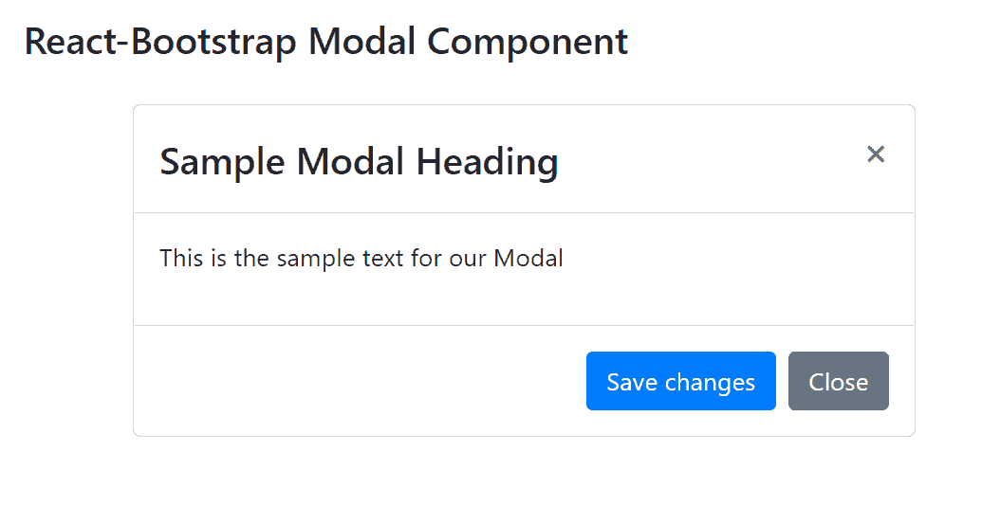

# Reaction-Bootstrap 模态组件

> Original: [https://www.geeksforgeeks.org/react-bootstrap-modal-component/](https://www.geeksforgeeks.org/react-bootstrap-modal-component/)

Reaction-Bootstrap 是一个前端框架，其设计考虑到了 Reaction。 模态组件提供了一种向我们的网站添加对话框以获得用户通知、显示信息、或向用户显示完全自定义信息的方法。 我们可以在 ReactJS 中使用以下方法来使用 Reaction-Bootstrap Modal 组件。

**模态道具：**

*   **动画：**用于在 Modal 打开和关闭时添加淡入淡出动画。
*   **自动聚焦：**当模式打开时，它用于自动将焦点转移到自身，并在此属性设置为 true 的情况下关闭时用最后一个聚焦的元素替换它。
*   **背景：**用于包含背景组件。
*   **backdropClassName：**它用于向*添加一个可选的额外类名。modal-backdrop：*
*   **居中：**用于将窗口中打开的对话框垂直居中。
*   **容器：**它是容器属性，类型为*any。*
*   **aria-labeldby：**它是由属性标记的*aria-labeldby，类型为*any。**
*   **contentClassName：**它用于向*添加一个可选的额外类名。modal-content*
*   **DialogAs：**它是一种组件类型，有助于提供模态内容标记。
*   **DialogClassName：**它是对话框的类名。
*   **EnforceFocus：**当模式设置为 true 时，模式将阻止焦点在打开时离开模式。
*   **键盘：**当按下退出键时，它关闭模式。
*   **管理器：**为了跟踪和管理开放模态的状态，使用了 ModalManager 实例。
*   **onEnter：**用于在进入 Modal 之前触发回调。
*   **onEntered：**用于在 Modal 转换完成后触发回调。
*   **onEnching：**用于在 Modal 开始过渡时触发回调。
*   **onEscapeKeyDown：**用于在按下退出键时触发回调。
*   **onExit：**用于在 Modal 转换出之前触发回调。
*   **onExited：**用于在 Modal 转出后触发回调。
*   **onExiting：**用于在 Modal 开始过渡时触发回调。
*   **onHide：**点击 Header 非静态背景或者 closeButton 时触发回调。
*   **onShow：**用于在通道打开时触发回调。
*   **restoreFocus：**它用于在隐藏模式时将焦点恢复到先前聚焦的元素。
*   **restoreFocusOptions：**当 restoreFocus 设置为 true 时，它是传递给焦点函数的选项集。
*   **可滚动：**它在溢出条件下使用，它允许滚动<Modal.Body>而不是整个模式。
*   **show：**用于显示模态。
*   **大小：**它用于呈现我们的模型的大小。
*   **bsPrefix：**它是使用高度定制的引导程序css的安全通道。

**模式对话框道具：**

*   **居中：**表示组件是否垂直居中。
*   **contentClassName：**添加内容类名进行样式化。
*   **可滚动：**它用于允许滚动<modal.Body>，而不是整个模式。
*   **大小：**它用于呈现我们的模型的大小。
*   **bsPrefix：**它是使用高度定制的引导程序css的安全通道。

**Modal.Header 道具：**

*   **closeButton：**用来指定模式是否应该有关闭按钮。
*   **closeLabel：**它用于为关闭按钮 p提供一个可访问的标签。
*   **onHide：**它是在单击关闭按钮时触发回调。
*   **bsPrefix：**它是使用高度定制的引导程序css的安全通道。

**模态。标题道具：**

*   **As：**它可以用作此组件的自定义元素类型。
*   **bsPrefix：**它是使用高度定制的引导程序css的安全通道。

**模态。主体道具：**

*   **As：**它可以用作此组件的自定义元素类型。
*   **bsPrefix：**它是使用高度定制的引导程序css的安全通道。

**模态。脚注道具：**

*   **As：**它可以用作此组件的自定义元素类型。
*   **bsPrefix：**它是使用高度定制的引导程序css的安全通道。

**创建 Reaction 应用程序并安装模块：**

*   **步骤 1：**使用以下命令创建 Reaction 应用程序：

    ```jsx
    npx create-react-app foldername
    ```

*   **步骤 2：**创建项目文件夹(即 foldername**)后，**使用以下命令移动到该文件夹：

    ```jsx
    cd foldername
    ```

*   **步骤 3：**创建 ReactJS 应用程序后，使用以下命令安装所需的****模块：****

    ```jsx
    **npm install react-bootstrap 
    npm install bootstrap**
    ```

******项目结构：**如下所示。****

****

项目结构**** 

******示例：**现在在**App.js**文件中写下以下代码。 在这里，App 是我们编写代码的默认组件。****

## ****App.js****

```jsx
**import React from 'react';
import 'bootstrap/dist/css/bootstrap.css';
import Modal from 'react-bootstrap/Modal';
import Button from 'react-bootstrap/Button';

export default function App() {
  return (
    <div style={{ display: 'block',
                  width: 700, 
                  padding: 30 }}>
      <h4>React-Bootstrap Modal Component</h4>
      <Modal.Dialog>
        <Modal.Header closeButton>
          <Modal.Title>
           Sample Modal Heading
          </Modal.Title>
        </Modal.Header>
        <Modal.Body>
          <p>
           This is the sample text for our Modal
          </p>
        </Modal.Body>
        <Modal.Footer>
          <Button variant="primary">
           Save changes
          </Button>
          <Button variant="secondary">
           Close
          </Button>
        </Modal.Footer>
      </Modal.Dialog>
    </div>
  );
}**
```

******运行应用程序的步骤：**使用以下命令从项目根目录运行应用程序：****

```jsx
**npm start**
```

******输出：**现在打开浏览器，转到***http://localhost:3000/***，您将看到以下输出：****

********

******引用：**[https://react-bootstrap.github.io/components/modal/](https://react-bootstrap.github.io/components/modal/)****