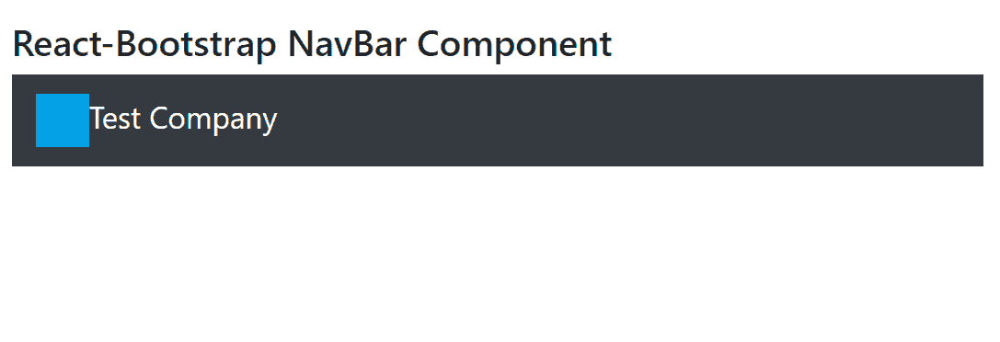

# Reaction-Bootstrap 导航栏组件

> Original: [https://www.geeksforgeeks.org/react-bootstrap-navbar-component/](https://www.geeksforgeeks.org/react-bootstrap-navbar-component/)

Reaction-Bootstrap 是一个前端框架，其设计考虑到了 Reaction。 导航栏组件是一个响应迅速且功能强大的导航头。 它的支持导航、品牌推广和许多其他相关功能。 我们可以在 ReactJS 中使用以下方法来使用 Reaction-Bootstrap NavBar 组件。

**导航栏道具：**

*   **As：**它可以用作此组件的自定义元素类型。
*   **bg：**用于添加*bg-**实用程序类。
*   **clapseOnSelect：**它用于在子<nav>元素的后代触发单击 onSelect 函数时折叠导航栏。
*   **展开：**它用于表示断点，低于该断点我们的导航栏将折叠。
*   **扩展：**通过它控制导航栏正文的可见性。
*   **固定：**它用于 c创建固定导航栏，该导航栏沿屏幕的底部或屏幕顶部停留。
*   **onSelect：**它是一个回调，在选择子<导航>的后代时触发。
*   **onTogger：**当<导航栏>主体收拢或展开时触发的回调
*   **角色：**用于定义导航栏的 ARIA 角色。
*   **粘滞：**它用于将给定的导航栏放置在视口的顶部。
*   **变量：**它表示导航栏的视觉变量。
*   **bsPrefix：**它是使用高度定制的引导程序css的安全通道。

**Navbar.Brand****道具：**

*   **As：**它可以用作此组件的自定义元素类型。
*   **href：**它用于将 href 属性传递给该元素。
*   **bsPrefix：**它是使用高度定制的引导程序css的安全通道。

**导航栏。切换****道具：**

*   **As：**它可以用作此组件的自定义元素类型。
*   **子代：**用于定义切换内容。
*   **标签：**对于触发器按钮，它用作可访问的 ARIA 标签。
*   **onClick：**点击事件触发的回调函数。
*   **bsPrefix：**它是使用高度定制的引导程序css的安全通道。

**Navbar.折叠****道具：**

*   **bsPrefix：**它是使用高度定制的引导程序css的安全通道。

**创建 Reaction 应用程序并安装模块：**

*   **步骤 1：**使用以下命令创建 Reaction 应用程序：

    ```jsx
    npx create-react-app foldername
    ```

*   **步骤 2：**创建项目文件夹(即 foldername**)后，**使用以下命令移动到该文件夹：

    ```jsx
    cd foldername
    ```

*   **步骤 3：**创建 ReactJS 应用程序后，使用以下命令安装所需的****模块：****

    ```jsx
    **npm install react-bootstrap 
    npm install bootstrap**
    ```

******项目结构：**如下所示。****

****

项目结构**** 

******示例：**现在在**App.js**文件中写下以下代码。 在这里，App 是我们编写代码的默认组件。****

## ****App.js****

```jsx
**import React from 'react';
import 'bootstrap/dist/css/bootstrap.css';
import Navbar from 'react-bootstrap/Navbar';

export default function App() {
  return (
    <div style={{ display: 'block', width: 700, padding: 30 }}>
      <h4>React-Bootstrap NavBar Component</h4>
      <Navbar bg="dark" variant="dark">
        <Navbar.Brand href="#home">
          Test Company
        </Navbar.Brand>
      </Navbar>
    </div>
  );
}**
```

******运行应用程序的步骤：**使用以下命令从项目根目录运行应用程序：****

```jsx
**npm start**
```

******输出：**现在打开浏览器，转到***http://localhost:3000/***，您将看到以下输出：****

********

******引用：**[https://react-bootstrap.github.io/components/navbar/](https://react-bootstrap.github.io/components/navbar/)****