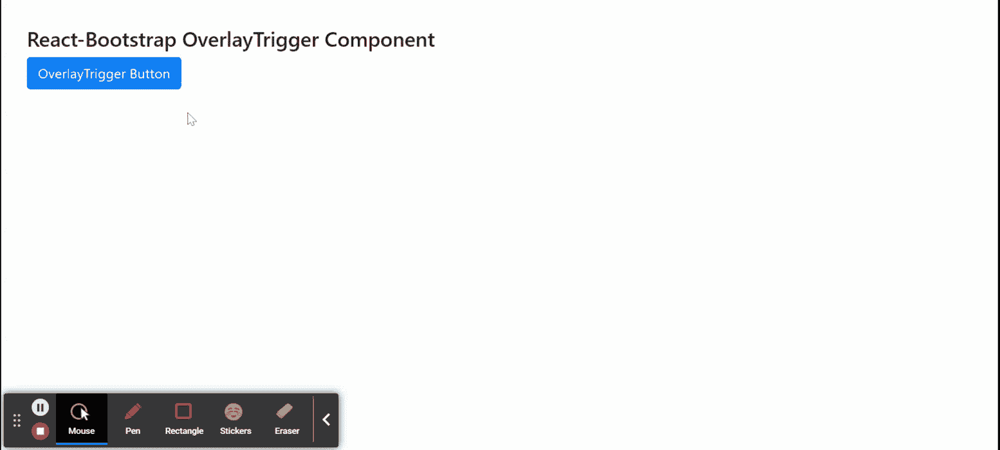

# Reaction-Bootstrap OverlayTrigger 组件

> Original: [https://www.geeksforgeeks.org/react-bootstrap-overlaytrigger-component/](https://www.geeksforgeeks.org/react-bootstrap-overlaytrigger-component/)

Reaction-Bootstrap 是一个前端框架，其设计考虑到了 Reaction。 OverlayTrigger 组件帮助将常见用例添加到我们的覆盖组件中。 它在我们覆盖组件的引用和样式道具的帮助下定位自身。 我们可以在 ReactJS 中使用以下方法来使用 Reaction-Bootstrap OverlayTrigger 组件。

**覆盖触发器道具：**

*   **子代：**用于指示覆盖的子代属性。
*   **defaultShow：**用于指示覆盖的初始可见状态。
*   **延迟：**用于指示覆盖被触发后显示和隐藏的延迟时间。
*   **翻转：**用于指示覆盖的初始翻转状态。
*   **onHide：**用于指示覆盖图的非隐藏属性。
*   **onTogger：**它是一个回调函数，在用户更改工具提示的可见性时触发。
*   **覆盖：**它是目标旁边的文本或元素覆盖。
*   **放置：**用于设置叠层的定位方向。
*   **popperConfig：**它是*Popper.js*的配置对象，传递给 Popper 的底层实例。
*   **show：**它表示覆盖的可见性。
*   **target：**它是需要为覆盖设置目标时使用的目标属性。
*   **触发器：**它用于 s指定哪些动作触发动作或覆盖可见性。

**覆盖道具：**

*   **子代：**用于指示覆盖的子代属性。
*   **容器：**它基本上是一个组件实例或一个返回或 DOM 节点的函数。
*   **onEnter：**它是在覆盖过渡之前触发的回调函数。
*   **onEntered：**它是一个回调函数，在 Overlay 完成转换后触发。
*   **onEnching：**它是一个回调函数，在覆盖开始过渡时触发。
*   **onExit：**它是一个回调函数，在覆盖转换出之前触发。
*   **onExited：**它是覆盖完成转出后触发的回调函数。
*   **onExiting：**它是一个回调函数，在覆盖开始过渡时触发。
*   **onHide：**用于指示覆盖图的非隐藏属性。
*   **放置：**用于设置叠层的定位方向。
*   **popperConfig：**它是*Popper.js*的配置对象，传递给 Popper 的底层实例。
*   **rootClose：**用于指定当用户在 Overlay 外部单击时是否调用 onHide 函数。
*   **rootCloseEvent：**它用于在组件外部激发事件时关闭该组件。
*   **show：**它表示覆盖的可见性。
*   **target：**它是需要为覆盖设置目标时使用的目标属性。
*   **过渡：**用于制作叠层进入和退出的动画。

**创建 Reaction 应用程序并安装模块：**

*   **步骤 1：**使用以下命令创建 Reaction 应用程序：

    ```
    npx create-react-app foldername
    ```

*   **步骤 2：**创建项目文件夹(即 foldername**)后，**使用以下命令移动到该文件夹：

    ```
    cd foldername
    ```

*   **步骤 3：**创建 ReactJS 应用程序后，使用以下命令安装所需的****模块：****

    ```
    **npm install react-bootstrap 
    npm install bootstrap**
    ```

******项目结构：**如下所示。****

****

项目结构**** 

******示例：**现在在**App.js**文件中写下以下代码。 在这里，App 是我们编写代码的默认组件。****

## ****App.js****

```
**import React from 'react';
import 'bootstrap/dist/css/bootstrap.css';
import OverlayTrigger from 'react-bootstrap/OverlayTrigger';
import Popover from 'react-bootstrap/Popover'
import Button from 'react-bootstrap/Button';

export default function App() {
  return (
    <div style={{ display: 'block', width: 700, padding: 30 }}>
      <h4>React-Bootstrap OverlayTrigger Component</h4>
      <OverlayTrigger
        placement="bottom"
        trigger="click"
        overlay={(
          <Popover>
            <Popover.Title as="h3">
             Hello User
            </Popover.Title>
          </Popover>
        )}>
        <Button variant="primary">
             OverlayTrigger Button
        </Button>
      </OverlayTrigger>
    </div>
  );
}**
```

******运行应用程序的步骤：**使用以下命令从项目根目录运行应用程序：****

```
**npm start**
```

******输出：**现在打开浏览器，转到***http://localhost:3000/***，您将看到以下输出：****

********

******引用：**[https://react-bootstrap.github.io/components/overlays/#overlay-trigger-props](https://react-bootstrap.github.io/components/overlays/#overlay-trigger-props)****