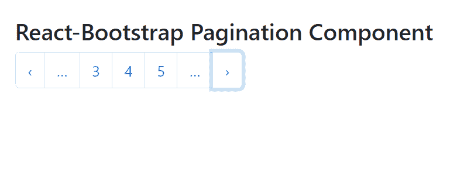

# Reaction-Bootstrap 分页组件

> Original: [https://www.geeksforgeeks.org/react-bootstrap-pagination-component/](https://www.geeksforgeeks.org/react-bootstrap-pagination-component/)

Reaction-Bootstrap 是一个前端框架，其设计考虑到了 Reaction。 分页组件为用户到在页之间轻松切换提供了一种方式。 它基本上是一组表现性的组件，用于向用户提供更好的 UI 体验。 我们可以在 ReactJS 中使用以下方法来使用 Reaction-Bootstrap 分页组件。

**分页道具：**

*   **大小：**用于定义所有 PageItems 的大小。
*   **bsPrefix：**它是使用高度定制的引导程序css的安全通道。

**PageItem****道具：**

*   **活动：**它用于将页面项目设置为活动状态的样式。
*   **activeLabel：**它用于通过可访问标签指示活动状态。
*   **禁用：**用于禁用页面项组件。
*   **href：**t 用于提供此元素的 href 属性。
*   **onClick：**单击此组件时触发的回调函数。

**创建 Reaction 应用程序并安装模块：**

*   **步骤 1：**使用以下命令创建 Reaction 应用程序：

    ```jsx
    npx create-react-app foldername
    ```

*   **步骤 2：**创建项目文件夹(即 foldername**)后，**使用以下命令移动到该文件夹：

    ```jsx
    cd foldername
    ```

*   **步骤 3：**创建 ReactJS 应用程序后，使用以下命令安装所需的****模块：****

    ```jsx
    **npm install react-bootstrap 
    npm install bootstrap**
    ```

******项目结构：**如下所示。****

****

项目结构**** 

******示例：**现在在**App.js**文件中写下以下代码。 在这里，App 是我们编写代码的默认组件。****

## ****App.js****

```jsx
**import React from 'react';
import 'bootstrap/dist/css/bootstrap.css';
import Pagination from 'react-bootstrap/Pagination';

export default function App() {
  return (
    <div style={{ display: 'block', width: 700, padding: 30 }}>
      <h4>React-Bootstrap Pagination Component</h4>
      <Pagination>
        <Pagination.Prev />
        <Pagination.Ellipsis />
        <Pagination.Item>{3}</Pagination.Item>
        <Pagination.Item>{4}</Pagination.Item>
        <Pagination.Item>{5}</Pagination.Item>
        <Pagination.Ellipsis />
        <Pagination.Next />
      </Pagination>
    </div>
  );
}**
```

******运行应用程序的步骤：**使用以下命令从项目根目录运行应用程序：****

```jsx
**npm start**
```

******输出：**现在打开浏览器，转到***http://localhost:3000/***，您将看到以下输出：****

********

******引用：**[https://react-bootstrap.github.io/components/pagination/](https://react-bootstrap.github.io/components/pagination/)****