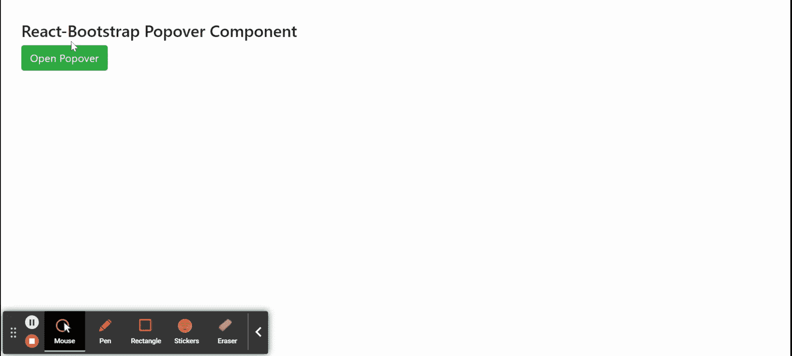

# Reaction Bootstrap Popover 组件

> Original: [https://www.geeksforgeeks.org/react-bootstrap-popover-component/](https://www.geeksforgeeks.org/react-bootstrap-popover-component/)

Reaction-Bootstrap 是一个前端框架，其设计考虑到了 Reaction。 Popover 组件i是悬停在父窗口上的容器类型元素。 就像弹出信息一样，在父窗口上某个事件上触发。 我们可以在 ReactJS 中使用以下方法来使用 Reaction-Bootstrap Popover 组件。

**弹跳道具：**

*   **ArrowProps：**它用于定位弹出箭头。
*   **内容：**它用于创建内部带有*Popover.Content*的*Popover*，并在设置为 true 时直接传递给子对象。
*   **id：**这只是可访问性所必需的 HTML*id*属性。
*   **放置：**用于设置弹出器的定位方向。
*   **Popper：**它是 Object 类型，指示 PopOver 元素的 Popper 属性。
*   **show：**用于指示弹出窗口是否打开。
*   **标题：**用于定义弹出窗口的标题。
*   **bsPrefix：**它是使用高度定制的引导程序css的安全通道。

**PopoverContent****道具：**

*   **As：**它可以用作此组件的自定义元素类型。
*   **bsPrefix：**它是使用高度定制的引导程序css的安全通道。

**PopoverTitle****道具：**

*   **As：**它可以用作此组件的自定义元素类型。
*   **bsPrefix：**它是使用高度定制的引导程序css的安全通道。

**创建 Reaction 应用程序并安装模块：**

*   **步骤 1：**使用以下命令创建 Reaction 应用程序：

    ```jsx
    npx create-react-app foldername
    ```

*   **步骤 2：**创建项目文件夹(即 foldername**)后，**使用以下命令移动到该文件夹：

    ```jsx
    cd foldername
    ```

*   **步骤 3：**创建 ReactJS 应用程序后，使用以下命令安装所需的****模块：****

    ```jsx
    **npm install react-bootstrap 
    npm install bootstrap**
    ```

******项目结构：**如下所示。****

****

项目结构**** 

******示例：**现在在**App.js**文件中写下以下代码。 在这里，App 是我们编写代码的默认组件。****

## ****App.js****

```jsx
**import React from 'react';
import 'bootstrap/dist/css/bootstrap.css';
import OverlayTrigger from 'react-bootstrap/OverlayTrigger';
import Popover from 'react-bootstrap/Popover'
import Button from 'react-bootstrap/Button';

export default function App() {
  return (
    <div style={{ display: 'block', 
                  width: 700, 
                  padding: 30 }}>
      <h4>React-Bootstrap Popover Component</h4>
      <OverlayTrigger
        placement="bottom"
        trigger="click"
        overlay={(
          <Popover>
            <Popover.Title as="h3">
              GeeksforGeeks
            </Popover.Title>
            <Popover.Content>
              Greetings from GeeksforGeeks
          </Popover.Content>
          </Popover>
        )}>
        <Button variant="success">
              Open Popover
        </Button>
      </OverlayTrigger>
    </div>
  );
}**
```

******运行应用程序的步骤：**使用以下命令从项目根目录运行应用程序：****

```jsx
**npm start**
```

******输出：**现在打开浏览器，转到***http://localhost:3000/***，您将看到以下输出：****

********

******引用：**[https://react-bootstrap.github.io/components/overlays/#popovers](https://react-bootstrap.github.io/components/overlays/#popovers)****