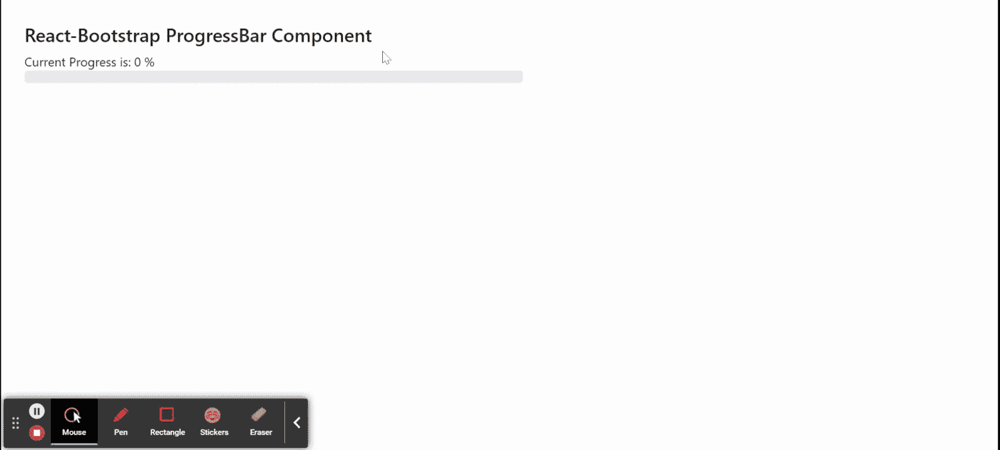

# 加入时间：清华大学 2007 年 01 月 25 日下午 3：33

> Original: [https://www.geeksforgeeks.org/react-bootstrap-progressbar-component/](https://www.geeksforgeeks.org/react-bootstrap-progressbar-component/)

Reaction-Bootstrap 是一个前端框架，其设计考虑到了 Reaction。 ProgressBar 组件提供了一种以进度条的形式向用户显示任何任务/活动的进度的方法。 我们可以在 ReactJS 中使用以下方法来使用 Reaction-Bootstrap ProgressBar 组件。

==同步，由 Elderman 更正==@ELDER_MAN

*   **Animated：**它用于将条纹动画应用于 ProgressBar 组件。
*   **子元素：**它用于仅允许子元素。
*   **isChild：**它是布尔型的，指示元素是否是子成员。
*   **标签：**用于显示表示视觉百分比的标签。
*   **max：**它是进度可以达到的最大值。
*   **min：**这是进度可以开始的最小值。
*   **现在：**用来表示进度的当前值。
*   **srOnly：**它用于直观地隐藏标签。
*   **条纹：**用于创建条纹效果。
*   **变体：**它用于设置我们的进度条的背景类。
*   **bsPrefix：**它是一个用于使用高度定制的引导 CSS 的逃生舱。

**创建 Reaction 应用程序并安装模块：**

**步骤 1：**使用以下命令创建 Reaction 应用程序：

```jsx
npx create-react-app foldername
```

**步骤 2：**创建项目文件夹(即 foldername**)后，**使用以下命令移动到该文件夹：

```jsx
cd foldername
```

**步骤 3：**创建 ReactJS 应用程序后，使用以下命令安装所需的****模块：****

```jsx
**npm install react-bootstrap 
npm install bootstrap**
```

******项目结构：**如下所示。****

****

项目结构**** 

******示例：**现在在**App.js**文件中写下以下代码。 在这里，App 是我们编写代码的默认组件。****

******文件名：App.js******

## ****JavaScript****

```jsx
**import React from 'react';
import 'bootstrap/dist/css/bootstrap.css';
import ProgressBar from 'react-bootstrap/ProgressBar';

export default function App() {

  const [countOfProgess, setCountOfProgess] = React.useState(0);

  React.useEffect(() => {
    const timer = setInterval(() => {
      setCountOfProgess((oldProgress) => {
        if (100 == oldProgress) return 0;
        return Math.min(oldProgress + Math.random() * 10, 100);
      });
    }, 499);

    return () => {
      clearInterval(timer);
    };
  }, []);

  return (
    <div style={{ display: 'block',
                  width: 700, padding: 30 }}>
      <h4>React-Bootstrap ProgressBar Component</h4>
      Current Progress is: {parseInt(countOfProgess)} %
      <ProgressBar now={countOfProgess} />
    </div>
  );
}**
```

 ******运行应用程序的步骤：**使用以下命令从项目的根目录运行应用程序：****

```jsx
**npm start**
```

******输出：**现在打开浏览器，转到***http://localhost:3000/***，您将看到以下输出：****

********

******引用：**[https://react-bootstrap.github.io/components/progress/](https://react-bootstrap.github.io/components/progress/)****