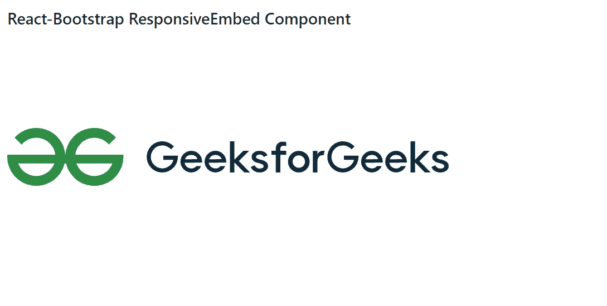

# Reaction-Bootstrap ResponsiveEmbed 组件

> Original: [https://www.geeksforgeeks.org/react-bootstrap-responsiveembed-component/](https://www.geeksforgeeks.org/react-bootstrap-responsiveembed-component/)

Reaction-Bootstrap 是一个前端框架，其设计考虑到了 Reaction。 ResponsiveEmbed Component很有用，因为 b基于容器块宽度，它允许浏览器确定幻灯片放映或视频尺寸。 我们可以在 ReactJS 中使用以下方法来使用 Reaction-Bootstrap ResponsiveEmbed 组件。

**ResponsiveEmbedded 道具：**

*   **aspectRatio：**用于设置嵌入的纵横比。
*   **子元素：**它用于定义这个组件的单个子元素。
*   **bsPrefix：**它是使用高度定制的引导程序css的安全通道。

**创建 Reaction 应用程序并安装模块：**

*   **步骤 1：**使用以下命令创建 Reaction 应用程序：

    ```jsx
    npx create-react-app foldername
    ```

*   **步骤 2：**创建项目文件夹(即文件夹名**)后，**使用以下命令移动到该文件夹：

    ```jsx
    cd foldername
    ```

*   **步骤 3：**创建 ReactJS 应用程序后，使用以下命令安装所需的****模块：****

    ```jsx
    **npm install react-bootstrap 
    npm install bootstrap**
    ```

******项目结构：**如下所示。****

****

项目结构**** 

******示例：**现在在**App.js**文件中写下以下代码。 在这里，App 是我们编写代码的默认组件。****

## ****App.js****

```jsx
**import React from 'react';
import 'bootstrap/dist/css/bootstrap.css';
import ResponsiveEmbed from 'react-bootstrap/ResponsiveEmbed'

export default function App() {
  return (
    <div style={{ display: 'block', width: 700, padding: 30 }}>
      <h4>React-Bootstrap ResponsiveEmbed Component</h4>
      <div style={{ width: 660, height: 'auto' }}>
        <ResponsiveEmbed aspectRatio="16by9">
          <embed type="image/svg+xml" 
                 src=
"https://media.geeksforgeeks.org/wp-content/cdn-uploads/logo-new-2.svg" />
        </ResponsiveEmbed>
      </div>
    </div>
  );
}**
```

******运行应用程序的步骤：**使用以下命令从项目根目录运行应用程序：****

```jsx
**npm start**
```

******输出：**现在打开浏览器，转到***http://localhost:3000/***，您将看到以下输出：****

********

******引用：**[https://react-bootstrap.github.io/utilities/responsive-embed/](https://react-bootstrap.github.io/utilities/responsive-embed/)****