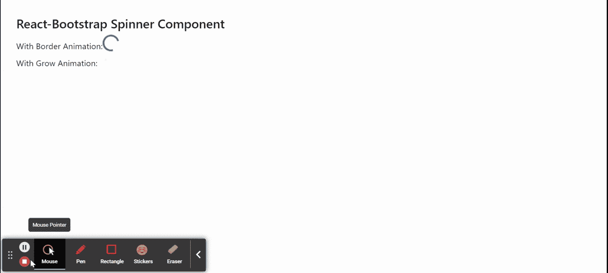

# 反应引导微调器组件

> Original: [https://www.geeksforgeeks.org/react-bootstrap-spinner-component/](https://www.geeksforgeeks.org/react-bootstrap-spinner-component/)

Reaction-Bootstrap 是一个前端框架，其设计考虑到了 Reaction。 微调器组件为提供了一种显示加载效果的方法。 只要我们的应用程序需要，我们就可以使用它来显示加载状态。 我们可以在 ReactJS 中使用以下方法来使用 Reaction-Bootstrap 微调器组件。

**微调道具：**

*   **动画：**它用于定义微调器的动画类型。
*   **As：**它可以用作此组件的自定义元素类型。
*   **子元素：**用于包裹子元素或组件，可以使用该组件。
*   **角色：**在菜单组件中，它是应用于它的 ARIA 可访问角色。
*   **大小：**用于定义组件的大小。
*   **变体****：**它用于定义微调器组件的视觉样式。
*   **bsPrefix：**它是使用高度定制的引导程序css的安全通道。

**创建 Reaction 应用程序并安装模块：**

*   **步骤 1：**使用以下命令创建 Reaction 应用程序：

    ```
    npx create-react-app foldername
    ```

*   **步骤 2：**创建项目文件夹(即 foldername**)后，**使用以下命令移动到该文件夹：

    ```
    cd foldername
    ```

*   **步骤 3：**创建 ReactJS 应用程序后，使用以下命令安装所需的****模块：****

    ```
    **npm install react-bootstrap 
    npm install bootstrap**
    ```

******项目结构：**如下所示。****

****

项目结构**** 

******示例：**现在在**App.js**文件中写下以下代码。 在这里，App 是我们编写代码的默认组件。****

## ****App.js****

```
**import React from 'react';
import 'bootstrap/dist/css/bootstrap.css';
import Spinner from 'react-bootstrap/Spinner';

export default function App() {
  return (
    <div style={{ display: 'block', width: 700, padding: 30 }}>
      <h4>React-Bootstrap Spinner Component</h4>
      With Border Animation: 
      <Spinner animation="border" variant="primary" /> <br/>
      With Grow Animation:
      <Spinner animation="grow" variant="warning" />
    </div>
  );
}**
```

******运行应用程序的步骤：**使用以下命令从项目根目录运行应用程序：****

```
**npm start**
```

******输出：**现在打开浏览器，转到***http://localhost:3000/***，您将看到以下输出：****

********

******引用：**[https://react-bootstrap.github.io/components/spinners/](https://react-bootstrap.github.io/components/spinners/)****