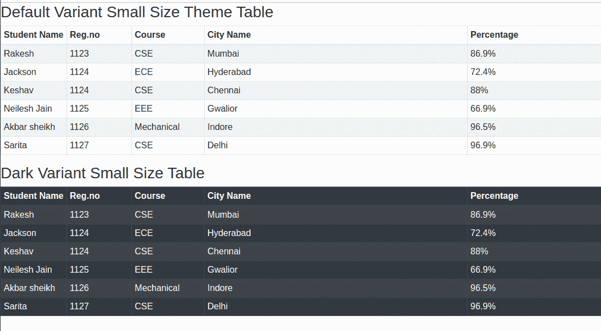

# Reaction-Bootstrap Tables 组件

> Original: [https://www.geeksforgeeks.org/react-bootstrap-tables-component/](https://www.geeksforgeeks.org/react-bootstrap-tables-component/)

Reaction-Bootstrap 是一个前端框架，其设计考虑到了 Reaction。 Bootstrap 是为 Reaction 重新构建和修改的，因此被称为 Reaction-Bootstrap。

Reaction-Bootstrap 中的表带有预定义的样式类，这些样式类既具有响应性，又具有可靠性。

**桌面道具：**

*   **有边框：**在表格和单元格的所有侧面添加边框。
*   **无边框：**删除所有边的边框，包括表头。
*   **Variant：**它用于将桌子的颜色从深色反转到浅色，反之亦然。
*   **大小：**用于设置表格的大小。 当我们将其设置为‘sm’时，单元格填充减少了一半。
*   **bsPrefix：**它是一个用于使用高度定制的引导 CSS 的逃生舱。

**创建 Reaction 应用程序并安装模块：**

**步骤 1：**使用以下命令创建 Reaction 应用程序：

```
npx create-react-app foldername
```

**步骤 2：**创建项目文件夹(即 foldername**)后，**使用以下命令移动到该文件夹：

```
cd foldername
```

**步骤 3：**创建 ReactJS 应用程序后，使用以下命令安装所需的模块：

```
npm install react-bootstrap bootstrap
```

**第四步：**在*index.js*文件中添加以下行：

```
import 'bootstrap/dist/css/bootstrap.css';
```

**项目结构：**如下所示。


**示例：**现在在**App.js**文件中写下以下代码。 在这里，App 是我们编写代码的默认组件。

**文件名：App.js**

## JavaScript

```
import React from 'react';
import Table from 'react-bootstrap/Table'

export default function TableExample() {
  return (
    <>

<h3>Default Variant Small Size Theme Table</h3>

<Table stripped bordered hover size="sm">
  <thead>
    <tr>
      <th width="170">Student Name</th>
      <th width="170">Reg.no</th>
      <th width="170">Course</th>
      <th width="870">City Name</th>
      <th width="1950">Percentage</th>

    </tr>
  </thead>
  <tbody>
    <tr>
      <td>Rakesh</td>
      <td>1123</td>
      <td>CSE</td>
      <td>Mumbai</td>
      <td>86.9%</td>

    </tr>
    <tr>
      <td>Jackson</td>
      <td>1124</td>
      <td>ECE</td>
      <td>Hyderabad</td>
      <td>72.4%</td>

    </tr>
    <tr>
      <td>Keshav</td>
      <td>1124</td>
      <td>CSE</td>
      <td>Chennai</td>
      <td>88%</td>

    </tr>
    <tr>
      <td>Neilesh Jain</td>
      <td>1125</td>
      <td>EEE</td>
      <td>Gwalior</td>
      <td>66.9%</td>

    </tr>
    <tr>
      <td>Akbar sheikh</td>
      <td>1126</td>
      <td>Mechanical</td>
      <td>Indore</td>
      <td>96.5%</td>

    </tr>
    <tr>
      <td>Sarita</td>
      <td>1127</td>
      <td>CSE</td>
      <td>Delhi</td>
      <td>96.9%</td>

    </tr>

  </tbody>
</Table>

<h3>Dark Variant Small Size Table</h3>

<Table stripped bordered hover variant="dark" size="sm">
  <thead>
    <tr>
      <th width="170">Student Name</th>
      <th width="170">Reg.no</th>
      <th width="170">Course</th>
      <th width="870">City Name</th>
      <th width="1950">Percentage</th>

    </tr>
  </thead>
  <tbody>
    <tr>
      <td>Rakesh</td>
      <td>1123</td>
      <td>CSE</td>
      <td>Mumbai</td>
      <td>86.9%</td>

    </tr>
    <tr>
      <td>Jackson</td>
      <td>1124</td>
      <td>ECE</td>
      <td>Hyderabad</td>
      <td>72.4%</td>

    </tr>
    <tr>
      <td>Keshav</td>
      <td>1124</td>
      <td>CSE</td>
      <td>Chennai</td>
      <td>88%</td>

    </tr>
    <tr>
      <td>Neilesh Jain</td>
      <td>1125</td>
      <td>EEE</td>
      <td>Gwalior</td>
      <td>66.9%</td>

    </tr>
    <tr>
      <td>Akbar sheikh</td>
      <td>1126</td>
      <td>Mechanical</td>
      <td>Indore</td>
      <td>96.5%</td>

    </tr>
    <tr>
      <td>Sarita</td>
      <td>1127</td>
      <td>CSE</td>
      <td>Delhi</td>
      <td>96.9%</td>

    </tr>

  </tbody>
</Table>
    </>
  );
}
```

**运行应用程序的步骤：**使用以下命令从项目根目录运行应用程序：

```
npm start
```

**输出：**现在打开浏览器，转到***http://localhost:3000/***，您将看到以下输出。



**引用：**[**https://react-bootstrap.netlify.app/components/table/#tables**](https://react-bootstrap.netlify.app/components/table/#tables)