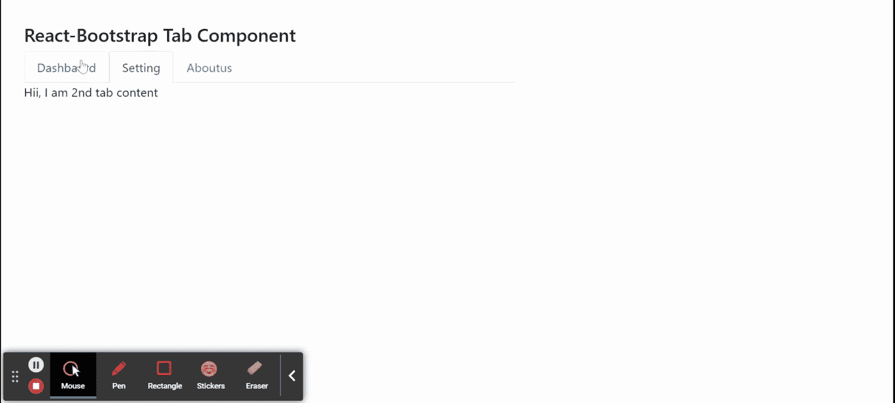

# Reaction-Bootstrap 选项卡组件

> Original: [https://www.geeksforgeeks.org/react-bootstrap-tabs-component/](https://www.geeksforgeeks.org/react-bootstrap-tabs-component/)

Reaction-Bootstrap 是一个前端框架，其设计考虑到了 Reaction。 Tab 组件为提供了一种制作表单动态选项卡式界面的方法。 通过标签的帮助，用户可以在给定的不同标签中出现的组件之间切换。 我们可以在 ReactJS 中使用以下方法来使用 Reaction-Bootstrap Tabs 组件。

**卡舌道具：**

*   **activeKey：**用于根据匹配的事件键将页签标记为活动。
*   **defaultActiveKey：**表示启动时选择的默认活动键。
*   **id：**它是未指定*GenerateChildId*属性时所需的 HTML*id*属性。
*   **mount OnEnter：**它用于挂载凸片。
*   **onSelect：**它是一个回调函数，在选择选项卡时触发。
*   **过渡：**对于所有子对象<选项卡窗格>，it 用于设置默认动画策略。
*   **Unmount tOnExit：**用于卸载页签。
*   **变量：**用于定义导航样式。

发帖主题：Re：Колибри0.7.0

*   **禁用：**用于禁用组件。
*   **eventKey：**它基本上是组件的唯一标识符。
*   **tabClassName：**用于添加页签样式的类名。
*   **标题：**用来表示页签组件的标题。

**TabContainer 道具：**

*   **activeKey：**用于当前处于活动状态的页签的 eventKey。
*   **defaultActiveKey：**作为页签的默认 eventKey。
*   **GenerateChildId：**此函数用于根据*eventKey*和*type*为子标签<TabPane>和<navItem>生成唯一 id，并将其作为参数传递给此函数。
*   **id：**它是用于标识的普通 HTML id 属性。
*   **installtOnEnter：**用来等待第一次“Enter”转换才能挂载标签。
*   **onSelect：**它是在选择选项卡时触发的回调。
*   **转换：**对于所有下级，用于设置默认动画策略。
*   **unmount tOnExit****：**用于 u挂载标签。

**选项卡内容****道具：**

*   **As：**它可以用作此组件的自定义元素类型。
*   **bsPrefix：**它是使用高度定制的引导程序css的安全通道。

**选项卡窗格****道具：**

*   **活动：**用于切换 TabPane 的活动状态。
*   **aria-labelledby：**它用于将标有的 aria属性传递给 TabPane。
*   **As：**它可以用作此组件的自定义元素类型。
*   **eventKey：**它用于将 TabPane 与其控制的 NavLink 的帮助相关联的键
*   **id：**它是用于标识的普通 HTML id 属性。
*   **installtOnEnter：**用来等待第一次“Enter”转换才能挂载标签。
*   **onEnter：**当动画不为 false 时，用于转换 OnEnter 回调。
*   **onEntered：**当动画不为 false 时，用于转换 OnEntered 回调。
*   **onEnching：**当动画不为 false 时，用于过渡 OnEnching 回调。
*   **onExit：**当动画不为 false 时，用于转换 OnExit 回调。
*   **onExted：**当动画不为 false 时，用于转换 OnExted 回调。
*   **onExiting：**当动画不为 false 时，用于过渡 OnExiting 回调。
*   **过渡：**用于在隐藏或显示<选项卡窗格>时显示动画
*   **unmount tOnExit：**用于 u挂片。
*   **bsPrefix：**它是使用高度定制的引导程序css的安全通道。

**创建 Reaction 应用程序并安装模块：**

*   **步骤 1：**使用以下命令创建 Reaction 应用程序：

    ```
    npx create-react-app foldername
    ```

*   **步骤 2：**创建项目文件夹(即 foldername**)后，**使用以下命令移动到该文件夹：

    ```
    cd foldername
    ```

*   **步骤 3：**创建 ReactJS 应用程序后，使用以下命令安装所需的****模块：****

    ```
    **npm install react-bootstrap 
    npm install bootstrap**
    ```

******项目结构：**如下所示。****

****

项目结构**** 

******示例：**现在在**App.js**文件中写下以下代码。 在这里，App 是我们编写代码的默认组件。****

## ****App.js****

```
**import React from 'react';
import 'bootstrap/dist/css/bootstrap.css';
import Tabs from 'react-bootstrap/Tabs';
import Tab from 'react-bootstrap/Tab';

export default function App() {
  return (
    <div style={{ display: 'block', width: 700, padding: 30 }}>
      <h4>React-Bootstrap Tab Component</h4>
      <Tabs defaultActiveKey="second">
        <Tab eventKey="first" title="Dashboard">
          Hii, I am 1st tab content
        </Tab>
        <Tab eventKey="second" title="Setting">
          Hii, I am 2nd tab content
        </Tab>
        <Tab eventKey="third" title="Aboutus">
          Hii, I am 3rd tab content
        </Tab>
      </Tabs>
    </div>
  );
}**
```

******运行应用程序的步骤：**使用以下命令从项目根目录运行应用程序：****

```
**npm start**
```

******输出：**现在打开浏览器，转到***http://localhost:3000/***，您将看到以下输出：****

********

******引用：**[https://react-bootstrap.github.io/components/tabs/](https://react-bootstrap.github.io/components/tabs/)****