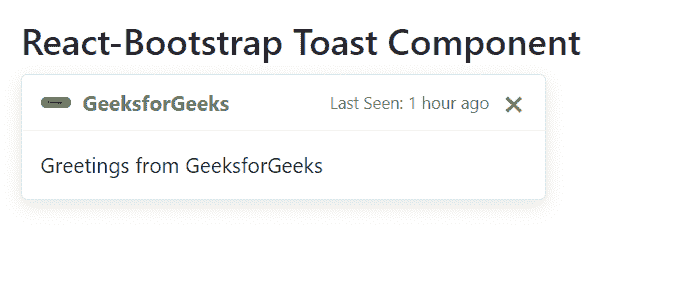

# Reaction Bootstrap Toast 组件

> Original: [https://www.geeksforgeeks.org/react-bootstrap-toasts-component/](https://www.geeksforgeeks.org/react-bootstrap-toasts-component/)

Reaction-Bootstrap 是一个前端框架，其设计考虑到了 Reaction。 Toast 组件是一个轻量级通知，是，旨在提供一种模拟来自桌面操作系统或移动设备的推送通知的方式。 我们可以在 ReactJS 中使用以下方法来使用 Reaction-Bootstrap Toast 组件。

**敬酒道具：**

*   **动画：**它用于将淡入淡出动画应用于我们的祝酒词
*   **自动隐藏：**用于自动隐藏吐司。
*   **延迟：**用于延迟吐司的隐藏。
*   **onClose：**它是一个回调函数，在单击关闭按钮时触发。
*   **show：**用于在设置为 true 时显示模态。
*   **Transition****：**它用于在单个水平行上显示一系列标签、按钮等。
*   **bsPrefix：**它是使用高度自定义的BootstrapCSS 的安全通道

**吐司标题道具：**

*   **closeButton：**指定组件的关闭按钮。
*   **closeLabel：**关闭按钮，用于 p提供可访问的标签。
*   **bsPrefix：**它是使用高度定制的引导程序css的安全通道。

**吐司身体道具：**

*   **As：**它可以用作此组件的自定义元素类型。
*   **bsPrefix：**它是使用高度定制的引导程序css的安全通道。

**创建 Reaction 应用程序并安装模块：**

*   **步骤 1：**使用以下命令创建 Reaction 应用程序：

    ```jsx
    npx create-react-app foldername
    ```

*   **步骤 2：**创建项目文件夹(即文件夹名**)后，**使用以下命令移动到该文件夹：

    ```jsx
    cd foldername
    ```

*   **步骤 3：**创建 ReactJS 应用程序后，使用以下命令安装所需的****模块：****

    ```jsx
    **npm install react-bootstrap 
    npm install bootstrap**
    ```

******项目结构：**如下所示。****

****

项目结构**** 

******示例：**现在在**App.js**文件中写下以下代码。 在这里，App 是我们编写代码的默认组件。****

## ****App.js****

```jsx
**import React from 'react';
import 'bootstrap/dist/css/bootstrap.css';
import Toast from 'react-bootstrap/Toast';

export default function App() {
  return (
    <div style={{ display: 'block',
                  width: 700, 
                  padding: 30 }}>
      <h4>React-Bootstrap Toast Component</h4>
      <Toast>
        <Toast.Header>
          
          <strong className="mr-auto">
             GeeksforGeeks
          </strong>
          <small>
             Last Seen: 1 hour ago 
          </small>
        </Toast.Header>
        <Toast.Body>
             Greetings from GeeksforGeeks
        </Toast.Body>
      </Toast>
    </div>
  );
}**
```

******运行应用程序的步骤：**使用以下命令从项目根目录运行应用程序：****

```jsx
**npm start**
```

******输出：**现在打开浏览器，转到***http://localhost:3000/***，您将看到以下输出：****

********

******参考：**https://react-bootstrap.github.io/components/toasts/****