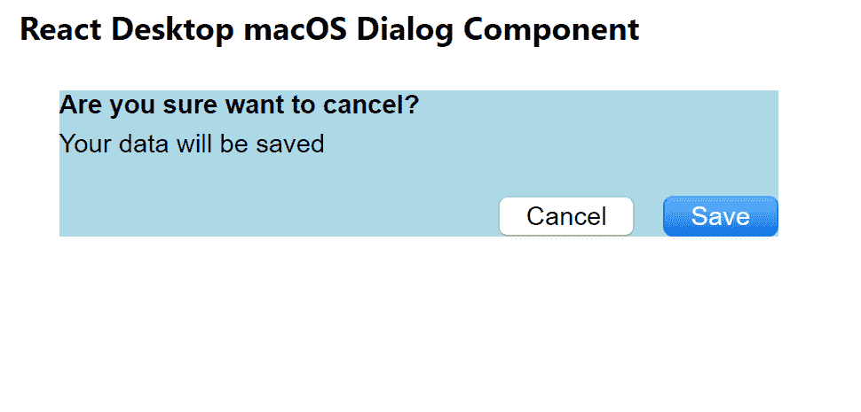

# Reaction Desktop MacOS 对话框组件

> Original: [https://www.geeksforgeeks.org/react-desktop-macos-dialog-component/](https://www.geeksforgeeks.org/react-desktop-macos-dialog-component/)

Reaction Desktop 是一个将原生桌面体验带到 Web 上的受欢迎的库。 该库提供MacOS和 Windows OS 组件。 对话框组件用于允许用户创建对话框。 **对话框**通知用户有关任务的信息，可以包含关键信息、需要决策或涉及多个任务。 我们可以在 ReactJS 中使用以下方法来使用 Reaction Desktop MacOS 对话框组件。

**道具对话框：**

*   **按钮：**用于设置组件按钮。
*   **HorizontalAlignment：**设置组件内容的水平对齐方式。
*   **图标：**设置组件的图标元素。
*   **边距：**设置组件的外边距。
*   **边框底边距：**设置组件的外底边距。
*   **FrontLeft：**设置组件的左边距外。
*   **边框右边距：**用于设置组件的右外边距。
*   **边沿顶部：**用于设置组件的外上边距。
*   **消息：**设置组件消息。
*   **标题：**设置组件标题。
*   **垂直对齐：**设置组件内容的垂直对齐方式。

**创建 Reaction 应用程序并安装模块：**

*   **步骤 1：**使用以下命令创建 Reaction 应用程序：

    ```jsx
    npx create-react-app foldername
    ```

*   **步骤 2：**创建项目文件夹(即 foldername**)后，**使用以下命令移动到该文件夹：

    ```jsx
    cd foldername
    ```

*   **步骤 3：**创建 ReactJS 应用程序后，使用以下命令安装所需的****模块：****

    ```jsx
    **npm install react-desktop**
    ```

******项目结构：**如下所示。****

****

项目结构**** 

******示例：**现在在**App.js**文件中写下以下代码。 在这里，App 是我们编写代码的默认组件。****

## ****App.js****

```jsx
**import React from 'react'
import { Dialog, Button } from 'react-desktop/macOs';

export default function App() {
  return (
    <div style={{
      display: 'block', width: 400, paddingLeft: 30
    }}>
      <h4>React Desktop macOS Dialog Component</h4>
      <Dialog
        style={{ backgroundColor: 'lightblue' }}
        title="Are you sure want to cancel?"
        message="Your data will be saved"
        buttons={[
          <Button onClick={() => console.log('Close This Box')}>
            Cancel
          </Button>,
          <Button onClick={() => console.log('Save Data')}
            color="blue"
          >Save</Button>,
        ]}
      />
    </div>
  );
}**
```

******运行应用程序的步骤：**使用以下命令从项目根目录运行应用程序：****

```jsx
**npm start**
```

******输出：**现在打开浏览器，转到***http://localhost:3000/***，您将看到以下输出：****

********

******引用：**[https://reactdesktop.js.org/docs/mac-os/dialog](https://reactdesktop.js.org/docs/mac-os/dialog)****