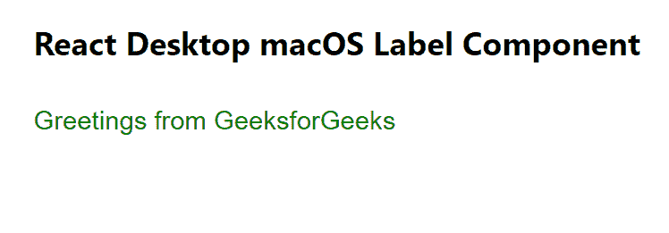

# Reaction Desktop MacOS 标签组件

> Original: [https://www.geeksforgeeks.org/react-desktop-macos-label-component/](https://www.geeksforgeeks.org/react-desktop-macos-label-component/)

Reaction Desktop 是一个将原生桌面体验带到 Web 上的受欢迎的库。 该库提供MacOS和 Windows OS 组件。 标签组件用于，允许用户为任何元素添加自己的自定义标签。 我们可以在 ReactJS 中使用以下方法来使用 Reaction Desktop MacOS 标签组件。

*   ****颜色：**用于设置文本的颜色。**
*   ****高度：**用于设置组件的高度。**
*   ****隐藏：**用于设置零部件可见性。**
*   ****HorizontalAlignment：**设置组件内容的水平对齐方式。**
*   ****边距：**设置组件的外边距。**
*   ****边框底边距：**设置组件的外底边距。**
*   ****FrontLeft：**设置组件的左边距外。**
*   ****边框右边距：**用于设置组件的右外边距。**
*   ****边沿顶部：**用于设置组件的外上边距。**
*   ****填充：**用于设置组件内部的填充。**
*   ****paddingBottom：**用于设置组件内部的底部填充。**
*   ****paddingLeft：**用于设置组件内部的左填充。**
*   ****paddingRight：**设置组件内部的正确填充。**
*   ****paddingTop：**用于设置组件内部的顶部填充。**
*   ****垂直对齐：**设置组件内容的垂直对齐方式。**
*   ****宽度：**设置组件宽度。**

****创建 Reaction 应用程序并安装模块：****

*   ****步骤 1：**使用以下命令创建 Reaction 应用程序：**

    ```jsx
    npx create-react-app foldername
    ```

*   ****步骤 2：**创建项目文件夹(即 foldername**)后，**使用以下命令移动到该文件夹：**

     **```jsx
    cd foldername
    ```** 
*   ****步骤 3：**创建 ReactJS 应用程序后，使用以下命令安装所需的****模块：******

    ```jsx
    ****npm install react-desktop****
    ```

********项目结构：**如下所示。******

****

项目结构**** 

******示例：**现在在**App.js**文件中写下以下代码。 在这里，App 是我们编写代码的默认组件。****

## ****App.js****

```jsx
**import React from 'react'
import { Label } from 'react-desktop/macOs';

export default function App() {
  return (
    <div style={{
      display: 'block', width: 700, paddingLeft: 30
    }}>
      <h4>React Desktop macOS Label Component</h4>
      <Label color="green">
        Greetings from GeeksforGeeks
      </Label>
    </div>
  );
}**
```

******运行应用程序的步骤：**使用以下命令从项目根目录运行应用程序：****

```jsx
**npm start**
```

******输出：**现在打开浏览器，转到***http://localhost:3000/***，您将看到以下输出：****

********

******引用：**[https://reactdesktop.js.org/docs/mac-os/label](https://reactdesktop.js.org/docs/mac-os/label)****