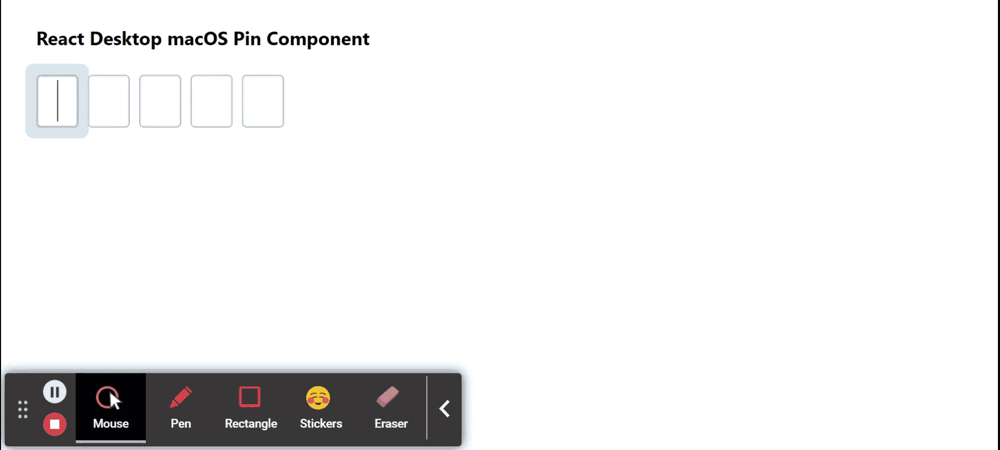

# Reaction 台式机 MacOS 引脚组件

> Original: [https://www.geeksforgeeks.org/react-desktop-macos-pin-component/](https://www.geeksforgeeks.org/react-desktop-macos-pin-component/)

Reaction Desktop 是一个将原生桌面体验带到 Web 上的受欢迎的库。 该库提供MacOS和 Windows OS 组件。 管脚组件用于允许用户创建一个管脚表单，该表单以管脚的形式接受用户输入。 它可用于动态口令验证等目的。 我们可以在 ReactJS 中使用以下方法来使用 Reaction Desktop MacOS Pin 组件。

**销钉道具：**

*   **隐藏：**用于设置零部件可见性。
*   **长度：**用于设置管脚的长度。
*   **边距：**设置组件的外边距。
*   **边框底边距：**设置组件的外底边距。
*   **FrontLeft：**设置组件的左边距外。
*   **边框右边距：**用于设置组件的右外边距。
*   **边沿顶部：**用于设置组件的外上边距。
*   **onChange：**输入更改时的回调函数。
*   **显示：**用于显示插针中的字符。

**创建 Reaction 应用程序并安装模块：**

*   **步骤 1：**使用以下命令创建 Reaction 应用程序：

    ```jsx
    npx create-react-app foldername
    ```

*   **步骤 2：**创建项目文件夹(即 foldername**)后，**使用以下命令移动到该文件夹：

    ```jsx
    cd foldername
    ```

*   **步骤 3：**创建 ReactJS 应用程序后，使用以下命令安装所需的****模块：

    ```jsx
    npm install react-desktop
    ```**** 

******项目结构：**如下所示。****

****

项目结构**** 

******示例：**现在在**App.js**文件中写下以下代码。 在这里，App 是我们编写代码的默认组件。****

## ****App.js****

```jsx
**import React from 'react'
import { Pin } from 'react-desktop/macOs';

export default function App() {
  return (
    <div style={{
      display: 'block', width: 400, paddingLeft: 30
    }}>
      <h4>React Desktop macOS Pin Component</h4>
      <Pin
        onChange={value => console.log(value)}
        reveal
        length={5}
      />
    </div>
  );
}**
```

******运行应用程序的步骤：**使用以下命令从项目根目录运行应用程序：****

```jsx
**npm start**
```

******输出：**现在打开浏览器，转到***http://localhost:3000/***，您将看到以下输出：****

********

******引用：**[https://reactdesktop.js.org/docs/mac-os/pin](https://reactdesktop.js.org/docs/mac-os/pin)****