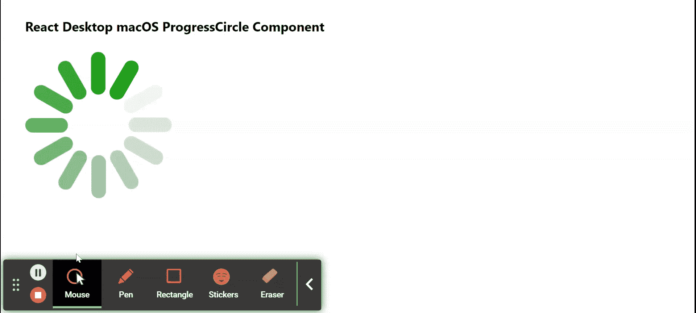

# Reaction Desktop MacOS ProgressCircle 组件

> Original: [https://www.geeksforgeeks.org/react-desktop-macos-progresscircle-component/](https://www.geeksforgeeks.org/react-desktop-macos-progresscircle-component/)

Reaction Desktop 是一个将原生桌面体验带到 Web 上的受欢迎的库。 该库提供MacOS和 Windows OS 组件。 ProgressCircle 组件用于允许用户显示循环动画进度，就像我们在 MacOS 中启动/关闭系统时一样。 我们可以在 ReactJS 中使用以下方法来使用 React Desktop MacOS ProgressCircle 组件。

**进行圈道具：**

*   **颜色：**用于设置组件的主颜色。
*   **隐藏：**用于设置零部件可见性。
*   **大小：**用于设置进度循环组件。

**创建 Reaction 应用程序并安装模块：**

*   **步骤 1：**使用以下命令创建 Reaction 应用程序：

    ```
    npx create-react-app foldername
    ```

*   **步骤 2：**创建项目文件夹(即 foldername**)后，**使用以下命令移动到该文件夹：

    ```
    cd foldername
    ```

*   **步骤 3：**创建 ReactJS 应用程序后，使用以下命令安装所需的****模块：

    ```
    npm install react-desktop
    ```**** 

******项目结构：**如下所示。****

****

项目结构**** 

******示例：**现在在**App.js**文件中写下以下代码。 在这里，App 是我们编写代码的默认组件。****

## ****JavaScript****

```
**import React from 'react'
import { ProgressCircle } from 'react-desktop/macOs';

export default function App() {
  return (
    <div style={{
      display: 'block', width: 700, paddingLeft: 30
    }}>
      <h4>React Desktop macOS ProgressCircle Component</h4>
      <ProgressCircle
        size={180}
        color="green"
      />
    </div>
  );
}**
```

******运行应用程序的步骤：**使用以下命令从项目根目录运行应用程序：****

```
**npm start**
```

******输出：**现在打开浏览器，转到***http://localhost:3000/***，您将看到以下输出：****

********

******引用：**[https://reactdesktop.js.org/docs/mac-os/progress-circle](https://reactdesktop.js.org/docs/mac-os/progress-circle)****