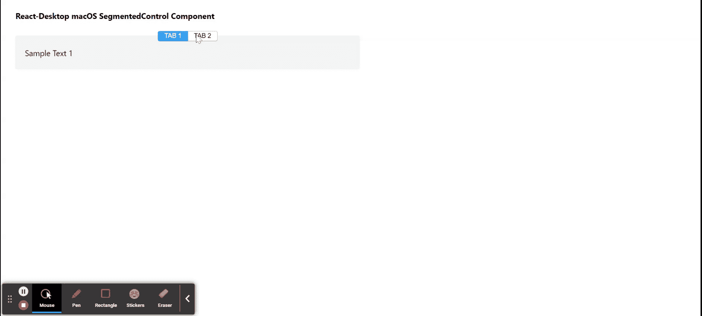

# Reaction Desktop MacOS SegmentedControl 组件

> Original: [https://www.geeksforgeeks.org/react-desktop-macos-segmentedcontrol-component/](https://www.geeksforgeeks.org/react-desktop-macos-segmentedcontrol-component/)

Reaction Desktop 是一个将原生桌面体验带到 Web 上的受欢迎的库。 该库提供MacOS和 Windows OS 组件。 SegmentedControl 组件是由两个或更多个段组成的线性集合，其中每个段都充当一个互斥的按钮。 我们可以在 ReactJS 中使用以下方法来使用 Reaction Desktop MacOS SegmentedControl 组件。

**分段控制道具：**

*   **盒子：**表示物品是否在盒子里。
*   **高度：**用于设置元件高度。
*   **隐藏：**用于设置零部件可见性。
*   **边距：**设置组件的外边距。
*   **边框底边距：**设置组件的外底边距。
*   **FrontLeft：**设置组件的左边距外。
*   **边框右边距：**用于设置组件的右外边距。
*   **边沿顶部：**用于设置组件的外上边距。
*   **宽度：**设置组件宽度。

**SegmentedControlItem 道具：**

*   **标题：**设置项目的标题。
*   **onSelect：**它是在选择项目时触发的回调函数。
*   **选中：**表示是否选中该项目。

**创建 Reaction 应用程序并安装模块：**

*   **步骤 1：**使用以下命令创建 Reaction 应用程序：

    ```
    npx create-react-app foldername
    ```

*   **步骤 2：**创建项目文件夹(即 foldername**)后，**使用以下命令移动到该文件夹：

    ```
    cd foldername
    ```

*   **步骤 3：**创建 ReactJS 应用程序后，使用以下命令安装所需的****模块：****

    ```
    **npm install react-desktop**
    ```

******项目结构：**如下所示。****

****

项目结构**** 

******示例：**现在在**App.js**文件中写下以下代码。 在这里，App 是我们编写代码的默认组件。****

## ****App.js****

```
**import React, { useState } from 'react'
import { SegmentedControl, SegmentedControlItem } from 'react-desktop/macOs';

export default function App() {

  // Our State object
  const [currentSelection, setCurrentSelection] = useState(1)

  return (
    <div style={{
      display: 'block', width: 700, paddingLeft: 30
    }}>
      <h4>React-Desktop macOS SegmentedControl Component</h4>
      <SegmentedControl box>
        <SegmentedControlItem
          key={1}
          title={"TAB 1"}
          selected={currentSelection === 1}
          onSelect={() => setCurrentSelection(1)}
        >
          Sample Text 1
        </SegmentedControlItem>
        <SegmentedControlItem
          key={2}
          title={"TAB 2"}
          selected={currentSelection === 2}
          onSelect={() => setCurrentSelection(2)}
        >
          Sample Text 2
        </SegmentedControlItem>
      </SegmentedControl>
    </div>
  );
}**
```

******运行应用程序的步骤：**使用以下命令从项目根目录运行应用程序：****

```
**npm start**
```

******输出：**现在打开浏览器，转到***http://localhost:3000/***，您将看到以下输出：****

********

******引用：**[https://reactdesktop.js.org/docs/mac-os/segmented-control](https://reactdesktop.js.org/docs/mac-os/segmented-control)****