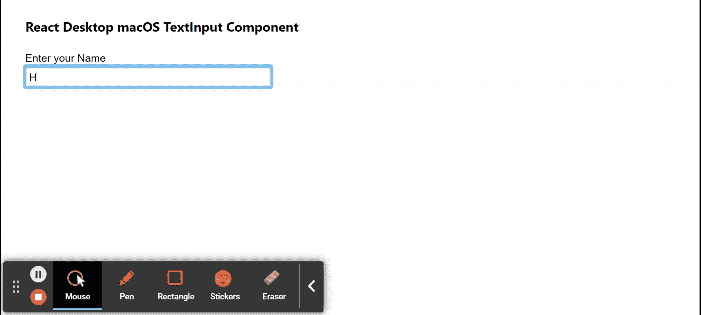

# Reaction Desktop MacOS TextInput 组件

> Original: [https://www.geeksforgeeks.org/react-desktop-macos-textinput-component/](https://www.geeksforgeeks.org/react-desktop-macos-textinput-component/)

Reaction Desktop 是一个将原生桌面体验带到 Web 上的受欢迎的库。 该库提供MacOS和 Windows OS 组件。 TextInput 组件用于允许用户创建输入文本字段，就像MacOS操作系统有一样。 我们可以在 ReactJS 中使用以下方法来使用 Reaction Desktop MacOS TextInput 组件。

==同步，由 Elderman 更正==@ELDER_MAN

*   **centerPlaceholder：**当输入未聚焦时，用于设置占位符是否为动画并居中。
*   **defaultValue：**表示默认输入值。
*   **FocusRing：**围绕输入，用于设置对焦环的可见性。
*   **隐藏：**用于设置零部件的可见性。
*   **图标：**用于向输入添加图标。
*   **标签：**用于为输入添加标签。
*   **边距：**设置组件的外边距。
*   **边框底边距：**设置组件的外底边距。
*   **FrontLeft：**设置组件的左边距外。
*   **边框右边距：**用于设置组件的右外边距。
*   **边沿顶部：**用于设置组件的外上边距。
*   **onChange：**它是输入更改时触发的回调函数。
*   **onEnter：**它是一个回调函数，在按 Enter 键时触发。
*   **占位符：**用于向输入添加占位符。
*   **四舍五入：**设置输入边框的圆度。
*   **大小：**设置组件字体大小。
*   **值：**用于设置输入值。
*   **宽度：**设置组件宽度。
*   **Password：**用于将输入类型设置为*Password*。

**创建 Reaction 应用程序并安装模块：**

*   **步骤 1：**使用以下命令创建 Reaction 应用程序：

    ```jsx
    npx create-react-app foldername
    ```

*   **步骤 2：**创建项目文件夹(即 foldername**)后，**使用以下命令移动到该文件夹：

    ```jsx
    cd foldername
    ```

*   **步骤 3：**创建 ReactJS 应用程序后，使用以下命令安装所需的****模块：****

    ```jsx
    **npm install react-desktop**
    ```

******项目结构：**如下所示。****

****

项目结构**** 

******示例：**现在在**App.js**文件中写下以下代码。 在这里，App 是我们编写代码的默认组件。****

## ****App.js****

```jsx
**import React from 'react'
import { TextInput } from 'react-desktop/macOs';

export default function App() {
  return (
    <div style={{
      display: 'block', width: 700, paddingLeft: 30
    }}>
      <h4>React Desktop macOS TextInput Component</h4>
      <TextInput
        color="white"
        width="300"
        label="Enter your Name"
        placeholder="Enter your Name"
        onChange={(e)=> { console.log(e)}}
      />
    </div>
  );
}**
```

******运行应用程序的步骤：**使用以下命令从项目根目录运行应用程序：****

```jsx
**npm start**
```

******输出：**现在打开浏览器，转到***http://localhost:3000/***，您将看到以下输出：****

********

******引用：**[https://reactdesktop.js.org/docs/mac-os/text-input](https://reactdesktop.js.org/docs/mac-os/text-input)****