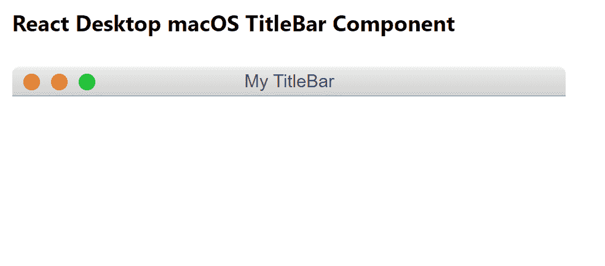

# Reaction Desktop MacOS 标题栏组件

> Original: [https://www.geeksforgeeks.org/react-desktop-macos-titlebar-component/](https://www.geeksforgeeks.org/react-desktop-macos-titlebar-component/)

Reaction Desktop 是一个将原生桌面体验带到 Web 上的受欢迎的库。 该库提供MacOS和 Windows OS 组件。 标题栏组件用于允许用户创建带有最大化、最小化、调整大小和关闭等控件的标题栏。 我们可以在 ReactJS 中使用以下方法来使用 Reaction Desktop MacOS 标题栏组件。

**标题栏道具：**

*   **控件：**用于设置显示在标题栏中的控件可见性。
*   **Inset：**用于将标题栏控件状态设置为 Inset。
*   **isFullScreen：**用于将标题栏设置为全屏。
*   **onCloseClick：**它是一个回调函数，通过单击 Close 按钮触发。
*   **onMaximizeClick：**它是一个回调函数，通过单击最大化按钮触发。
*   **onMinimizeClick：**它是一个回调函数，通过单击最小化按钮触发。
*   **onResizeClick：**它是一个回调函数，通过单击 RESIZE 按钮触发。
*   **标题：**设置标题栏标题。
*   **透明：**设置标题栏背景透明。

**创建 Reaction 应用程序并安装模块：**

*   **步骤 1：**使用以下命令创建 Reaction 应用程序：

    ```
    npx create-react-app foldername
    ```

*   **步骤 2：**创建项目文件夹(即 foldername**)后，**使用以下命令移动到该文件夹：

    ```
    cd foldername
    ```

*   **步骤 3：**创建 ReactJS 应用程序后，使用以下命令安装所需的****模块：****

    ```
    **npm install react-desktop**
    ```

******项目结构：**如下所示。****

****

项目结构**** 

******示例：**现在在**App.js**文件中写下以下代码。 在这里，App 是我们编写代码的默认组件。****

## ****App.js****

```
**import React from 'react'
import { TitleBar } from 'react-desktop/macOs';

export default function App() {
  return (
    <div style={{
      display: 'block', width: 400, paddingLeft: 30
    }}>
      <h4>React Desktop macOS TitleBar Component</h4>
      <TitleBar
        title="My TitleBar"
        controls
      />
    </div>
  );
}**
```

******运行应用程序的步骤：**使用以下命令从项目根目录运行应用程序：****

```
**npm start**
```

******输出：**现在打开浏览器，转到***http://localhost:3000/***，您将看到以下输出：****

********

******引用：**[https://reactdesktop.js.org/docs/mac-os/title-bar](https://reactdesktop.js.org/docs/mac-os/title-bar)****