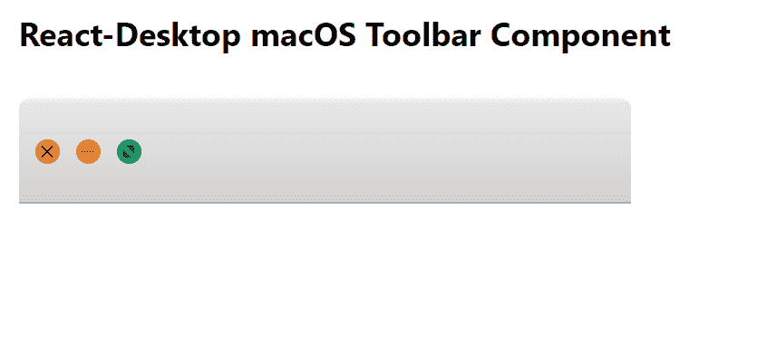

# Reaction Desktop MacOS 工具栏组件

> Original: [https://www.geeksforgeeks.org/react-desktop-macos-toolbar-component/](https://www.geeksforgeeks.org/react-desktop-macos-toolbar-component/)

Reaction Desktop 是一个将原生桌面体验带到 Web 上的受欢迎的库。 该库提供MacOS和 Windows OS 组件。 工具栏组件提供了一种访问常用功能和命令的方法。 它位于窗口的顶部或下方，该组件与标题栏集成在一起。 我们可以在 ReactJS 中使用以下方法来使用 Reaction Desktop MacOS 工具栏组件。

**工具栏道具：**

*   **高度：**用于设置元件高度。
*   **HorizontalAlignment：**设置组件内容的水平对齐方式。
*   **垂直对齐：**设置组件内容的垂直对齐方式。
*   **宽度：**设置组件宽度。

**创建 Reaction 应用程序并安装模块：**

*   **步骤 1：**使用以下命令创建 Reaction 应用程序：

    ```
    npx create-react-app foldername
    ```

*   **步骤 2：**创建项目文件夹(即 foldername**)后，**使用以下命令移动到该文件夹：

    ```
    cd foldername
    ```

*   **步骤 3：**创建 ReactJS 应用程序后，使用以下命令安装所需的****模块：****

    ```
    **npm install react-desktop**
    ```

******项目结构：**如下所示。****

****

项目结构**** 

******示例：**现在在**App.js**文件中写下以下代码。 在这里，App 是我们编写代码的默认组件。****

## ****App.js****

```
**import React from 'react'
import { Toolbar, TitleBar } from 'react-desktop/macOs';

export default function App() {
  return (
    <div style={{
      display: 'block', width: 700, paddingLeft: 30
    }}>
      <h4>React-Desktop macOS Toolbar Component</h4>
      <TitleBar controls width="300">
        <Toolbar height="50" horizontalAlignment="center"/>
      </TitleBar>
    </div>
  );
}**
```

******运行应用程序的步骤：**使用以下命令从项目根目录运行应用程序：****

```
**npm start**
```

******输出：**现在打开浏览器，转到***http://localhost:3000/***，您将看到以下输出：****

********

******引用：**[https://reactdesktop.js.org/docs/mac-os/toolbar](https://reactdesktop.js.org/docs/mac-os/toolbar)****