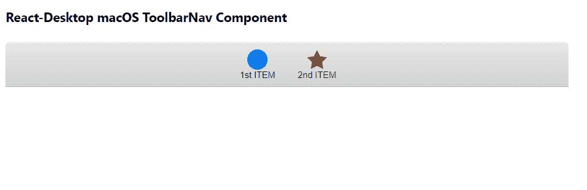

# Reaction Desktop MacOS ToolbarNav 组件

> Original: [https://www.geeksforgeeks.org/react-desktop-macos-toolbarnav-component/](https://www.geeksforgeeks.org/react-desktop-macos-toolbarnav-component/)

Reaction Desktop 是一个将原生桌面体验带到 Web 上的受欢迎的库。 该库提供MacOS和 Windows OS 组件。 ToolbarNav 组件用于允许用户添加。 我们可以在 ReactJS 中使用以下方法来使用 Reaction Desktop MacOS ToolbarNav 组件。

**工具栏导航道具：**

*   **高度：**用于设置元件高度。
*   **宽度：**设置组件宽度。

**工具栏导航项目道具：**

*   **图标：**用于设置项目的图标元素。
*   **onClick：**它是一个回调函数，在单击项目时触发。
*   **选中：**表示是否选中该项目。
*   **标题：**设置项目的标题。

**创建 Reaction 应用程序并安装模块：**

*   **步骤 1：**使用以下命令创建 Reaction 应用程序：

    ```
    npx create-react-app foldername
    ```

*   **步骤 2：**创建项目文件夹(即 foldername**)后，**使用以下命令移动到该文件夹：

    ```
    cd foldername
    ```

*   **步骤 3：**创建 ReactJS 应用程序后，使用以下命令安装所需的****模块：****

    ```
    **npm install react-desktop**
    ```

******项目结构：**如下所示。****

****

项目结构**** 

******示例：**现在在**App.js**文件中写下以下代码。 在这里，App 是我们编写代码的默认组件。****

## ****App.js****

```
**import React, { useState } from 'react'
import { TitleBar, Toolbar, ToolbarNav, ToolbarNavItem } from 'react-desktop/macOs';

export default function App() {

  // Our State object
  const [currentSelection, setCurrentSelection] = useState(1)

  return (
    <div style={{
      display: 'block', width: 700, paddingLeft: 30
    }}>
      <h4>React-Desktop macOS ToolbarNav Component</h4>
      <TitleBar>
        <Toolbar>
          <ToolbarNav>
            <ToolbarNavItem
              title="1st ITEM"
              icon={(
                <svg x="0px" y="0px" width="25px" 
                  height="25px" viewBox="0 0 25 25">
                  <circle cx="12.5" cy="12.5" r="12.5" />
                </svg>
              )}
              selected={currentSelection === 1}
              onClick={() => setCurrentSelection({ selected: 1 })}
            />
            <ToolbarNavItem
              title="2nd ITEM"
              icon={ (
                <svg x="0px" y="0px" width="25px" 
                  height="23.8px" viewBox="0 0 25 23.8">
                  <polygon points="12.5,0 16.4,7.8 25,9.1 18.8,15.2 20.2,23.8 
                                   12.5,19.7 4.8,23.8 6.2,15.2 0,9.1 8.6,7.8 " />
                </svg>
              )}
              selected={currentSelection === 2}
              onClick={() => setCurrentSelection({ selected: 2 })}
            />
          </ToolbarNav>
        </Toolbar>
      </TitleBar>
    </div>
  );
}**
```

******运行应用程序的步骤：**使用以下命令从项目根目录运行应用程序：****

```
**npm start**
```

******输出：**现在打开浏览器，转到***http://localhost:3000/***，您将看到以下输出：****

********

******引用：**[https://reactdesktop.js.org/docs/mac-os/toolbar-nav](https://reactdesktop.js.org/docs/mac-os/toolbar-nav)****