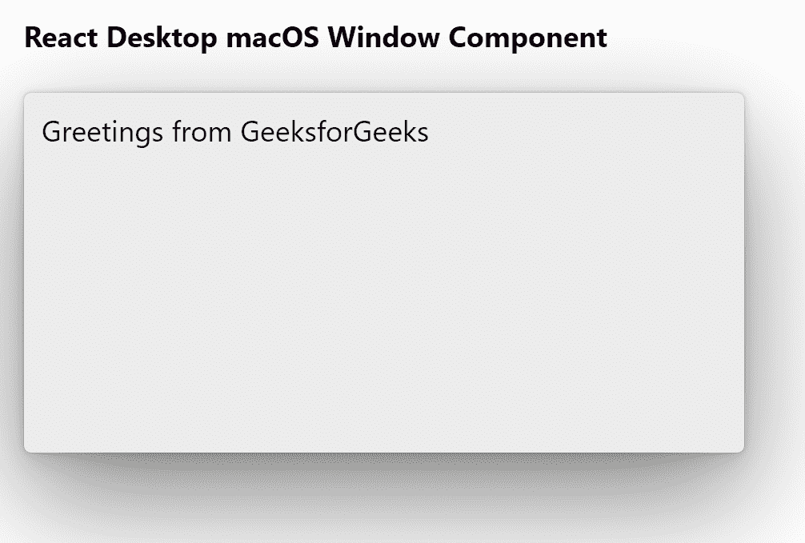

# Reaction Desktop MacOS 窗口组件

> Original: [https://www.geeksforgeeks.org/react-desktop-macos-window-component/](https://www.geeksforgeeks.org/react-desktop-macos-window-component/)

Reaction Desktop 是一个将原生桌面体验带到 Web 上的受欢迎的库。 该库提供MacOS和 Windows OS 组件。 窗口组件用于允许用户创建窗口。 我们可以在 ReactJS 中使用以下方法来使用 Reaction Desktop MacOS 窗口组件。

**窗口道具：**

*   **背景：**用于设置组件背景颜色。
*   **铬：**用于设置窗口的铬。
*   **高度：**用于设置元件高度。
*   **隐藏：**用于设置零部件可见性。
*   **水平对齐：**设置组件内容水平对齐。
*   **填充：**用于设置组件内部的填充。
*   **paddingBottom：**用于设置组件内部的底部填充。
*   **paddingLeft：**用于设置组件内部的左填充。
*   **paddingRight：**设置组件内部的正确填充。
*   **paddingTop：**用于设置组件内部的顶部填充。
*   **verticalAlign：**设置组件内容垂直对齐。
*   **宽度：**设置组件宽度。

**创建 Reaction 应用程序并安装模块：**

*   **步骤 1：**使用以下命令创建 Reaction 应用程序：

    ```jsx
    npx create-react-app foldername
    ```

*   **步骤 2：**创建项目文件夹(即 foldername**)后，**使用以下命令移动到该文件夹：

    ```jsx
    cd foldername
    ```

*   **步骤 3：**创建 ReactJS 应用程序后，使用以下命令安装所需的****模块：****

    ```jsx
    **npm install react-desktop**
    ```

******项目结构：**如下所示。****

****

项目结构**** 

******示例：**现在在**App.js**文件中写下以下代码。 在这里，App 是我们编写代码的默认组件。****

## ****App.js****

```jsx
**import React from 'react'
import { Window } from 'react-desktop/macOs';

export default function App() {
  return (
    <div style={{
      display: 'block', width: 700, paddingLeft: 30
    }}>
      <h4>React Desktop macOS Window Component</h4>
      <Window
        padding="10px"
        height="200px"
        width="400px"
        chrome
      >
        Greetings from GeeksforGeeks
      </Window>
    </div>
  );
}**
```

******运行应用程序的步骤：**使用以下命令从项目根目录运行应用程序：****

```jsx
**npm start**
```

******输出：**现在打开浏览器，转到***http://localhost:3000/***，您将看到以下输出：****

********

******引用：**[https://reactdesktop.js.org/docs/mac-os/window](https://reactdesktop.js.org/docs/mac-os/window)****