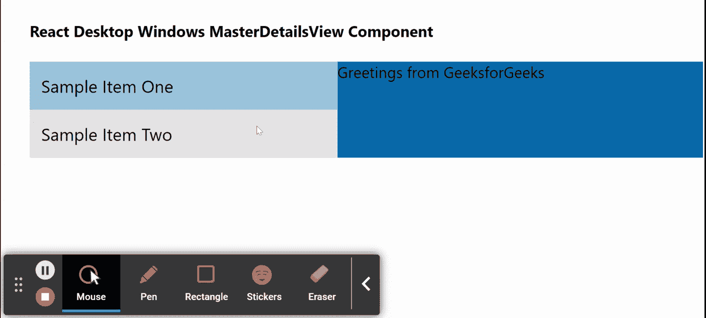

# Reaction Desktop Windows MasterDetailsView 组件

> Original: [https://www.geeksforgeeks.org/react-desktop-windows-masterdetailsview-component/](https://www.geeksforgeeks.org/react-desktop-windows-masterdetailsview-component/)

Reaction Desktop 是一个将原生桌面体验带到 Web 上的受欢迎的库。 该库提供MacOS和 Windows OS 组件。 MasterDetailsView 组件用于允许用户以列表或详细模式呈现项目。 它分别在*列表面板*和*详细信息面板*中显示该项目的项目集合和详细信息。 我们可以在 ReactJS 中使用以下方法来使用 Reaction Desktop Windows MasterDetailsView 组件。

**MasterDetailsView 道具：**

*   **颜色：**用于设置组件的主颜色。
*   **主题：**它用于设置 UI 主题，然后该组件及其子元素使用该主题。

**MasterDetailsViewItem 道具：**

*   **颜色：**用于设置组件的主颜色。
*   **主题：**它用于设置 UI 主题，然后该组件及其子元素使用该主题。

**MasterDetailsViewItemMaster 道具：**

*   **颜色：**用于设置组件的主颜色。
*   **推送：**用于在选择项目时显示推送动画。
*   **选择：**表示选择了主机。
*   **主题：**它用于设置 UI 主题，然后该组件及其子元素使用该主题。
*   **宽度：**设置组件宽度。

**MasterDetailsViewItemDetails 道具：**

*   **背景：**用于设置背景颜色。
*   **颜色：**用于设置组件的主颜色。
*   **主题：**它用于设置 UI 主题，然后该组件及其子元素使用该主题。

**创建 Reaction 应用程序并安装模块：**

*   **步骤 1：**使用以下命令创建 Reaction 应用程序：

    ```
    npx create-react-app foldername
    ```

*   **步骤 2：**创建项目文件夹(即 foldername**)后，**使用以下命令移动到该文件夹：

    ```
    cd foldername
    ```

*   **步骤 3：**创建 ReactJS 应用程序后，使用以下命令安装所需的****模块：****

    ```
    **npm install react-desktop**
    ```

******项目结构：**如下所示。****

****

项目结构**** 

******示例：**现在在**App.js**文件中写下以下代码。 在这里，App 是我们编写代码的默认组件。****

## ****App.js****

```
**import React from 'react'
import {
  MasterDetailsViewItem,
  MasterDetailsViewItemMaster,
  MasterDetailsView,
  MasterDetailsViewItemDetails
} from 'react-desktop/windows';

export default function App() {
  return (
    <div style={{
      display: 'block', width: 700, paddingLeft: 30
    }}>
      <h4>React Desktop Windows MasterDetailsView Component</h4>
      <MasterDetailsView>
        <MasterDetailsViewItem>
          <MasterDetailsViewItemMaster push>
             Sample Item One
          </MasterDetailsViewItemMaster>
          <MasterDetailsViewItemDetails background>
            Greetings from GeeksforGeeks
          </MasterDetailsViewItemDetails>
        </MasterDetailsViewItem>
        <MasterDetailsViewItem>
          <MasterDetailsViewItemMaster push>
            Sample Item Two
          </MasterDetailsViewItemMaster>
        </MasterDetailsViewItem>
      </MasterDetailsView>
    </div>
  );
}**
```

******运行应用程序的步骤：**使用以下命令从项目根目录运行应用程序：****

```
**npm start**
```

******输出：**现在打开浏览器，转到***http://localhost:3000/***，您将看到以下输出：****

********

******引用：**[http://reactdesktop.js.org/docs/windows/master-details-view](http://reactdesktop.js.org/docs/windows/master-details-view)****