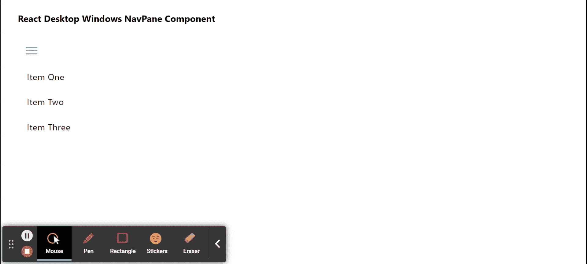

# Reaction Desktop Windows NavPane 组件

> Original: [https://www.geeksforgeeks.org/react-desktop-windows-navpane-component/](https://www.geeksforgeeks.org/react-desktop-windows-navpane-component/)

Reaction Desktop 是一个将原生桌面体验带到 Web 上的受欢迎的库。 该库提供MacOS和 Windows OS 组件。 NavPane 组件用于允许用户在元素之间轻松地导航，因为它是导航窗格。 我们可以在 ReactJS 中使用以下方法来使用 Reaction Desktop Windows NavPane 组件。

**导航面板道具：**

*   **canPaneTogger：**设置窗格是否可以压缩。
*   **颜色：**用于设置文本颜色。
*   **defaultIsPaneExpanded：**设置默认是否展开窗格。
*   **onPaneTogger：**它是一个回调函数，在压缩或展开窗格时触发。
*   **paneCompactedLength：**用于设置压缩时的窗格长度。
*   **paneExpandedLength：**用于设置展开时的窗格长度。
*   **主题：**它用于设置 UI 主题，然后该组件及其子元素使用该主题。

**NavPaneItem 道具：**

*   **背景：**用于设置背景颜色。
*   **颜色：**用于设置文本颜色。
*   **HorizontalAlignment：**设置组件内容的水平对齐方式。
*   **图标：**用于设置项目图标元素。
*   **边距：**设置组件的外边距。
*   **onSelect：**它是一个在选择项目时触发的回调函数。
*   **填充：**用于设置组件内部的填充。
*   **PUSH：**按钮被按下时，用来显示推送动画。
*   **选中：**表示该项目是否被选中。
*   **标题：**设置元素的标题。
*   **主题：**它用于设置 UI 主题，然后该组件及其子元素使用该主题。
*   **垂直对齐：**设置组件内容的垂直对齐方式。

**创建 Reaction 应用程序并安装模块：**

*   **步骤 1：**使用以下命令创建 Reaction 应用程序：

    ```jsx
    npx create-react-app foldername
    ```

*   **步骤 2：**创建项目文件夹(即 foldername**)后，**使用以下命令移动到该文件夹：

    ```jsx
    cd foldername
    ```

**步骤 3：**创建 ReactJS 应用程序后，使用以下命令安装所需的****模块：****

```jsx
**npm install react-desktop**
```

******项目结构：**如下所示。****

****

项目结构**** 

******示例：**现在在**App.js**文件中写下以下代码。 在这里，App 是我们编写代码的默认组件。****

## ****App.js****

```jsx
**import React from 'react'
import { NavPane, NavPaneItem } from 'react-desktop/windows';

export default function App() {
  return (
    <div style={{
      display: 'block', width: 700, paddingLeft: 30
    }}>
      <h4>React Desktop Windows NavPane Component</h4>
      <NavPane push>
        <NavPaneItem
          title="Item One"
          push
        >
        NavItem One
        </NavPaneItem>
        <NavPaneItem
          title="Item Two"
          push>
          NavItem Two
        </NavPaneItem>
        <NavPaneItem
          title="Item Three"
          push>
          NavItem Three
        </NavPaneItem>
      </NavPane>
    </div>
  );
}**
```

******运行应用程序的步骤：**使用以下命令从项目根目录运行应用程序：****

```jsx
**npm start**
```

******输出：**现在打开浏览器，转到***http://localhost:3000/***，您将看到以下输出：****

********

******引用：**[http://reactdesktop.js.org/docs/windows/nav-pane](http://reactdesktop.js.org/docs/windows/nav-pane)****