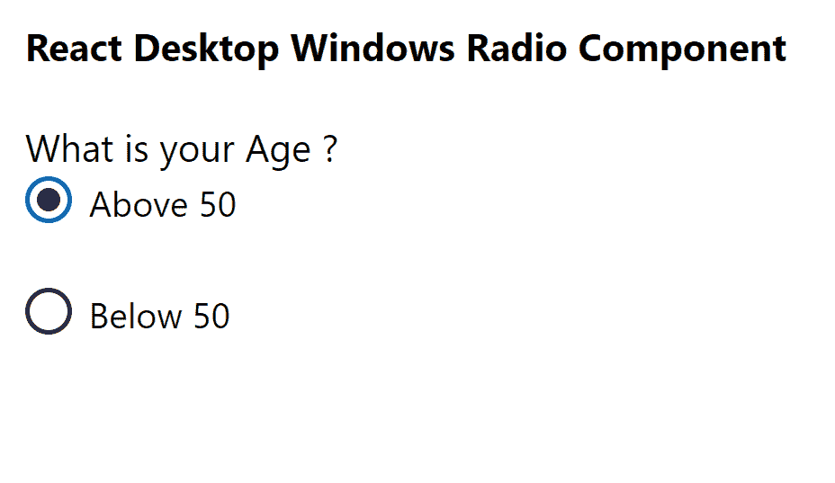

# Reaction 桌面 Windows 单选组件

> Original: [https://www.geeksforgeeks.org/react-desktop-windows-radio-component/](https://www.geeksforgeeks.org/react-desktop-windows-radio-component/)

Reaction Desktop 是一个将原生桌面体验带到 Web 上的受欢迎的库。 该库提供MacOS和 Windows OS 组件。 无线组件用于允许用户从集合中选择一个选项。 我们可以在 ReactJS 中使用以下方法来使用 Reaction Desktop Windows 单选组件。

**无线电道具：**

*   **颜色：**用于设置广播颜色。
*   **defaultValue：**表示默认输入值。
*   **defaultChecked：**表示是否默认勾选收音机。
*   **隐藏：**用于设置零部件的可见性。
*   **标签：**用于为收音机添加标签。
*   **名称：**表示输入的名称。
*   **onChange：**它是复选框更改时触发的回调函数。
*   **主题：**它用于设置 UI 主题，然后该组件及其子元素使用该主题。

**创建 Reaction 应用程序并安装模块：**

*   **步骤 1：**使用以下命令创建 Reaction 应用程序：

    ```
    npx create-react-app foldername
    ```

*   **步骤 2：**创建项目文件夹(即 foldername**)后，**使用以下命令移动到该文件夹：

    ```
    cd foldername
    ```

*   **步骤 3：**创建 ReactJS 应用程序后，使用以下命令安装所需的****模块：****

    ```
    **npm install react-desktop**
    ```

******项目结构：**如下所示。****

****

项目结构**** 

******示例：**现在在**App.js**文件中写下以下代码。 在这里，App 是我们编写代码的默认组件。****

## ****App.js****

```
**import React from 'react'
import { Radio } from 'react-desktop/windows';

export default function App() {
  return (
    <div style={{
      display: 'block', width: 700, paddingLeft: 30
    }}>
      <h4>React Desktop Windows Radio Component</h4>
      What is your Age ?
      <Radio
        label="Above 50"
        name="ageRadio"
        defaultChecked
      /> 
      <Radio
        label="Below 50"
        name="ageRadio"
      />
    </div>
  );
}**
```

******运行应用程序的步骤：**使用以下命令从项目根目录运行应用程序：****

```
**npm start**
```

******输出：**现在打开浏览器，转到***http://localhost:3000/***，您将看到以下输出：****

********

******引用：**[http://reactdesktop.js.org/docs/windows/radio](http://reactdesktop.js.org/docs/windows/radio)****