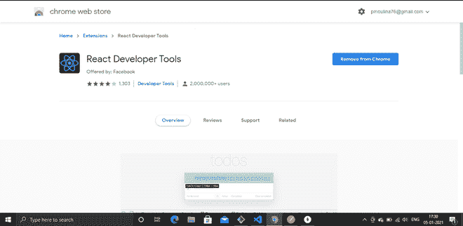
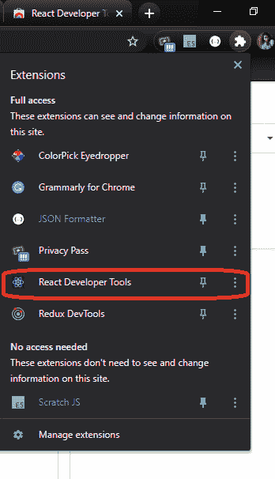
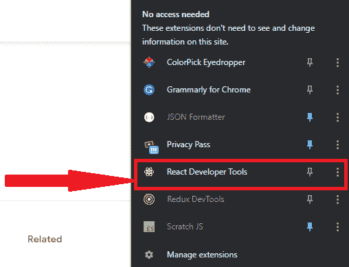
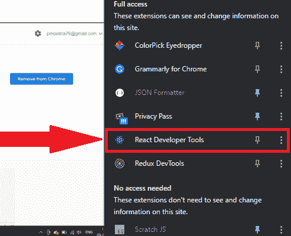
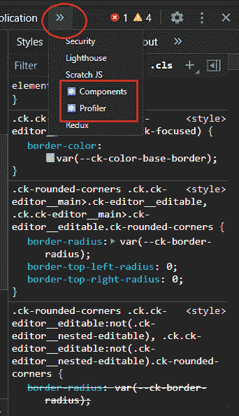
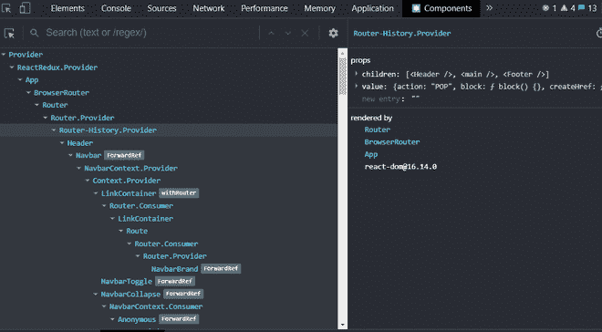
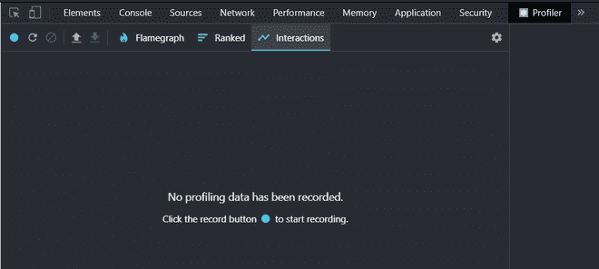

# Reaction 开发人员工具

> Original: [https://www.geeksforgeeks.org/react-developer-tools/](https://www.geeksforgeeks.org/react-developer-tools/)

**React Developer Tools：**React Developer Tools 是 React JavaScript 库的 Chrome DevTools 扩展。 如果您正在使用 React.js 应用程序，这是一个非常有用的工具。

该扩展将 Reaction 调试工具添加到 Chrome 开发人员工具中。 它可以帮助您检查和编辑构建页面的 Reaction 组件树，对于每个组件，可以检查道具、状态、挂钩等，还可以帮助您了解在特定的应用程序中是否使用了 React.js。

它也可以在 Firefox 中使用。

**如何添加扩展名：**跟随链接至[https://chrome.google.com/webstore/detail/react-developer-tools/fmkadmapgofadopljbjfkapdkoienihi?hl=en](https://chrome.google.com/webstore/detail/react-developer-tools/fmkadmapgofadopljbjfkapdkoienihi?hl=en)

*   现在点击添加到 Chrome。
*   现在，该工具已添加到您的 Chrome 中。 要删除该扩展，请点击从 Chrome 中删除。

单击**添加到 Chrome 后**

*   转到顶部右侧的 Extensions 选项卡，单击它。 在下拉列表中，可以看到扩展已添加。

**如何使用分机：**

*   **检测应用程序是否使用 React.js：**打开要检查的应用程序，现在单击 Extension 选项卡，然后单击 Reaction Developer Tools。 如果扩展保持**多彩**，这意味着它是用 React.js 构建的，如果它是**无色的**，则意味着应用程序没有使用 React.js

未使用 React.js 构建的应用程序

使用 React.js 构建的应用程序

*   **检查和编辑反应组件：**在应用程序上，右键单击，从下拉菜单转到**检查**或键入**Ctrl+Shift+I**。 它会打开**Chrome DevTools**，现在点击顶部栏上的双箭头，下拉菜单会像这样打开。

*   单击**组件**，将显示 Reaction 组件树。

组件窗口

*   在这里，人们可以检查、编辑道具、了解状态、了解结构。 同样，单击**Profiler**。 单击 Profiler 将允许您记录性能。

探查器窗口