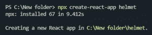
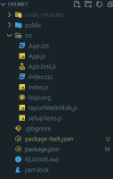

# Reaction Helmet-ReactJS 应用程序的搜索引擎优化

> Original: [https://www.geeksforgeeks.org/react-helmet-seo-for-reactjs-apps/](https://www.geeksforgeeks.org/react-helmet-seo-for-reactjs-apps/)

虽然 Reaction 经常因为使前端开发更有效率而受到赞誉，但如果我们没有正确设置网站，这个流行的库可能会给搜索引擎带来问题。

**为什么搜索引擎优化反应差？**

Reaction 为您提供了一个 SPA(单页应用程序)，它需要 Javascript 来显示页面上的内容。 问题是，扫描互联网上所有页面的谷歌爬行机器人(Google Crawl Bot)不如用 javascript 理解页面，因为 index.html 首先返回一个空白的 HTML 页面，然后根据路由改变页面的内容，而不是由常规 HTML 代码组成的页面。

**React Helmet：**React Helmet 可重用 Reaction 组件将管理您对文档头所做的所有更改。

Helmet 获取纯 HTML 标签并输出纯 HTML 标签。 它非常简单，而且反应非常适合初学者。

**功能：**

*   支持所有有效的 head 标签：title、base、meta、link、script、noscript 和 style。
*   支持 body、html 和 title 标签的属性。
*   支持服务器端渲染。
*   嵌套组件覆盖重复的头部更改(树下的组件可以覆盖提供给更高级别的头盔组件的值)。
*   当在同一组件中指定时，会保留重复的头部更改(支持“Apple-touch-icon”等标签)。
*   用于跟踪 DOM 更改的回调。

**安装和使用：**

**第一步：**创建 Reaction 应用程序并安装模块：

```
npx create-react-app helmet
```



**步骤 2：**创建项目文件夹(即 Reaction-Helmet)后，使用以下命令移动到该文件夹：

```
cd helmet
```

**步骤 3：**我们可以继续添加头盔。

```
npm i react-helmet
```


**项目结构**：如下所示。



项目结构

**第四步：**添加用于路由的 Reaction-Router-DOM

```
npm i react-router-dom
```


注意：在这里，App 是我们编写代码的默认组件。

**第五步：**在同一目录下创建两个文件：Lyrics.js、和 Audio.js

## Lyrics.js

```
import React from 'react';

const Lyrics = () => (
    <div>
        <h2>Lyrics</h2>
    </div>
);

export default Lyrics;
```

## Audio.js

```
import React from 'react';

const Audio = () => (
    <div>
        <h2>Audio</h2>
    </div>
);

export default Audio;
```

## App.js

```
import React from "react";
import { Helmet } from "react-helmet";
import { BrowserRouter as Router, Route, 
         Link } from "react-router-dom";

import Audio from "./Audio";

import Lyrics from "./Lyrics";

const App = () => (
    <Router>
      <Helmet>
        <title>Music Website</title>
        <meta
          name="description"
          content="Get stats about every music from every movie"
        />
        <meta
          name="keywords"
          content="Music, Audio, Lyrics"
        />
      </Helmet>
      <div>
        <ul>
          <li>
            <Link to="/Audio">Audio</Link>
          </li>
          <li>
            <Link to="/Lyrics">Lyrics</Link>
          </li>
        </ul>

        <hr />
        <Route path="/Lyrics" component={Lyrics} />
        <Route path="/Audio" component={Audio} />
      </div>
    </Router>
  )

export default App ;
```

现在标题将更改为**Music WebSite**，您可以从开发人员工具中查看**说明**

****步骤 6：**现在在其余管线中执行相同的操作，因为子零部件中的头盔零部件将覆盖父零部件中的头盔零部件。 添加与 Lyrics.js 相关的 title 和 meta 标签。 在反应头盔的帮助下，父组件 App 有 2 个子组件。 我们可以插入多个具有相同属性(名称和内容)的<Head>标签和<meta>标签，正因为如此，Reaction 网站的 SEO 增加了。**

## **Lyrics.js**

```
import React from 'react';
import { Helmet } from "react-helmet";

const Lyrics = () => (
    <div>
        <Helmet>

            <title>Music Lyrics</title>
            <meta
                name="description"
                content="Get lyrics of every music for free"
            />
        </Helmet>
        <h2>Lyrics</h2>
    </div>
);

export default Lyrics;
```