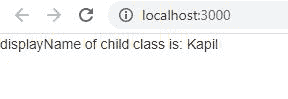

# React.js 显示名称

> Original: [https://www.geeksforgeeks.org/react-js-displayname/](https://www.geeksforgeeks.org/react-js-displayname/)

DisplayName 字符串用于调试消息。 通常没有必要显式设置它，因为描述组件的函数或类的名称会推断它。 如果出于调试目的或在生成更高级别的组件时希望显示不同的名称，则可能需要专门设置该名称。

React 提供的 displayName 是一个强烈推荐的特性，它极大地帮助了单元测试和调试。 当使用 Reaction 开发工具检查零件时，它也会派上用场。

**创建 Reaction 应用程序：**

*   **步骤 1：**使用以下命令创建 Reaction 应用程序。

    ```jsx
    npx create-react-app foldername
    ```

*   **步骤 2：**创建项目文件夹(即 Foldername)后，使用以下命令移动到该文件夹。

    ```jsx
    cd foldername
    ```

**项目结构：**如下所示。


**示例：**现在在**App.js**文件中写下以下代码。 在这里，App 是我们编写代码的默认组件。

## App.js

```jsx
import React from 'react';
import ReactDOM from 'react-dom';

const child_class = class Myclass {
  render() {
    return (
      <div></div>
    )
  }
}

child_class.displayName = "Kapil";
class App extends React.Component {

  render() {
    return (
      <div>
        <p> 
            displayName of child class is: 
            {child_class.displayName}
        </p>
      </div>
    )
  }
}

export default App;
```

**运行应用程序的步骤：**使用以下命令从项目根目录运行应用程序：

```jsx
npm start
```

**输出：**现在打开浏览器，转到***http://localhost:3000/***，您将看到以下输出：

