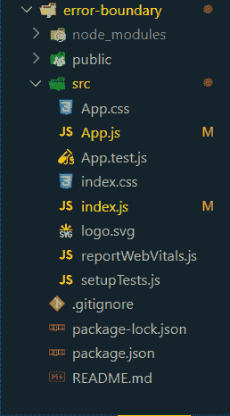
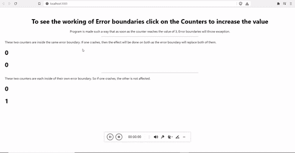

# React.js 错误边界

> Original: [https://www.geeksforgeeks.org/react-js-error-boundaries/](https://www.geeksforgeeks.org/react-js-error-boundaries/)

**错误边界：**错误边界基本上提供了某种类型的错误边界或检查，它们是用于处理其子组件树中的 JavaScript 错误的反应组件。

对捕捉其子组件树中任意位置的 JavaScript 错误的组件作出反应，记录这些错误，并显示回退 UI。 它在渲染、生命周期方法等过程中捕获错误。

**使用理由：**假设 JavaScript 内部组件中存在错误，则它用于破坏 Reaction 的内部状态并导致其发出隐蔽的错误。 错误边界有助于删除这些错误，并显示一个后备 UI(这意味着显示代码中的错误)。

**工作原理：**错误边界的工作方式几乎类似于 JavaScript 中的 CATCH。 假设遇到错误，那么一旦呈现或生命周期方法中出现损坏的 JavaScript 部分，它就会尝试查找最近的错误边界标记。

**创建 Reaction 应用程序：**

**步骤 1**：使用以下命令创建 Reaction 应用程序：

```
create-react-app error-boundary
```

**步骤 2：**创建错误边界目录后，移至该目录。

```
cd error-boundary
```

**项目结构：**如下所示。



**示例：**现在在**App.js**文件中写下以下代码。 在这里，App 是我们编写代码的默认组件。

**文件名：App.js**

## JavaScript

```
import React from "react";

class ErrorBoundary extends React.Component {

  // Constructor for initializing Variables etc in a state
  // Just similar to initial line of useState if you are familiar
  // with Functional Components
  constructor(props) {
    super(props);
    this.state = { error: null, errorInfo: null };
  }

  // This method is called if any error is encountered
  componentDidCatch(error, errorInfo) {

    // Catch errors in any components below and
    // re-render with error message
    this.setState({
      error: error,
      errorInfo: errorInfo
    })

    // You can also log error messages to an error
    // reporting service here
  }

  // This will render this component wherever called
  render() {
    if (this.state.errorInfo) {

      // Error path
      return (
        <div>
          <h2>An Error Has Occured</h2>
          <details>
            {this.state.error && this.state.error.toString()}
            <br />
            {this.state.errorInfo.componentStack}
          </details>
        </div>
      );
    }
    // Normally, just render children, i.e. in
    // case no error is Found
    return this.props.children;
  }
}

// This is a component for Counter,Named Counter
class Counter extends React.Component {
  constructor(props) {
    super(props);
    this.state = { counter: 0 };
    this.handleClick = this.handleClick.bind(this);
  }

  handleClick() {
    this.setState(({ counter }) => ({
      counter: counter + 1
    }));
  }

  render() {
    if (this.state.counter === 3) {

      // Simulate a JS error
      throw new Error('Crashed!!!!');
    }
    return <h1 onClick={this.handleClick}>{this.state.counter}</h1>;
  }
}

function App() {
  return (
    <div style={{ marginLeft: '30px', marginTop: '50px' }}>
      <div style={{ textAlign: "center" }}>
        <h1>
          <strong>To see the working of Error boundaries
           click on the Counters to increase the value
          </strong>
        </h1>

<p>
          Program is made such a way that as soon as the counter
          reaches the value of 3, Error boundaries will throw an
          error.
        </p>

      </div>
      <hr style={{ width: "500px" }} />
      <ErrorBoundary>

<p>
          These two counters are inside the same error boundary.
          If one crashes, then the effect will be done on both
          as the error boundary will replace both of them.
        </p>

        <Counter />
        <Counter />
      </ErrorBoundary>
      <hr style={{ width: "500px" }} />

<p>
        These two counters are each inside of their
        own error boundary. So if one crashes, the
        other is not affected.
      </p>

      <ErrorBoundary><Counter /></ErrorBoundary>
      <ErrorBoundary><Counter /></ErrorBoundary>
    </div>
  );
}

export default App;
```

↔
**文件名：index.js**

## JavaScript

```
import React from 'react';
import ReactDOM from 'react-dom';
import './index.css';
import App from './App';
import reportWebVitals from './reportWebVitals';

ReactDOM.render(
  <React.StrictMode>
    <App />
  </React.StrictMode>,
  document.getElementById('root')
);

reportWebVitals();
```

**运行应用程序的步骤：**使用以下命令从项目的根目录运行应用程序。

```
npm start
```

**输出：**现在打开浏览器，转到***http://localhost:3000/***，您将看到以下输出。



**解释：**上述代码的编写方式是，如果计数器达到值 3，则错误边界将抛出错误。

如上述代码所示，同一错误边界组件中包含两个计数器，如果其中任何一个计数器达到值 3 而导致任何类型的错误，则屏幕上将显示详细消息，而不是呈现其中任何一个计数器。

在下面的另一端，两个计数器都包括在各个错误边界组件中，通过该组件发生的只是导致错误的那个计数器不被呈现，而其他计数器被正常呈现。

**错误边界不捕获****以下事件的错误：**

*   事件处理程序
*   异步代码(示例请求、动画帧等)
*   服务器端渲染
*   错误在错误边界本身(而不是其子边界)中抛出

**Try/Catch：**一个可能在您脑海中萦绕不去的问题是，既然错误边界就像 Catch 一样工作，为什么不干脆使用 Try/Catch，为什么要学习这个新概念。 好的，答案是 try/catch 用于命令性代码，但我们知道 Reaction 本质上是声明性的，错误边界有助于保留 Reaction 的声明性本质。

**未捕获的更改：**因为它在某些特定情况下不捕获错误，那么那些未检查或未捕获的错误怎么办。 从 Reaction 16 开始，没有被任何错误边界捕获的错误将导致卸载整个 Reaction 组件树。 这意味着在迁移到 Reaction 16 并使用错误边界之后，您将能够提供更好的用户体验，因为现在用户将能够在意外崩溃之前看到原因，而不是仅仅猜测。

**组件堆栈跟踪：**Reaction 16 打印发生的所有错误，它提供组件[堆栈跟踪](https://www.geeksforgeeks.org/what-is-stacktrace-and-how-to-print-in-node-js/)。 这有助于用户识别发生错误的点。

**事件侦听器：**错误边界不检查事件处理程序中的错误，因此这是否应被视为错误边界的某种限制，答案是否定的，原因是事件侦听器在呈现过程中不会发生，因此如果由于它们而导致任何错误，Reaction 将简单地将其显示在屏幕上。

**错误界限：**

*   它只能与类组件一起使用。
*   它不捕获**事件处理程序的错误，****异步代码(示例请求动画帧)、服务器端呈现**、**和**错误在错误边界本身(而不是其子级)中抛出。****
*   **它只有在反应 16 或之后才可用。**

****引用：**[https://reactjs.org/docs/error-boundaries.html](https://reactjs.org/docs/error-boundaries.html)**