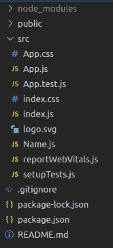
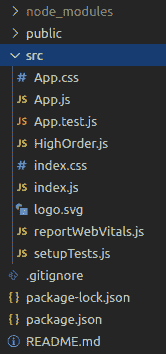

# 高次分量

> 原文:[https://www . geesforgeks . org/react-js-高阶-组件/](https://www.geeksforgeeks.org/react-js-higher-order-components/)

高阶组件或 HOC 是重用组件功能逻辑的高级方法。它只是获取原始组件并返回增强组件。

**语法:**

```
const EnhancedComponent = higherOrderComponent(OriginalComponent);
```

**使用高阶组件的原因:**

*   易于操作
*   不要在每个组件中复制相同的逻辑
*   使代码更易读

**创建反应应用程序:**

*   **步骤 1:** 使用以下命令创建一个 React 应用程序。

    ```
    npx create-react-app foldername
    ```

*   **步骤 2:** 创建项目文件夹(即文件夹名)后，使用以下命令移动到该文件夹。

    ```
    cd foldername
    ```

**项目结构:**



**示例 1:** 假设，我们需要重用相同的逻辑，就像将名称传递给每个组件一样。

## Name.js

```
import React from 'react'

const EnhancedComponent = (OriginalComponent) => {
    class NewCompoenent extends React.Component {

        // Logic here

        render() {
            // Pass the callable props to Original component
            return <OriginalComponent name="GeeksforGeeks"  /> 
        }
    }
    // Returns the new component
    return NewCompoenent
}

export default EnhancedComponent;
```

## App.js

```
import React from "react";
import "./App.css"
import EnhancedComponent from './Name'

class App extends React.Component {
  render() {
    // Call the props from originalComponent
    return <h1>{this.props.name}</h1> 
  }
}

// Passed the originalcomponent 
export default EnhancedComponent(App);
```

**输出:**这里，我们将名称作为一个道具传递，其值用于从不同的组件中调用。


**示例 2:** 在这个示例中，让我们实现一些逻辑。让我们制作一个计数器应用程序。在 HighOrder.js 中，我们传递**手柄点击**和**显示**道具来调用组件的功能。

**项目结构:**



## HighOrder.js

```
import React from 'react'

const EnhancedComponent = (OriginalComponent) => {
    class NewCompoenent extends React.Component {

        constructor(props) {
            super(props);
            // Set initial count to be 0
            this.state = { count: 0 }; 
        }

        handleClick = () => {
            // Incrementing the count
            this.setState({ count: this.state.count + 1 }); 
        }

        render() {

            // passed a handleclick and count in the originalComponent
            // as a props for calling and adding the functionality
            return <OriginalComponent
                handleclick={this.handleClick} 
                show={this.state.count} /> 
        }
    }
    // Returns the new component
    return NewCompoenent 
}
// Export main Component
export default EnhancedComponent 
```

## App.js

```
import React from 'react'
import "./App.css"
// importing HighOrder file
import EnhancedComponent from './HighOrder' 

class App extends React.Component {
  render() {
    // Destructuring the props
    const { show, handleclick } = this.props

    // Calling out the props
    return <button onClick={handleclick}>{show}
    </button> 
  }
}

export default EnhancedComponent(App);
```

**输出:**


**参考:**T2】https://reactjs.org/docs/higher-order-components.html