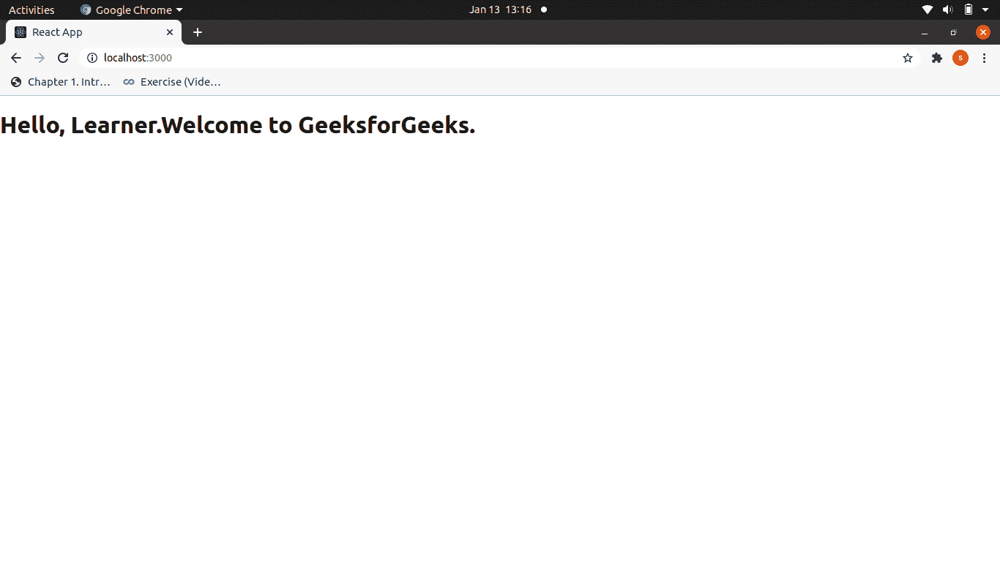

# React.js(介绍和工作)

> 原文:[https://www . geesforgeks . org/react-js-introduction-work/](https://www.geeksforgeeks.org/react-js-introduction-working/)

**ReactJS 简介:**让我们用一个实际的例子来理解这一点。

假设你的一个朋友在脸书发布了一张照片。现在你去喜欢这张图片，然后你也开始查看评论。现在，当你浏览评论时，你会发现点赞数增加了 100，因为你喜欢这张图片，即使没有重新加载页面。这个神奇的计数变化是因为 Reactjs。
React 是一个声明性的、高效的、灵活的 JavaScript 库，用于构建用户界面。是 MVC 中的‘V’。ReactJS 是一个开源的、基于组件的前端库，只负责应用程序的视图层。它由脸书维护。
React 使用声明性范例，使您更容易对应用程序进行推理，并旨在既高效又灵活。它为应用程序中的每个状态设计简单的视图，当数据发生变化时，React 将有效地更新和呈现正确的组件。声明式视图使您的代码更可预测，也更容易调试。
一个 React 应用程序由多个组件组成，每个组件负责呈现一小段可重用的 HTML。组件可以嵌套在其他组件中，以允许用简单的构建块构建复杂的应用程序。组件也可以保持内部状态——例如，TabList 组件可以存储与当前打开的选项卡相对应的变量。

**注意:** React 不是框架。它只是脸书为了解决我们之前面临的一些问题而开发的一个图书馆。
**先决条件**:下载最新版本的节点包。

**示例:**使用以下命令创建一个新的 React 项目:

```
npx create-react-app myapp
```

**文件名 App.js:** 现在用下面给出的代码更改 **App.js** 文件:

## java 描述语言

```
import React,{ Component }  from 'react';

class App extends Component {

  render() {
    return (    
       <div>
         <h1>Hello, Learner.Welcome to GeeksforGeeks.</h1>
       </div>

    );
  }
}

export default App;
```

**输出:**



**工作原理:**在构建客户端应用的时候，脸书的一个开发团队意识到 DOM 很慢(文档对象模型(DOM)是一个用于 HTML 和 XML 文档的应用编程接口(API)。它定义了文档的逻辑结构以及访问和操作文档的方式。).因此，为了使它更快，React 实现了一个虚拟 DOM，它基本上是 JavaScript 中的 DOM 树表示。因此，当它需要读取或写入 DOM 时，它将使用它的虚拟表示。然后虚拟 DOM 将尝试找到最有效的方法来更新浏览器的 DOM。
与浏览器的 DOM 元素不同，React 元素是简单的对象，创建起来很便宜。反应 DOM 负责更新 DOM 以匹配反应元素。原因是 JavaScript 非常快，值得在其中保留一个 DOM 树来加速它的操作。
虽然 React 被设想用于浏览器，但由于其设计，它也可以与 Node.js.
一起用于服务器