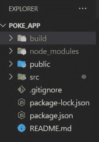

# React.js Pokémon App .

> 原文:[https://www.geeksforgeeks.org/react-js-pokemon-app/](https://www.geeksforgeeks.org/react-js-pokemon-app/)

**简介:**在本文中，我们将看到如何使用 React.js 和神奇宝贝 API 构建一个神奇宝贝 App。

**先决条件:**

*   [JavaScript 为 6](https://www.geeksforgeeks.org/introduction-to-es6/)
*   [反作用钩](https://www.geeksforgeeks.org/introduction-to-react-hooks/)
*   [反应成分](https://www.geeksforgeeks.org/reactjs-components/)
*   [获取 API 数据](https://www.geeksforgeeks.org/how-to-use-the-javascript-fetch-api-to-get-data/)
*   CSS

**方法:**这个网络应用将是一个一页式的网络应用，我们将向不同类型的神奇宝贝展示，它们的一些功能也将在那里提到，我们将使用免费的应用编程接口资源 https://pokeapi.co/.获得所有这些数据。我们将设置一个**加载更多**按钮，单击该按钮页面将在我们的网页上加载更多的神奇宝贝(神奇宝贝的数量将取决于我们在应用编程接口调用中设置的限制值)。

现在让我们看看上述方法的逐步实现。

**创建 react 应用并安装所有需要的包:**

**步骤 1:** 使用以下命令创建一个反应应用程序:

```jsx
npx create-react-app foldername
```

**步骤 2:** 创建项目文件夹(即文件夹名)后，使用以下命令移动到该文件夹:

```jsx
cd foldername
```

**项目结构:**如下图。



文件浏览器

暂时忽略构建文件夹，当你制作完这个应用程序后，如果你想在某个地方部署你的应用程序，那么你必须在你的终端中运行“ **npm 运行构建**，这将创建一个**构建**文件夹。然后你只需要简单地拖放**建立**文件夹在你的部署网站 https://www.netlify.com/.

**第三步:**现在进入 src 文件夹，编辑你的 App.js，对于 **loadPoke** 你可以设置任何你想要的限制，这里我已经设置了限制为 20。在这个文件中，我们使用了两个 useState hooks 容器，一个用于在 useEffect and 中使用**https://pokeapi.co/api/v2/pokemon/${pokemon.name}**获取所有带有名称的数据，另一个用于在**上加载更多神奇宝贝点击**事件的**更多神奇宝贝**按钮获取**API https://pokeapi.co/api/v2/pokemon?limit=20.**然后在神奇宝贝应用程序容器中，我们用所需的特性构建整个神奇宝贝卡，并为其他组件设置道具。

## App.js

```jsx
import React, { useEffect, useState } from "react";
import PokemonThumbnail from "./Components/PokemonThumbnail";

function App() {
  const [allPokemons, setAllPokemons] = useState([]);
  const [loadPoke, setLoadPoke] = useState(
    "https://pokeapi.co/api/v2/pokemon?limit=20"
  );
  const getAllPokemons = async () => {
    const res = await fetch(loadPoke);
    const data = await res.json();
    setLoadPoke(data.next);

    function createPokemonObject(result) {
      result.forEach(async (pokemon) => {
        const res = await fetch(
          `https://pokeapi.co/api/v2/pokemon/${pokemon.name}`
        );
        const data = await res.json();
        setAllPokemons((currentList) => [...currentList, data]);
      });
    }
    createPokemonObject(data.results);
    await console.log(allPokemons);
  };
  useEffect(() => {
    getAllPokemons();
  }, []);

  return (
    <div className="app-container">
      <h1>Pokemon Kingdom .</h1>

      <div className="pokemon-container">
        <div className="all-container">
          {allPokemons.map((pokemon, index) => (
            <PokemonThumbnail
              id={pokemon.id}
              name={pokemon.name}
              image=
      {pokemon.sprites.other.dream_world.front_default}
              type={pokemon.types[0].type.name}
              key={index}
              height={pokemon.height}
              weight={pokemon.weight}
              stat1={pokemon.stats[0].stat.name}
              stat2={pokemon.stats[1].stat.name}
              stat3={pokemon.stats[2].stat.name}
              stat4={pokemon.stats[3].stat.name}
              stat5={pokemon.stats[4].stat.name}
              stat6={pokemon.stats[5].stat.name}
              bs1={pokemon.stats[0].base_stat}
              bs2={pokemon.stats[1].base_stat}
              bs3={pokemon.stats[2].base_stat}
              bs4={pokemon.stats[3].base_stat}
              bs5={pokemon.stats[4].base_stat}
              bs6={pokemon.stats[5].base_stat}
            />
          ))}
        </div>
        <button className="load-more" 
          onClick={() => getAllPokemons()}>
          More Pokemons
        </button>
      </div>
    </div>
  );
}

export default App;
```