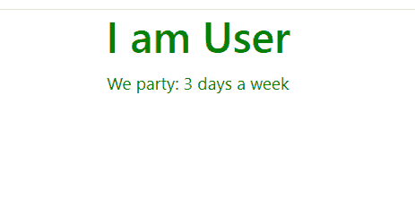

# React.js render()方法

> 原文:[https://www.geeksforgeeks.org/react-js-render-method/](https://www.geeksforgeeks.org/react-js-render-method/)

React.js 库就是将应用程序拆分成几个组件。每个组件都有自己的生命周期。React 为我们提供了一些内置的方法，我们可以在组件生命周期的特定阶段覆盖这些方法。

在**基于类的组件**中，render()方法是所有内置生命周期钩子/方法中唯一必需的也是最重要的方法。在 render()方法中，我们可以读取**道具和状态**，并将我们的 **JSX 代码**返回到我们的应用程序的根组件。在 render()方法中，我们不能更改状态，也不能导致副作用(例如向 web 服务器发出 HTTP 请求)。

**创建反应应用程序并安装模块:**

*   **步骤 1:** 使用以下命令创建一个 React 应用程序。

    ```jsx
    npx create-react-app foldername
    ```

*   **步骤 2:** 在创建项目文件夹(即文件夹名**)后，使用以下命令移动到该文件夹。**

    ```jsx
    cd foldername
    ```

**项目结构:**如下图。


项目结构

**示例:**现在在 **App.js** 文件中写下以下代码。在这里，App 是我们编写代码的默认组件。

## App.js

```jsx
import React, { Component } from 'react';
export default class App extends Component {
  state = {
    PawriDays: [
      { id: '123s', Day: 'Monday' },
      { id: '234r', Day: 'Saturday' },
      { id: '12d5', Day: 'Sunday' }
    ]
  }

  render() {
    const PartyDays = this.state.PawriDays.length
    const style = {
      'textAlign': 'center',
      'color': 'green'
    }

    // Return JSX code
    return (
      <div style={style}>
        <h1>I am User</h1>
        <p> We party: {PartyDays} days a week </p>
      </div>
    );
  }
}
```

**运行应用程序的步骤:**使用以下命令从项目的根目录运行应用程序

```jsx
npm start
```

**输出:**

