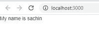

# react . js static getderevedfromprops()

> 哎哎哎:# t0]https://www . geeksforgeeks . org/reac-js-static-getderivedfromprops/http://www . geeksforgeeks . org/reac-js-static-getderivedfromprops/

当组件的状态依赖于道具的变化时，使用 getDerivedStateFromProps()方法。

getderivedstateformprops(props，state)是一个静态方法，在 React 的挂载和更新阶段都会在 render()方法之前调用。它以更新的道具和当前状态作为参数。

我们必须返回一个对象来更新状态，或者返回 null 来表示没有任何变化。

**创建反应应用程序:**

*   **步骤 1:** 使用以下命令创建一个反应应用程序:

    ```jsx
    npx create-react-app foldername
    ```

*   **步骤 2:** 创建项目文件夹(即文件夹名)后，使用以下命令移动到该文件夹:

    ```jsx
    cd foldername
    ```

**项目结构:**如下图。


## App.js

```jsx
import React from 'react';
import ReactDOM from 'react-dom';

class App extends React.Component {

  render() {

    return (
      <div>
      <Child name = "sachin"></Child>
      </div>
    )
  }
}

class Child extends React.Component{
    constructor(props){
        super(props);
        this.state = {
        name: "kapil"
        };
    }
    static getDerivedStateFromProps(props, state) {
        if(props.name !== state.name){
            //Change in props
            return{
                name: props.name
            };
        }
        return null; // No change to state
    }
    /* if props changes then after getDerivedStateFromProps
       method, state will look something like 

    {
        name: props.name
    }
    */
    render(){
       return (
        <div> My name is {this.state.name }</div>
       )
    }
}

export default App;
```

如果道具改变了，那么状态也会随之改变，否则 getDerivedStateFromProps 将返回空值，表示状态没有改变。在上面的例子中，道具有一个名为 name 的属性，但是州政府有一个不同值的属性。所以状态会根据道具属性的价值而变化。

**输出:**



**参考:**[https://reactjs . org/docs/react-component . html # static-getderevedstatefromps](https://reactjs.org/docs/react-component.html#static-getderivedstatefromprops)